# .env Redis 配置

输入 `docker exec ubuntu2404 sh -lc 'install -d -m 0755 /var/lib/redis /var/log/redis && redis-server --daemonize yes --dir /var/lib/redis --logfile /var/log/redis/redis-server.log --bind 127.0.0.1 --port 6379'` 启动redis 后，
在运行 `src/test.cpp` 前，请在 `Redis` 目录下创建 `.env` 文件，示例：

```env
REDIS_HOST=127.0.0.1
REDIS_PORT=6379
REDIS_PASSWORD=
REDIS_DB=0
REDIS_CONNECT_TIMEOUT_MS=2000
REDIS_SOCKET_TIMEOUT_MS=2000
```

程序会读取这些配置并连接 Redis，然后执行 `PING` 验证连接。


# 1. RESP 协议

RESP（Redis Serialization Protocol）是 Redis 客户端与服务器之间进行通信所使用的**序列化协议**。它规定了 Redis 命令和返回值在网络中应该如何表示。

例如客户端执行：

```bash
SET name Tom
```

Redis 客户端会按照 RESP 协议将命令编码后发送给服务器，服务器执行完成后，再按照 RESP 格式返回结果。

RESP 的特点是**简单、易解析、效率较高**。

## RESP2 的基本数据类型

| 类型            | 前缀  | 作用               |
| ------------- | --- | ---------------- |
| Simple String | `+` | 表示简单字符串，例如 `+OK` |
| Error         | `-` | 表示错误信息           |
| Integer       | `:` | 表示整数             |
| Bulk String   | `$` | 表示字符串或二进制数据      |
| Array         | `*` | 表示多个元素组成的数组      |

例如：

```text
+OK\r\n
```

表示简单字符串 `OK`。

```text
:100\r\n
```

表示整数 `100`。

```text
$5\r\nhello\r\n
```

表示字符串 `hello`。

Redis 客户端发送命令时，通常会将命令表示为一个 **Array**，数组中的每个参数都是一个 Bulk String。例如：

```text
SET name Tom
```

会表示为：

```text
*3
$3
SET
$4
name
$3
Tom
```

因此可以简单理解为：

> **RESP 就是 Redis 客户端和服务器之间约定的一种通信格式，用来规定“命令怎么发送、结果怎么返回”。**

目前 Redis 还支持 **RESP3**，它在 RESP2 的基础上增加了 Map、Set、Boolean、Null 等数据类型。

[Redis 官方 RESP 协议文档](https://redis.io/docs/latest/develop/reference/protocol-spec/?utm_source=chatgpt.com)


# 2. C++客户端 redis++安装

## 1. 依赖说明

`redis-plus-plus` 基于 C 语言官方客户端 `hiredis` 封装实现，需先安装 hiredis 开发库。

## 2. 安装 hiredis

- **Ubuntu/Debian**

```
apt install libhiredis-dev
```

- **CentOS**

```
yum install hiredis-devel.x86_64
```

## 3. 编译安装 redis-plus-plus

下载源码：

```
git clone https://github.com/sewenew/redis-plus-plus.git
```

### Ubuntu 编译安装

```
cd redis-plus-plus
mkdir build
cd build
cmake ..
make
sudo make install
```

### CentOS 编译安装

CentOS 自带 cmake 版本较低，需先安装 cmake3：

```
yum install cmake3
```

再执行编译安装：

```
cd redis-plus-plus
mkdir build
cd build
cmake3 ..
make
sudo make install
```

### 安装产物

- 头文件路径：`/usr/local/include/sw/redis++/`
- 静态库路径：`/usr/local/lib/`（CentOS 为 `/usr/local/lib64/`）

# 3. cmake编写

```cpp
cmake_minimum_required(VERSION 3.10)
project(RedisClient LANGUAGES CXX)

# redis-plus-plus 当前安装版本使用 std::string_view/std::optional/std::variant 因此必须启用 C++17
set(CMAKE_CXX_STANDARD 17)
set(CMAKE_CXX_STANDARD_REQUIRED ON)

# PkgConfig 用于读取系统库的 .pc 文件；本项目中的 cmake/Findhiredis.cmake 会通过 hiredis.pc 补齐 hiredis 的 CMake 查找能力。
find_package(PkgConfig REQUIRED)
list(APPEND CMAKE_MODULE_PATH "${CMAKE_CURRENT_SOURCE_DIR}/cmake")

# hiredis 是 redis++ 底层依赖，jsoncpp 用于解析 .env 后保存为 Json::Value。
find_package(hiredis REQUIRED)
find_package(jsoncpp REQUIRED)
find_package(redis++ REQUIRED)

# redis_test 是当前示例程序：读取 .env，连接 Redis，并执行 PING。
add_executable(redis_test src/test.cpp)

# 使用导入目标链接第三方库，可以自动携带 include 路径和链接参数。
target_link_libraries(redis_test PRIVATE
    redis++::redis++
    JsonCpp::JsonCpp
)

```

# 4. 通用命令

覆盖 EXISTS、DEL、KEYS、EXPIRE、TTL、PTTL、TYPE 等全局键操作命令。

## GET

* **参数类型**：`StringView key`，对于字符串可读不能写
* **返回值类型**：`std::optional<std::string>`，可能存在值也可能为空
* **含义**：Key 存在返回 value，不存在返回 `std::nullopt`。

## SET

* **参数类型**：`StringView key, StringView value`
* **返回值类型**：`bool`
* **含义**：设置成功返回 `true`，失败或条件不满足返回 `false`。


## EXISTS

* **参数类型**：`StringView key` （也支持传入多个 key）
* **返回值类型**：`long long`
* **含义**：返回**存在的 key 的数量**。

## DEL

* **参数类型**：`StringView key`（也支持传入多个 key）
* **返回值类型**：`long long`
* **含义**：返回**实际删除的 key 的数量**。


## KEYS

* **参数类型**：`StringView pattern`
* **返回值类型**：`void`
* **含义**：将**匹配 `pattern` 的所有 key** 写入你提供的输出迭代器中。Redis++ 的 `keys` 本身不直接返回一个容器。


这里强调一下三个特殊迭代器：
| 类型                           | 创建方式                     | 作用        | 插入位置        | 对应容器操作         | 常见容器                    |
| ---------------------------- | ------------------------ | --------- | ----------- | -------------- | ----------------------- |
| `std::insert_iterator`       | `std::inserter(c, pos)`  | 向指定位置插入元素 | `pos` 指定的位置 | `insert()`     | `vector`、`list`、`set` 等 |
| `std::back_insert_iterator`  | `std::back_inserter(c)`  | 向容器末尾插入元素 | 尾部          | `push_back()`  | `vector`、`deque`、`list` |
| `std::front_insert_iterator` | `std::front_inserter(c)` | 向容器头部插入元素 | 头部          | `push_front()` | `deque`、`list`          |

## EXPIRE

* **参数类型**：`StringView key`、`long long timeout`
* **返回值类型**：`bool`
* **含义**：给指定 key 设置过期时间，设置成功返回 `true`，key 不存在返回 `false`。
## TTL

* **参数类型**：`StringView key`
* **返回值类型**：`long long`
* **含义**：返回 key 的剩余过期时间，单位是秒；`-1` 表示永不过期，`-2` 表示 key 不存在。


## TYPE

* **参数类型**：`StringView key`
* **返回值类型**：`std::string`
* **含义**：返回指定 key 的数据类型，例如 `string`、`list`、`set`、`zset`、`hash`、`stream`；key 不存在时返回 `none`。

测试用函数：
```cpp
void testGenericCommands(sw::redis::Redis &redis)
{
    printf("Generic 系列命令:\n");
    printf("=============================================\n");

    // getset命令
    {
        printf("GetSet 命令\n\n");
        redis.flushdb();
        redis.set("key1", "111");
        auto ret = redis.get("key1");
        if (ret)
            cout << ret.value() << endl; // 由于返回类型是optional，需要判断真假
    }

    // EXISTS 命令
    {
        printf("EXISTS 命令\n\n");
        redis.flushdb();

        bool b;
        b = redis.set("key1", "Hello");
        printf("redis < SET key1 \"Hello\"\n");
        printf("redis > %s\n", b ? "OK" : "(nil)");

        long long e;
        e = redis.exists("key1");
        printf("redis < EXISTS key1\n");
        printf("redis > %lld\n", e);

        e = redis.exists("nosuchkey");
        printf("redis < EXISTS nosuchkey\n");
        printf("redis > %lld\n", e);

        b = redis.set("key2", "World");
        printf("redis < SET key2 \"World\"\n");
        printf("redis > %s\n", b ? "OK" : "(nil)");

        e = redis.exists({"key1", "key2", "nosuchkey"});
        printf("redis < EXISTS key1 key2 nosuchkey\n");
        printf("redis > %lld\n", e);
        printf("\n");
    }

    // DEL 命令
    {
        printf("DEL 命令\n\n");
        redis.flushdb();
        bool b;
        b = redis.set("key1", "Hello");
        printf("redis < SET key1 \"Hello\"\n");
        printf("redis > %s\n", b ? "OK" : "(nil)");

        b = redis.set("key2", "World");
        printf("redis < SET key2 \"World\"\n");
        printf("redis > %s\n", b ? "OK" : "(nil)");

        int d;
        d = redis.del({"key1", "key2", "key3"});
        printf("redis < DEL key1 key2 key3\n");
        printf("redis > %d\n", d);
        printf("\n");
    }

    // KEYS 命令
    {
        printf("KEYS 命令\n\n");
        redis.flushdb();
        std::unordered_map<std::string, std::string> kvs1 = {
            {"firstname", "Jack"},
            {"lastname", "Stuntman"},
            {"age", "35"}};
        redis.mset(kvs1.begin(), kvs1.end()); // 一次设置三个key
        printf("redis < MSET firstname Jack lastname Stuntman age 35\n");
        printf("redis > OK\n");

        std::vector<std::string> keys;
        std::insert_iterator<std::vector<std::string>> ins = std::inserter(keys, keys.begin()); // 创建一个“输出位置”，让 redis.keys() 把找到的 key 放进 keys 里面
        redis.keys("*name*", ins);                                                              // 前面可以有任意字符，后面也可以有任意字符，但中间必须出现 name
        printf("redis < KEYS *name*\n");
        int n = 1;
        for (auto it = keys.begin(); it != keys.end(); ++it)
        {
            printf("redis > %d) %s\n", n++, it->c_str());
        }
    }

    // EXPIRE & TTL 命令
    {
        printf("EXPIRE 命令\n");
        printf("TTL 命令\n\n");
        redis.flushdb();
        bool b;
        b = redis.set("mykey", "Hello");
        printf("redis < SET mykey \"Hello\"\n");
        printf("redis > %s\n", b ? "OK" : "(nil)");

        b = redis.expire("mykey", std::chrono::seconds(10)); // Redis 中的键 mykey 设置 10 秒的过期时间
        printf("redis < EXPIRE mykey 10\n");
        printf("redis > %d\n", b ? 1 : 0);

        long long ttl = redis.ttl("mykey");
        printf("redis < TTL mykey\n");
        printf("redis > %lld\n", ttl);
        printf("\n");
    }

    // TYPE 命令
    {
        printf("TYPE 命令\n\n");
        redis.flushdb();
        bool b;
        b = redis.set("key1", "value");
        printf("redis < SET key1 \"value\"\n");
        printf("redis > %s\n", b ? "OK" : "(nil)");

        long long c = redis.lpush("key2", "value");
        printf("redis < LPUSH key2 \"value\"\n");
        printf("redis > %lld\n", c);

        c = redis.sadd("key3", "value");
        printf("redis < SADD key3 \"value\"\n");
        printf("redis > %lld\n", c);

        std::string type = redis.type("key1");
        printf("redis < TYPE key1\n");
        printf("redis > \"%s\"\n", type.c_str());

        type = redis.type("key2");
        printf("redis < TYPE key2\n");
        printf("redis > \"%s\"\n", type.c_str());

        type = redis.type("key3");
        printf("redis < TYPE key3\n");
        printf("redis > \"%s\"\n", type.c_str());

        printf("=============================================\n");
    }
}
```


# 5. 字符串命令

覆盖 SET、GET、APPEND、GETRANGE、SETEX、INCR/DECR、MSET/MGET 等核心字符串操作。

## 完整代码

```cpp
void testStringCommands(sw::redis::Redis &redis)
{
    printf("String 系列命令:\n");
    printf("=============================================\n");

    // SET 命令（含 NX/XX/过期时间选项）
    {
        printf("SET 命令\n\n");
        redis.flushdb();

        long long e = redis.exists("mykey");
        printf("redis < EXISTS mykey\n");
        printf("redis > %lld\n", e);

        bool b = redis.set("mykey", "Hello");
        printf("redis < SET mykey \"Hello\"\n");
        printf("redis > %s\n", b ? "OK" : "(nil)");

        auto v = redis.get("mykey");
        printf("redis < GET mykey\n");
        if (v)
        {
            printf("redis > \"%s\"\n", v->c_str());
        }
        else
        {
            printf("redis > (nil)\n");
        }

        // NX：键不存在时才设置
        b = redis.set("mykey", "World", std::chrono::milliseconds(0),
                      sw::redis::UpdateType::NOT_EXIST);
        printf("redis < SET mykey \"World\" NX\n");
        printf("redis > %s\n", b ? "OK" : "(nil)");

        long long d = redis.del("mykey");
        printf("redis < DEL mykey\n");
        printf("redis > %lld\n", d);

        // XX：键存在时才设置
        b = redis.set("mykey", "World", std::chrono::seconds(0),
                      sw::redis::UpdateType::EXIST);
        printf("redis < SET mykey \"World\" XX\n");
        printf("redis > %s\n", b ? "OK" : "(nil)");

        v = redis.get("mykey");
        printf("redis < GET mykey\n");
        if (bool(v))
        {
            printf("redis > \"%s\"\n", v->c_str());
        }
        else
        {
            printf("redis > (nil)\n");
        }

        // 设置带过期时间的键
        b = redis.set("mykey", "Will expire in 10s", std::chrono::seconds(10));
        printf("redis < SET mykey \"Will expire in 10s\" EX 10\n");
        printf("redis > %s\n", b ? "OK" : "(nil)");

        v = redis.get("mykey");
        printf("redis < GET mykey\n");
        if (v)
        {
            printf("redis > \"%s\"\n", v->c_str());
        }
        else
        {
            printf("redis > (nil)\n");
        }

        // 等待过期
        for (int i = 10; i > 0; --i)
        {
            printf("Waiting %ds\n", i);
            std::this_thread::sleep_for(std::chrono::seconds(1));
        }

        v = redis.get("mykey");
        printf("redis < GET mykey\n");
        if (v)
        {
            printf("redis > \"%s\"\n", v->c_str());
        }
        else
        {
            printf("redis > (nil)\n");
        }
        printf("\n");
    }

    // GET 命令与批量操作命令
    {
        printf("GET 命令\n\n");
        redis.flushdb();

        auto v = redis.get("nonexisting");
        printf("redis < GET nonexisting\n");
        if (v)
        {
            printf("redis > \"%s\"\n", v->c_str());
        }
        else
        {
            printf("redis > (nil)\n");
        }

        std::unordered_map<std::string, std::string> kvs1 = {
            {"firstname", "Jack"},
            {"lastname", "Stuntman"},
            {"age", "35"}};
        redis.mset(kvs1.begin(), kvs1.end()); // 一次设置多个key
        std::vector<std::string> keys;
        std::insert_iterator<std::vector<std::string>> ins = std::inserter(keys, keys.begin()); // 还是将查询的value插入数组
        redis.mget({"firstname", "lastname"}, ins);                                             // 一次查询多个value
        for (auto it = keys.begin(); it != keys.end(); ++it)
        {
            printf("redis > %d) %s\n", it->c_str());
        }
    }

    // APPEND、GETRANGE 命令
    {
        printf("APPEND 命令\n\n"); // 返回追加字符串后，整个 value 的长度
        redis.flushdb();
        long long c = redis.append("mykey", "Hello");
        printf("redis < APPEND mykey \"Hello\"\n");
        printf("redis > %lld\n", c);
        c = redis.append("mykey", " World");
        printf("redis < APPEND mykey \" World\"\n");
        printf("redis > %lld\n", c);
        printf("\n");

        printf("SETRANGE 命令\n\n");
        redis.set("mykey", "This is a string");
        printf("redis < SETRANGE mykey 0 Redis > %lld\n", redis.setrange("mykey", 0, "Redis"));
        printf("redis < GET mykey > %s\n", redis.get("mykey").value().c_str());

        printf("GETRANGE 命令\n\n"); // 返回指定范围内的字符串，如果不存在则返回空字符串
        redis.set("mykey", "This is a string");
        printf("redis < GETRANGE mykey 0 3 > %s\n", redis.getrange("mykey", 0, 3).c_str());
        printf("redis < GETRANGE mykey -3 -1 > %s\n", redis.getrange("mykey", -3, -1).c_str());
    }

    // 数值增减命令
    {
        printf("INCR / DECR 命令\n\n");
        redis.flushdb();
        printf("redis < INCR mykey > %lld\n", redis.incr("mykey"));
        redis.set("mykey", "10");
        printf("redis < INCR mykey > %lld\n", redis.incr("mykey"));
        printf("redis < DECR mykey > %lld\n", redis.decr("mykey"));
        printf("redis < INCRBY mykey 5 > %lld\n", redis.incrby("mykey", 5));
        printf("redis < INCRBYFLOAT mykey 0.5 > %.2f\n", redis.incrbyfloat("mykey", 0.5));
        printf("=============================================\n");
    }
}
```

# 6. 列表命令

覆盖 LPUSH/RPUSH、LPOP/RPOP、LRANGE、阻塞弹出、索引查询等列表操作。

## 完整代码

```cpp
void testListCommands(sw::redis::Redis &redis)
{
    printf("List 系列命令:\n");
    printf("=============================================\n");

    // 左右压入命令
    {
        printf("LPUSH / RPUSH 命令\n\n");
        redis.flushdb();
        redis.lpush("mylist", "world");            // 左压入一个元素
        redis.lpush("mylist", {"hello", "Redis"}); // 支持一次性压入多个元素

        std::vector<std::string> elements;
        redis.lrange("mylist", 0, -1, std::inserter(elements, elements.begin())); // 获取指定下标范围的元素
        printf("redis < LRANGE mylist 0 -1\n");
        int n = 1;
        for (auto &e : elements)
        {
            printf("redis > %d) %s\n", n++, e.c_str());
        }
    }

    // 弹出命令
    {
        printf("LPOP / RPOP 命令\n\n");
        redis.flushdb();
        redis.rpush("mylist", {"one", "two", "three", "four", "five"}); // 先压入五个元素

        auto left = redis.lpop("mylist"); // 删除并返回 List 左侧的第一个元素；List 不存在或为空时返回 std::nullopt
        printf("redis < LPOP mylist > %s\n", left ? left->c_str() : "(nil)");
        auto right = redis.rpop("mylist");
        printf("redis < RPOP mylist > %s\n", right ? right->c_str() : "(nil)");
        printf("\n");
    }

    // 阻塞弹出 BLPOP/BRPOP
    {
        printf("BLPOP 阻塞弹出命令\n\n");
        redis.flushdb();
        redis.rpush("list1", {"a", "b", "c"});

        auto res = redis.blpop({"list1", "list2"}, std::chrono::seconds(0)); // 成功弹出时，返回 {key, value}；超时没有弹出元素时返回 std::nullopt
        if (res)
        {
            printf("redis > 来自键: %s, 值: %s\n", res->first.c_str(), res->second.c_str());
        }
        printf("\n");
    }

    // 索引与长度
    {
        printf("LINDEX / LLEN 命令\n\n");
        redis.flushdb();
        redis.rpush("mylist", {"Hello", "World"});
        printf("redis < LLEN mylist > %lld\n", redis.llen("mylist"));

        auto val = redis.lindex("mylist", 0); // 类似于get，返回指定下标的元素；不存在时返回 std::nullopt
        printf("redis < LINDEX mylist 0 > %s\n", val ? val->c_str() : "(nil)");
        printf("=============================================\n");
    }
}
```

# 7. 集合命令

覆盖增删查、集合运算（交集、并集、差集）等无序集合操作。

## 完整代码

```cpp
void testSetCommands(sw::redis::Redis &redis)
{
    printf("Set 系列命令:\n");
    printf("=============================================\n");

    // 基础增删查
    {
        printf("SADD / SMEMBERS / SISMEMBER 命令\n\n");
        redis.flushdb();
        redis.sadd("myset", "Hello");
        redis.sadd("myset", "World");
        redis.sadd("myset", "World"); // 重复元素自动去重

        std::unordered_set<std::string> elements;
        redis.smembers("myset", std::inserter(elements, elements.begin()));
        printf("集合元素数量: %zu\n", elements.size());
        printf("是否包含 Hello: %d\n", redis.sismember("myset", "Hello"));

        printf("SISMEMBER 和 SPOP 命令\n\n");
        redis.sadd("myset", {"Hello", "World", "Redis"});
        // SREM：删除集合中的指定元素
        printf("SREM 删除 World: %lld\n", redis.srem("myset", "World"));
        // SPOP：随机删除并返回一个元素
        auto element = redis.spop("myset");
        if (element)
        {
            printf("SPOP 弹出元素: %s\n", element->c_str());
        }
    }

    // 集合运算
    {
        printf("交集 / 并集 / 差集 命令\n\n");
        redis.flushdb();
        redis.sadd("key1", {"a", "b", "c"});
        redis.sadd("key2", {"c", "d", "e"});

        std::unordered_set<std::string> inter;
        redis.sinter({"key1", "key2"}, std::inserter(inter, inter.begin()));
        printf("交集元素数量: %zu\n", inter.size());

        long long count = redis.sinterstore("key3", {"key1", "key2"});

        std::unordered_set<std::string> union_set;
        redis.sunion({"key1", "key2"}, std::inserter(union_set, union_set.begin()));
        printf("并集元素数量: %zu\n", union_set.size());

        std::unordered_set<std::string> diff;
        redis.sdiff({"key1", "key2"}, std::inserter(diff, diff.begin()));
        printf("差集元素数量: %zu\n", diff.size());
    }
}
```

# 8. 哈希命令

覆盖字段读写、批量操作、数值增减等哈希结构操作。

## 完整代码

```cpp
void testHashCommand(sw::redis::Redis &redis)
{
    printf("Hash 系列命令:\n");
    printf("=============================================\n");

    // 基础读写
    {
        printf("HSET / HGET 命令\n\n");
        redis.flushdb();

        redis.hset("key", "f1", "111");
        redis.hset("key", std::make_pair("f2", "222"));
        // hset 能够一次传入多个 field-value 对!!
        redis.hset("key", {std::make_pair("f3", "333"),
                           std::make_pair("f4", "444")});
        vector<std::pair<string, string>> fields = {
            std::make_pair("f5", "555"),
            std::make_pair("f6", "666")};
        redis.hset("key", fields.begin(), fields.end());

        redis.hset("user", "name", "zhangsan");
        redis.hset("user", "age", "20");

        auto name = redis.hget("user", "name");
        auto age = redis.hget("user", "age");
        if (name && age)
        {
            printf("name: %s, age: %s\n", name->c_str(), age->c_str());
        }
    }

    // 批量操作
    {
        printf("HKEYS / HVALS / HMGET 命令\n\n");
        redis.flushdb();
        redis.hset("user", "name", "zhangsan");
        redis.hset("user", "age", "20");

        // HKEYS：获取 Hash 中所有 field
        std::vector<string> keys;
        redis.hkeys("user", std::back_inserter(keys));
        printf("字段数量: %zu\n", keys.size());

        for (const auto &key : keys)
        {
            printf("field: %s\n", key.c_str());
        }

        // HVALS：获取 Hash 中所有 value
        std::vector<string> values;
        redis.hvals("user", std::back_inserter(values));

        printf("值数量: %zu\n", values.size());

        for (const auto &value : values)
        {
            printf("value: %s\n", value.c_str());
        }

        // HMGET：根据多个 field 获取对应的 value
        std::vector<sw::redis::OptionalString> hmget_values;
        vector<string> fields = {"name", "age"};
        redis.hmget("user", fields.begin(), fields.end(), std::back_inserter(hmget_values));
    }

    // 数值增减
    {
        printf("HINCRBY 命令\n\n");
        redis.flushdb();
        redis.hset("user", "age", "20");
        long long new_age = redis.hincrby("user", "age", 2);
        printf("自增后年龄: %lld\n", new_age);
        printf("=============================================\n");
    }
}
```

# 9. 有序集合命令

覆盖带权值的增删查、排名查询、集合运算等有序集合操作。

## 完整代码

```cpp
void testZsetCommand(sw::redis::Redis &redis)
{
    printf("Zset 系列命令:\n");
    printf("=============================================\n");

    // 基础增删与范围查询
    {
        printf("ZADD / ZRANGE 命令\n\n");
        redis.flushdb();
        // 这里其实支持很多插入方式，但是
        redis.zadd("ranking", "吕布", 100);
        redis.zadd("ranking", "赵云", 98);
        redis.zadd("ranking", "典韦", 95);

        vector<std::pair<string, double>> members;
        redis.zrange("ranking", 0, -1, std::inserter(members, members.begin()));
        for (auto &item : members)
        {
            printf("%s: %.0f\n", item.first.c_str(), item.second);
        }
    }

    // 排名与分数查询
    {
        printf("ZRANK / ZSCORE / ZREVRANK / ZCARD 命令\n\n");

        auto rank = redis.zrank("ranking", "吕布"); // 某个成员从小到大排第几
        auto score = redis.zscore("ranking", "吕布");

        printf("吕布的排名(从小到大): %lld, 分数: %.0f\n", rank.value(), score.value());

        rank = redis.zrevrank("ranking", "吕布"); // 某个成员从大到小排第几

        printf("吕布的排名(从大到小): %lld\n", rank.value());

        auto count = redis.zcard("ranking");
        printf("ranking中的成员数量: %lld\n", count);

        auto result = redis.zrem("ranking", "吕布");
        printf("删除了 %lld 个成员\n", result);
    }

    // 交集运算
    {
        printf("ZINTERSTORE 命令\n\n");
        redis.flushdb();
        redis.zadd("key1", "吕布", 100);
        redis.zadd("key1", "赵云", 98);
        redis.zadd("key2", "吕布", 100);
        redis.zadd("key2", "关羽", 92);

        long long count = redis.zinterstore("result", {"key1", "key2"});
        printf("交集结果数量: %lld\n", count);
    }
}
```


# 持久化
Redis支持RDB和AOF两种持久化机制，持久化功能有效地避免因进程退出造成数据丢失问题，当下次重启时利用之前持久化的文件即可实现数据恢复。下面主要介绍的是：
- RDB、AOF的配置和运行流程，以及控制持久化的命令
- 对常见持久化问题进行分析定位和优化

这里我用**最直接、最直白、最不饶弯子、最简洁、最明了、最精炼**的一句话描述关系：RDB 是**定期把内存数据生成快照保存**，AOF 是**记录每一次写操作命令**，因此 RDB 文件更小、恢复更快，而 AOF 数据更完整、丢失数据更少。

## RDB
RDB持久化是把当前进程数据生成快照保存到硬盘的过程，触发RDB持久化过程分为**手动触发和自动触发。**

### 触发机制
手动触发分别对应save和bgsave命令：
- **save命令**：阻塞当前Redis服务器，直到RDB过程完成为止，**对于内存比较大的实例造成长时间阻塞，基本不采用**。
- **bgsave命令**：Redis进程执行fork操作创建子进程，**RDB持久化过程由子进程负责，完成后自动结束。阻塞只发生在fork阶段，一般时间很短**。

Redis内部的所有涉及RDB的操作都采用类似bgsave的方式。RDB 的配置主要在 **`redis.conf`** 中，一般保存在 `/usr/src/redis-5.0.14/redis.conf `通常关注两个地方：

除了手动触发之外，Redis运行自动触发RDB持久化机制：
1. 使用save配置。如`save m n`表示m秒内数据集发生了n次修改，自动RDB持久化。
```conf
save 900 1
save 300 10
save 60 10000
```
> **900 秒内至少修改 1 次，就自动执行 RDB；300 秒内修改 10 次；60 秒内修改 10000 次。**


2. 从节点进行全量复制操作时，主节点自动进行RDB持久化，随后将RDB文件内容发送给从节点。
3. 执行shutdown命令关闭Redis时，执行RDB持久化。


### 流程说明
bgsave是主流的RDB持久化方式，其运作流程如下：

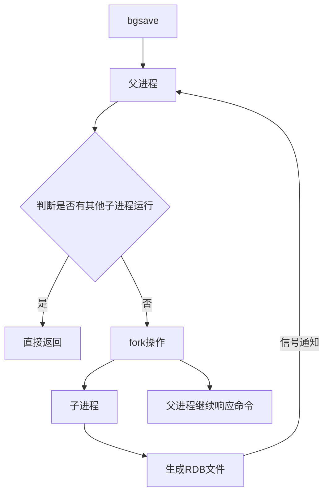

详细执行步骤：
1. 执行bgsave命令，Redis父进程判断当前**是否存在其他正在执行的子进程（如RDB/AOF子进程）**，如果存在则bgsave命令直接返回。
2. 父进程执行fork创建子进程，fork过程中父进程会阻塞，*通过`info stats`命令查看`latest_fork_usec`选项，可以获取最近一次fork操作的耗时，单位为微秒。*
3. 父进程fork完成后，bgsave命令返回"Background saving started"信息并不再阻塞父进程，可以继续响应其他命令。
4. 子进程创建RDB文件，根据父进程内存**生成临时快照文件，完成后对原有文件进行文件替换**。执行`lastsave`命令可以获取最后一次生成RDB的时间，对应info统计的`rdb_last_save_time`选项。
5. 子进程**发送信号给父进程表示完成**，父进程更新统计信息。

### RDB文件的处理
- **保存**：RDB文件保存在dir配置指定的目录（默认`/var/lib/redis/`）下，文件名通过`dbfilename`配置（默认`dump.rdb`）指定。可以通过执行`config set dir {newDir}`和`config set dbfilename {newFilename}`在运行期间动态修改，当下次运行时RDB文件会保存到新目录。
- **压缩**：Redis默认采用LZF算法对生成的RDB文件做压缩处理，压缩后的文件远远小于内存大小，默认开启，可以通过参数`config set rdbcompression {yes|no}`动态修改。

> 压缩RDB会消耗CPU，但可以大幅降低文件的体积，方便保存到硬盘或通过网络发送到从节点，因此建议开启。

- **校验**：如果Redis启动时加载到损坏的RDB文件会拒绝启动。这时可以使用Redis提供的`redis-check-dump`工具检测RDB文件并获取对应的错误报告。


### RDB的优缺点
- RDB是一个紧凑压缩的二进制文件，代表Redis在某个时间点上的数据快照。非常适用于备份、全量复制等场景。比如每6小时执行bgsave备份，并把RDB文件复制到远程机器或者文件系统中（如HDFS）用于灾备。
- **Redis加载RDB恢复数据远远快于AOF的方式。**
- RDB方式数据没办法做到实时持久化/秒级持久化。因为bgsave每次运行都要执行fork创建子进程，属于重量级操作，频繁执行成本过高。
- RDB文件使用特定二进制格式保存，Redis版本演进过程中有多个RDB版本，兼容性可能有风险。
- RDB 的缺点是**只能恢复到最近一次快照，快照之间发生的写操作无法记录，Redis 宕机时可能丢失这部分数据**。

在下面这些场景中，RDB可能也会出错：
* **磁盘空间不足**：没有足够空间写入 RDB 文件。
* **没有写权限**：Redis 无法在指定目录创建或修改 RDB 文件。
* **磁盘故障**：磁盘损坏、挂载异常等导致无法写入。
* **`fork()` 失败**：系统内存不足或进程资源达到限制，无法创建 RDB 子进程。
* **Redis 进程被强制终止**：例如 `kill -9`、系统断电等，**来不及完成 RDB 保存**。
* **RDB 保存过程中发生其他系统错误**：例如文件系统异常等。


## AOF
AOF（Append Only File）持久化：以独立日志的方式记录每次写命令，重启时再重新执行AOF文件中的命令达到恢复数据的目的。AOF的主要作用是解决了数据持久化的实时性，目前已经是Redis持久化的主流方式。**如果 RDB 和 AOF 都开启，Redis 重启恢复数据时以 AOF 为准。**

### 使用
开启AOF功能需要在 `redis.conf` 设置配置：`appendonly yes`，默认不开启。

AOF文件名通过`appendfilename`配置（默认是`appendonly.aof`）设置。保存目录同RDB持久化方式一致，通过`dir`配置指定。
AOF的工作流程包含四个环节：**命令写入（append）、文件同步（sync）、文件重写（rewrite）、重启加载（load）。**

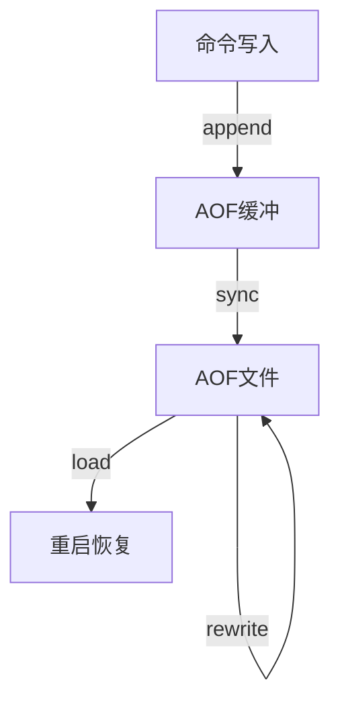

流程说明：
1. 所有的写入命令会追加到aof_buf（AOF 缓冲区）中，缓冲区之后还要写入文件缓冲区，之后才能写入到磁盘：
```plain
Redis内存
   ↓
aof_buf（Redis自己的AOF缓冲区）
   ↓ write()
OS Page Cache（操作系统文件缓存）
   ↓ fsync()
磁盘
```
2. 文件缓冲区根据对应的策略向硬盘做同步操作。
3. 随着AOF文件越来越大，需要定期对AOF文件进行重写，达到压缩的目的。
4. 当Redis服务器启动时，可以加载AOF文件进行数据恢复。

### 命令写入
AOF命令写入的内容直接是文本协议格式。例如`set hello world`这条命令，在AOF缓冲区会追加如下文本：
```
*3\r\n$3\r\nset\r\n$5\r\nhello\r\n$5\r\nworld\r\n
```

此处遵守Redis格式协议，Redis选择文本协议可能的原因：文本协议具备较好的兼容性；实现简单；具备可读性。


### 文件同步
Redis提供了多种同步文件策略，由参数`appendfsync`控制，不同值的含义如下表所示。

| 可配置值 | 说明 |
| :--- | :--- |
| always | 命令写入aof_buf后调用fsync同步，完成后返回 |
| everysec | 命令写入aof_buf后只执行write操作，不进行fsync。每秒由同步线程进行fsync。 |
| no | 命令写入aof_buf后只执行write操作，由OS控制fsync频率。 |

系统调用write和fsync说明：
- write操作会触发延迟写（delayed write）机制。write操作在写入系统缓冲区后立即返回。同步硬盘操作依赖于系统调度机制，例如：缓冲区页空间写满或达到特定时间周期。同步文件之前，如果此时系统故障宕机，缓冲区内数据将丢失。
- **fsync针对单个文件操作，做强制硬盘同步，fsync将阻塞直到数据写入到硬盘**。
- 配置为always时，每次写入都要同步AOF文件，性能很差不建议配置。
- 配置为no时，由于操作系统同步策略不可控，数据丢失风险大增不建议配置。
- 配置为everysec，是默认配置，最多丢失1秒的数据。


### AOF重写

AOF文件会不断变大，因此 Redis 通过**AOF重写**重新生成一个更小的AOF文件：根据当前内存中的数据，**生成能恢复这些数据的最少写命令**。

**为什么能变小：**

* 已过期的数据不再写入。
* 删除旧AOF中的无效命令，如 `DEL`、`HDEL`、`SREM`，只保留最终有效数据。
* 将多条相同类型的操作合并，例如：

  ```bash
  LPUSH list a
  LPUSH list b
  LPUSH list c
  ```

  合并为：

  ```bash
  LPUSH list a b c
  ```

主要可以减少磁盘占用，同时加快 Redis 重启时的数据恢复。

**触发方式：**

* **手动：** `BGREWRITEAOF`
* **自动：** 由以下两个参数控制：

  * `auto-aof-rewrite-min-size`：AOF达到的最小重写大小，默认 **64MB**。
  * `auto-aof-rewrite-percentage`：当前AOF大小相对**上次重写后大小**的增长比例，达到条件后触发重写。


AOF重写的运行流程如下：

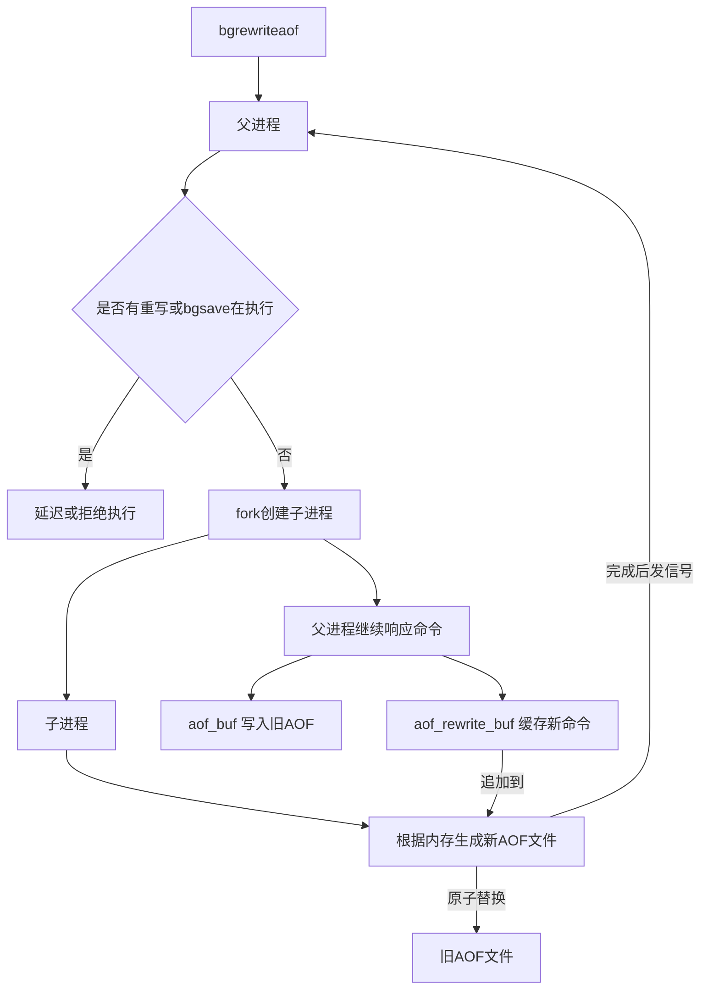

执行步骤：
1. 执行AOF重写请求。
   **如果当前进程正在执行AOF重写，请求不执行。如果当前进程正在执行bgsave操作，重写命令延迟到bgsave完成之后再执行。**
2. 父进程执行fork创建子进程。
3. 重写阶段
   a. 主进程fork之后，继续响应其他命令。所有修改操作写入AOF缓冲区并根据appendfsync策略同步到硬盘，保证旧AOF文件机制正确。
   b. **子进程只有fork之前的所有内存信息，父进程中需要将fork之后这段时间的修改操作写入AOF重写缓冲区中。**
4. 子进程根据内存快照，将命令合并到**新的AOF文件**中。
5. 子进程完成重写
   a. 新文件写入后，子进程发送信号给父进程。
   b. **父进程把AOF重写缓冲区内临时保存的命令追加到新AOF文件中**。
   c. 用新AOF文件替换老AOF文件。

重写时要注意混合式持久化：
* **Redis 4.0** 开始支持混合持久化。
* 配置项：`aof-use-rdb-preamble yes`。
* **AOF 重写时**，先把当前内存数据以 **RDB 格式**（二进制格式）写入 AOF 文件，再把重写期间产生的新写命令以 **AOF 格式**（文本格式）追加到后面。
* 特点：**兼顾 RDB 的恢复速度和 AOF 的数据完整性**，相比纯 AOF 文件更小、恢复更快。

### 启动时数据恢复
当Redis启动时，会根据RDB和AOF文件的内容进行数据恢复，流程如下：

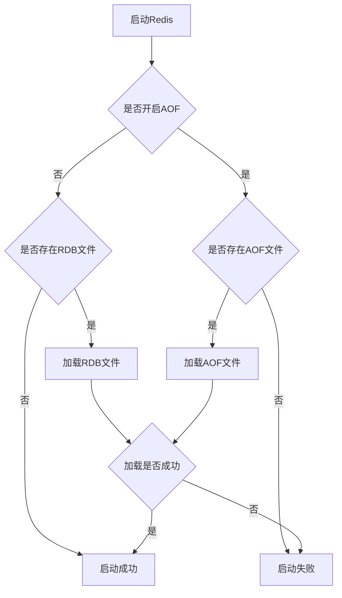

**注意两种不同持久化方式的特点：**

```text
RDB：读取快照 → 直接恢复数据
AOF：读取命令 → 逐条执行 → 恢复数据
```

所以一般来说：

> **RDB 文件更紧凑、需要执行的操作更少，因此恢复速度通常比 AOF 快。**


# 事务

## 概念
Redis 事务和 MySQL 事务区别：

- **弱化了原子性**：Redis 没有“回滚机制”，只能做到操作批量执行，不能做到“一个失败就恢复到初始状态”。
- **不保证一致性**：不涉及数据约束，也没有回滚机制。MySQL 的一致性体现为事务运行前后结果都合理有效，不会出现中间非法状态。
- **不需要隔离性**：没有隔离级别，因为 Redis 单线程处理请求，不会并发执行事务，所有事务都串行执行。
- **不需要持久性**：数据保存在内存中，是否开启持久化以及具体的持久化方式由 redis-server 自身决定，和事务无关。

Redis 事务本质是在服务端维护一个“事务队列”：每次客户端在事务中执行操作，命令会先发送到服务器并放入事务队列，不会立即执行；直到收到 `EXEC` 命令后，才会执行队列中的所有操作。

> 事务中的命令按顺序连续执行，中间不会插入其他客户端的命令，所以不会出现事务执行过程中被其他事务“插队”的问题。


## 事务操作

### MULTI

开启一个事务，执行成功返回 `OK`。

**实例**

```
127.0.0.1:6379> MULTI
OK
```

### EXEC

提交并真正执行事务队列中的所有命令。

**实例**

```
127.0.0.1:6379> MULTI
OK
127.0.0.1:6379> set k1 1
QUEUED
127.0.0.1:6379> set k2 2
QUEUED
127.0.0.1:6379> set k3 3
QUEUED
127.0.0.1:6379> EXEC
1) OK
2) OK
3) OK
```

每次添加操作都会返回 `QUEUED`，表示命令已进入事务队列。执行 `EXEC` 后命令才在服务端执行，此时可以读取到对应的值：

```
127.0.0.1:6379> get k1
"1"
127.0.0.1:6379> get k2
"2"
127.0.0.1:6379> get k3
"3"
```

### DISCARD

放弃当前事务，直接清空事务队列，所有入队的操作都不会真正执行。

**实例**

```
127.0.0.1:6379> MULTI
OK
127.0.0.1:6379> set k1 1
QUEUED
127.0.0.1:6379> set k2 2
QUEUED
127.0.0.1:6379> DISCARD
OK

127.0.0.1:6379> get k1
(nil)
127.0.0.1:6379> get k2
(nil)
```

### WATCH

用于解决并发修改带来的数据不一致问题：如果事务要修改的 key 在执行前被其他客户端改动，事务会执行失败。

#### 并发问题示例

客户端1先开启事务并入队命令：

```
127.0.0.1:6379> MULTI
OK
127.0.0.1:6379> set key 100
QUEUED
```

客户端2在客户端1提交前修改同一个 key：

```
127.0.0.1:6379> set key 200
OK
```

客户端1提交事务：

```
127.0.0.1:6379> EXEC
OK
```

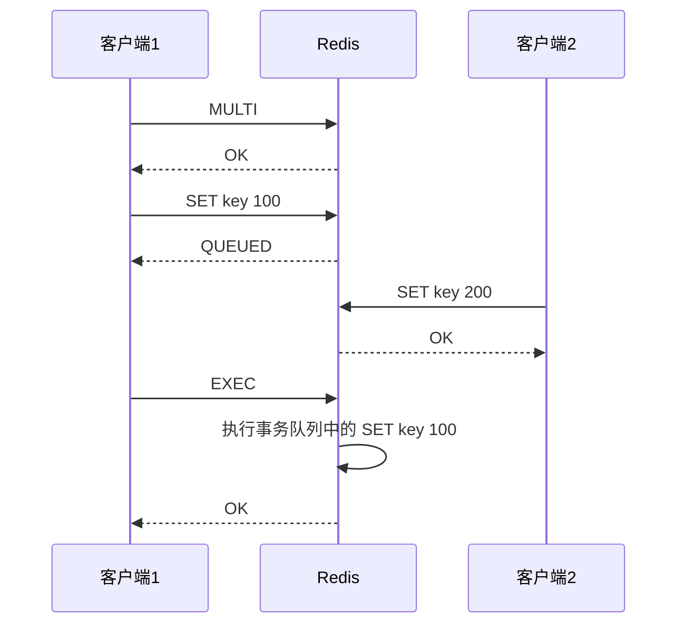

最终 key 的值为 `100`。从输入顺序看客户端1先执行、客户端2后执行，但实际执行顺序是客户端2先写、客户端1后写，最终结果覆盖了客户端2的修改，容易产生业务歧义。

#### WATCH 工作机制

* **悲观锁**：先把资源锁住，阻止其他人修改，自己操作完成后再释放锁。
* **乐观锁**：不加锁，操作前先记录状态，提交时检查数据是否被别人修改过。

**`WATCH` 的工作机制类似于乐观锁**，在客户端监控一组指定的 key：

- 开启事务时，记录被监控 key 的当前版本号（版本号为整数，每次修改都会自增，由服务端维护）。
- 提交事务时，如果服务端 key 的版本号已经大于事务开始时记录的版本号，事务直接执行失败，所有命令都不执行，**证明监控的key已经被修改过了。**

**实例**
客户端1先执行监控并开启事务：

```
127.0.0.1:6379> watch k1    # 开始监控 k1
OK
127.0.0.1:6379> MULTI
OK
127.0.0.1:6379> set k1 100    # 记录当前 k1 版本号为 0，命令入队暂不执行
QUEUED
127.0.0.1:6379> set k2 1000
QUEUED
```

客户端2修改 k1，使服务端版本号从 0 变为 1：

```
127.0.0.1:6379> set k1 200
OK
```

客户端1提交事务，版本校验失败，事务取消：

```
127.0.0.1:6379> EXEC          # 对比版本号：客户端记录 0，服务端已为 1，版本不一致，事务失败
(nil)
127.0.0.1:6379> get k1
"200"
127.0.0.1:6379> get k2
(nil)
```
其他客户端修改了被 WATCH 的 key → 当前客户端的 EXEC 失败 → 当前事务里的命令不会执行，所以最终保留的是别人修改后的结果。

### UNWATCH

取消对 key 的监控，是 `WATCH` 的逆操作。

# 主从复制
一般有三种是 Redis 常见的部署/高可用模式：

1. **主从模式**

   * 一个 Master，多个 Slave。
   * Master 负责写，Slave 复制数据，主要用于**读扩展和数据备份**。
   * **缺点**：Master 挂掉后，通常需要人工处理故障转移。

2. **主从 + 哨兵模式（Sentinel）**

   * 在主从基础上增加 Sentinel。
   * Sentinel 会**监控节点、自动发现故障并选举新的 Master**。
   * 主要解决**主节点自动故障转移**问题。

3. **集群模式（Redis Cluster）**

   * 多个 Master + Slave，并把数据**分片到不同 Master**。
   * 可以同时解决**高并发和大数据量**问题。
   * 复杂度最高，但扩展能力最强。


在分布式系统中，为了解决单点故障问题，通常会将数据复制为多个副本部署在不同服务器，满足故障恢复、负载均衡等需求。Redis 的复制功能是高可用的基础，哨兵、集群模式都基于复制构建。

## 配置

### 建立复制

参与复制的 Redis 实例分为**主节点（master）**和**从节点（slave）**：每个从节点只能有一个主节点，一个主节点可以挂载多个从节点；数据流向是单向的，只能从主节点同步到从节点，**主节点负责写入数据和读取数据，从节点负责读取数据不可以写入数据，并且会从主节点同步数据。**

配置复制的三种方式：

1. 配置文件中写入 `slaveof {masterHost} {masterPort}`，随 Redis 启动生效
2. 启动命令中添加 `--slaveof {masterHost} {masterPort}` 生效
3. 运行时执行 redis 命令 `slaveof {masterHost} {masterPort}` 生效

#### 配置步骤

复制一份从节点配置文件 `redis-slave.conf`，开启守护进程：

```
# By default Redis does not run as a daemon. Use 'yes' if you need it.
# Note that Redis will write a pid file in /var/run/redis.pid when daemonized.
daemonize yes
```

默认端口 6379 的实例作为主节点，启动端口 6380 的从节点实例：

```
# ubuntu
redis-server redis-slave.conf路径 --port 6380 --slaveof 127.0.0.1 6379

# centos
redis-server redis-slave.conf路径 --port 6380 --slaveof 127.0.0.1 6379
```

通过 `netstat -nlpt` 验证两个实例都已启动：

```
tcp        0      0 127.0.0.1:6379          0.0.0.0:*               LISTEN      209656/redis-server
tcp        0      0 127.0.0.1:6380          0.0.0.0:*               LISTEN      778534/redis-server
tcp        0      0 127.0.0.1:6381          0.0.0.0:*               LISTEN      778635/redis-server
```

验证数据同步效果：
主节点写入数据：

```
127.0.0.1:6379> set hello world
OK
127.0.0.1:6379> get hello
"world"
```

从节点读取数据：

```
127.0.0.1:6380> get hello
"world"
```

#### 主从复制基础流向

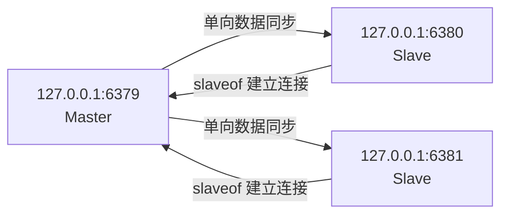

#### 复制状态查看

通过 `info replication` 命令查看主从节点的复制状态。

**主节点 6379 状态**

```
127.0.0.1:6379> info replication
# Replication
role:master                                     # 当前 Redis 节点的角色：主节点
connected_slaves:2                              # 当前连接的从节点数量：2 个

slave0:ip=127.0.0.1,port=6380,state=online,offset=796,lag=1
                                                # 第 1 个从节点
                                                # ip=127.0.0.1：从节点 IP
                                                # port=6380：从节点端口
                                                # state=online：从节点在线
                                                # offset=796：从节点当前已经同步到的位置
                                                # lag=1：距离上次与主节点通信约 1 秒

slave1:ip=127.0.0.1,port=6381,state=online,offset=796,lag=0
                                                # 第 2 个从节点
                                                # ip=127.0.0.1：从节点 IP
                                                # port=6381：从节点端口
                                                # state=online：从节点在线
                                                # offset=796：从节点当前已经同步到的位置
                                                # lag=0：当前没有明显延迟

master_replid:def3ebeb6ed8a1cef6487a8140026fc14dc18200
                                                # 当前主节点的复制 ID
                                                # 用于标识当前这套主节点复制历史

master_replid2:0000000000000000000000000000000000000000
                                                # 上一个主节点的复制 ID
                                                # 这里全是 0，表示当前没有有效的上一个复制 ID

master_repl_offset:796                         # 主节点当前的复制偏移量
                                                # 表示主节点已经产生/记录到复制流中的位置

second_repl_offset:-1                           # 上一个复制 ID 对应的偏移量
                                                # -1 表示当前没有可用的第二复制历史

repl_backlog_active:1                            # 复制积压缓冲区是否启用
                                                # 1 表示已启用

repl_backlog_size:1048576                       # 复制积压缓冲区大小
                                                # 1048576 字节 = 1 MB

repl_backlog_first_byte_offset:1                # 复制积压缓冲区中最早数据的偏移量

repl_backlog_histlen:796                        # 当前复制积压缓冲区中实际保存了多少字节的历史数据
```

**从节点 6380 状态**

```
127.0.0.1:6380> info replication
# Replication
role:slave
master_host:127.0.0.1
master_port:6379
master_link_status:up
master_last_io_seconds_ago:1
master_sync_in_progress:0
slave_repl_offset:100
slave_read_only:1
connected_slaves:0
master_replid:2fbd35a8b8401b22eb92ff49ad5e42250b3e7a06
master_repl_offset:170
second_repl_offset:-1
repl_backlog_active:1
repl_backlog_size:1048576
repl_backlog_first_byte_offset:1
repl_backlog_histlen:170
```

### 断开复制

在从节点cli中执行 `slaveof no one` 即可断开与主节点的复制关系。

断开复制的流程：

1. 从节点断开与主节点的复制连接
2. 从节点晋升为主节点

断开复制后，从节点不会丢弃已有数据，只是不再接收主节点的新数据变更。

#### 切主操作

`slaveof` 也可以切换主节点，执行 `slaveof {newMasterIp} {newMasterPort}` 即可。

切主操作流程：

1. 断开与旧主节点的复制关系
2. 与新主节点建立复制连接
3. 清空从节点当前所有数据
4. 从新主节点重新执行全量复制

> 注意：使用这个命令只能临时改变主从关系，如果重启redis还是会按照配置文件进行启动

### 安全性

如果主节点配置了 `requirepass` 密码验证，客户端访问需要执行 `auth` 命令。主从复制时，从节点需要配置 `masterauth` 参数，值与主节点密码保持一致，才能正常建立复制连接。

#### 主节点

```conf
port 6379
requirepass 123456
```

#### 从节点 1

```conf
port 6380
replicaof 127.0.0.1 6379
masterauth 123456
```

#### 从节点 2

```conf
port 6381
replicaof 127.0.0.1 6379
masterauth 123456
```

#### 客户端连接主节点

```bash
redis-cli -p 6379
```

```bash
AUTH 123456
SET name zhangsan
```


### 只读

默认配置下，从节点通过 `slave-read-only=yes` 设置为只读模式。

由于复制是主到从的单向同步，**修改从节点的数据无法同步回主节点**，会造成主从数据不一致，不建议关闭从节点的只读模式，从节点就不应该修改。

### 传输延迟

主从节点跨机器部署时，网络延迟是重要考量。Redis 通过 `repl-disable-tcp-nodelay` 参数控制 TCP_NODELAY 开关，默认为 `no`（即关闭 TCP_NODELAY）：

- **关闭时（默认 no）**：主节点产生的命令无论大小都会立即发送给从节点，延迟低，但带宽消耗高，适合同机房、网络条件好的场景。
- **开启时（设为 yes）**：主节点会合并小的 TCP 包再发送，节省带宽但延迟升高（默认间隔约 40ms，由内核决定），适合跨机房、网络环境复杂的场景。

## 拓扑

Redis 复制支持单层、多层拓扑，常见分为三种：一主一从、一主多从、树状主从。

### 一主一从结构

最简单的复制拓扑，用于主节点宕机时从节点提供故障转移。

当写并发较高且需要持久化时，可以只在从节点开启 AOF 持久化，既保证数据安全，又避免持久化影响主节点性能。**注意主节点关闭持久化时，宕机后不要自动重启，否则可能导致数据丢失，应该从从节点获取AOF文件恢复数据**

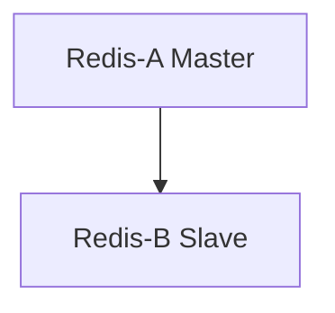

### 一主多从结构

也叫星形结构，适合读多写少的场景，通过多个从节点实现读写分离、读请求负载均衡；也可以将耗时的读命令指定到特定从节点执行，避免影响主业务。

缺点是**写并发高时，主节点需要向多个从节点同步数据，会加重主节点的网络和 CPU 负载。**

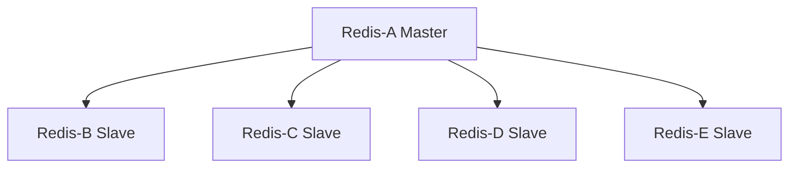

### 树状主从结构

也叫分层结构：从节点既可以从上层节点复制数据，也可以作为主节点向下层从节点同步数据。 **通过中间层分担主节点的复制压力，减少主节点需要直接同步的从节点数量。** 缺点是同步的耗时较长。

数据写入顶层主节点 A 后，同步给中间层 B、C；B 再同步给下层 D、E，适合从节点数量多、需要降低主节点负载的场景。

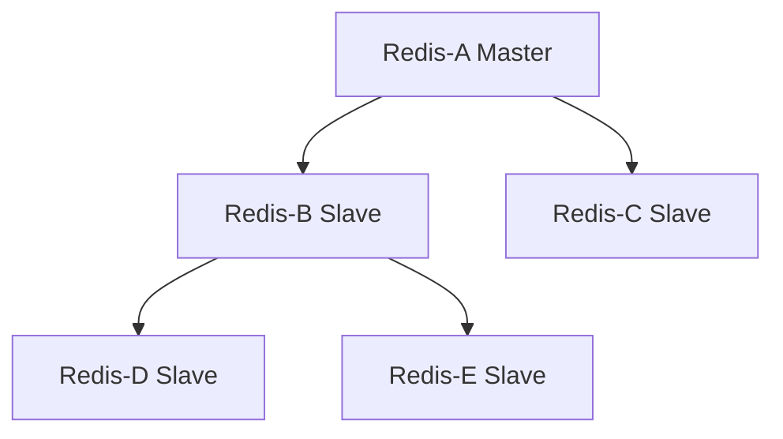

## 原理


### 复制过程

下面详细介绍建立复制的完整流程，复制过程大致分为6个过程：


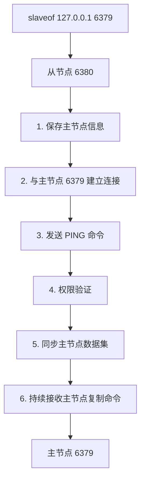

#### 1) 保存主节点（master）的信息

开始配置主从同步关系之后，从节点只保存主节点的地址信息，此时建立复制流程还没有开始，在从节点6380执行`info replication`可以看到如下信息：

```
master_host: 127.0.0.1
master_port: 6379
master_link_status: down
```

从统计信息可以看出，主节点的ip和port被保存下来，但是主节点的连接状态（`master_link_status`）是下线状态。

#### 2) 建立TCP网络连接

从节点（slave）内部通过每秒运行的定时任务维护复制相关逻辑，当定时任务发现存在新的主节点后，会尝试与主节点建立基于TCP的网络连接。如果从节点无法建立连接，定时任务会无限重试直到连接成功或者用户停止主从复制。

#### 3) 发送ping命令

连接建立成功之后，从节点通过`ping`命令确认主节点在应用层上是工作良好的。如果ping命令的结果pong回复超时，从节点会断开TCP连接，等待定时任务下次重新建立连接。

#### 4) 权限验证

如果主节点设置了`requirepass`参数，则需要密码验证，从节点通过配置`masterauth`参数来设置密码。如果验证失败，则从节点的复制将会停止。

#### 5) 同步数据集

对于首次建立复制的场景，主节点会把当前持有的所有数据全部发送给从节点，这步操作基本是耗时最长的，又划分为两种情况：**全量同步和部分同步**

#### 6) 命令持续复制

当从节点复制了主节点的所有数据之后，针对之后的修改命令，主节点会持续的把命令发送给从节点，从节点执行修改命令，保证主从数据的一致性。


### 数据同步 psync

Redis使用`psync`命令完成主从数据同步，同步过程分为：**全量复制**和**部分复制**。

- **全量复制**：一般用于初次复制场景，Redis早期支持的复制功能只有全量复制，**它会把主节点全部数据一次性发送给从节点**，当数据量较大时，会对主从节点和网络造成很大的开销。
- **部分复制**：用于处理在主从复制中因网络闪断等原因造成的数据丢失场景，当从节点再次连上主节点后，如果条件允许，**主节点会补发数据给从节点**。因为补发的数据远小于全量数据，可以有效避免全量复制的过高开销。

### PSYNC 的语法格式

```
PSYNC replicationid offset
```
`replicationid`：从节点之前同步主节点时，由主节点提供并保存下来的复制 ID。
`offset`：从节点根据自己已经接收到的主节点复制数据，维护的复制偏移量。


* 如果 `replicationid` 为 `?`、`offset` 为 `-1`，表示**从节点没有有效的复制历史，向主节点请求全量同步**。
* 如果 `replicationid` 和 `offset` 为具体值，表示**从节点携带已有的复制历史，请求主节点尝试进行部分同步；如果主节点无法满足条件，则会退化为全量同步**。


#### 1. replicationid/replid (复制id)

主节点的复制id。主节点重新启动，或者从节点晋级成主节点，都会生成一个replicationid **（同一个节点，每次重启，生成的replicationid也会变化）**。
从节点在和主节点建立连接之后，就会获取到主节点的replicationid。

通过 `info replication` 看到replicationid：


* `master_replid`：当前节点现在作为**主节点**使用的复制 ID。
* `master_replid2`：这个节点**之前作为从节点时所跟随的那个主节点的复制 ID**；后来因为主节点挂壁了成为新主节点后，把这个旧 ID 保留下来，用于兼容之前的复制历史，支持部分同步。还可以根据这个 旧ID 找回之前的可能恢复的挂壁主节点。


#### 2. offset (偏移量)

参与复制的主从节点都会维护自身复制偏移量。主节点（master）在处理完写入命令后，会把命令的字节长度做累加记录，统计信息在`info replication`中的`master_repl_offset`指标中。


从节点（slave）每秒钟上报自身的复制偏移量给主节点，因此主节点也会保存从节点的复制偏移量，统计指标如下：


从节点在接受到主节点发送的命令后，也会累加记录自身的偏移量。统计信息在`info replication`中的`slave_repl_offset`指标中：


#### 复制偏移量维护

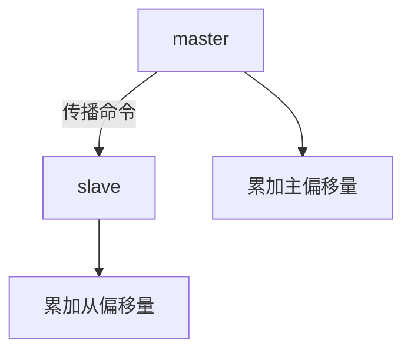

通过对比主从节点的复制偏移量，可以判断主从节点数据是否一致。


>
> **replid + offset 共同标识了一个"数据集"**
> 如果两个节点的replid 和 offset 都相同，则这两个节点上持有的数据就一定相同。


## psync 运行流程

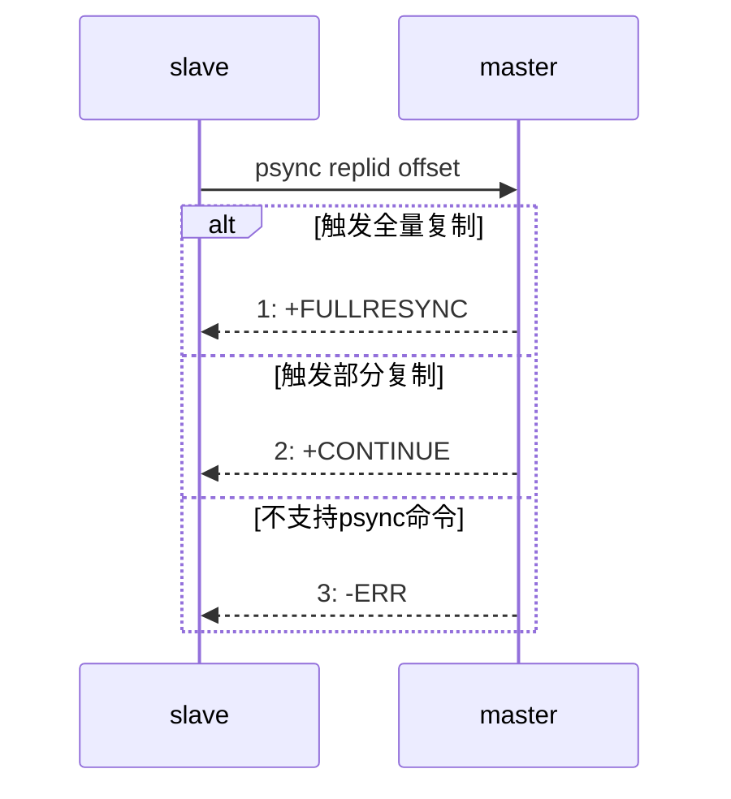

1. 从节点发送psync命令给主节点，replid和offset的默认值分别是`?`和`-1`。
2. 主节点根据psync参数和自身数据情况决定响应结果：
   - 如果回复`+FULLRESYNC replid offset`，则从节点需要进行全量复制流程。
   - 如果回复`+CONTINUE`，从节点进行部分复制流程。
   - 如果回复`-ERR`，说明Redis主节点版本过低，不支持psync命令。从节点可以使用`sync`命令进行全量复制。

补充说明：

- psync一般不需要手动执行，**Redis会在主从复制模式下自动调用执行**。
- 老版本redis `sync` 会阻塞redis server处理其他请求，`psync` 则不会。


### 全量复制

全量复制是Redis最早支持的复制方式，也是主从第一次建立复制时必须经历的阶段。

#### 全量复制流程

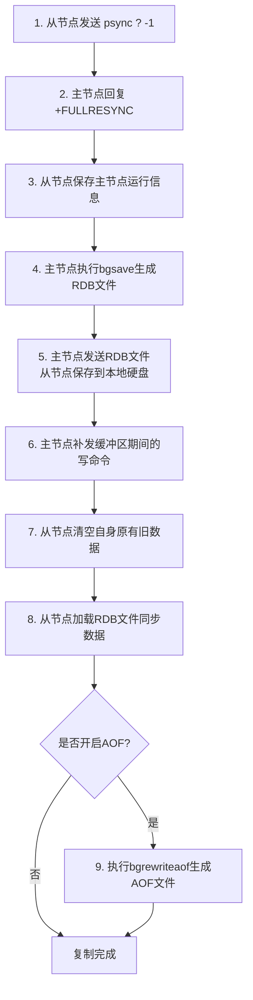

详细步骤说明：

1. 从节点发送psync命令给主节点进行数据同步，由于是第一次进行复制，从节点没有主节点的运行ID和复制偏移量，所以发送`psync ? -1`。
2. 主节点根据命令，解析出要进行全量复制，回复`+FULLRESYNC`响应。
3. 从节点接收主节点的运行信息进行保存。
4. 主节点执行`bgsave`进行RDB文件的持久化。**不用 AOF：主从全量同步需要的是某一时刻的完整数据集快照，RDB 天然就是这个用途，并且压缩的二进制文件便于传输；AOF 保存的是写命令日志，不适合作为全量同步的基础数据文件。**
5. 主节点发送RDB文件给从节点，从节点保存RDB数据到本地硬盘。
6. 主节点将从生成RDB到接收完成期间执行的写命令，写入缓冲区中；等从节点保存完RDB文件后，主节点再将缓冲区内的数据补发给从节点，**补发的数据仍然按照rdb的二进制格式追加写入到收到的rdb文件中，保持主从一致。**
7. 从节点清空自身原有旧数据。
8. 从节点加载RDB文件得到与主节点一致的数据。
9. 如果从节点加载RDB完成之后，并且开启了AOF持久化功能，它会进行`bgrewriteaof`操作，得到最近的AOF文件。

通过分析全量复制的所有流程，可以发现全量复制是高成本操作：包含主节点bgsave的时间、RDB在网络传输的时间、从节点清空旧数据的时间、从节点加载RDB的时间等。因此一般应该尽可能避免对已经有大量数据集的Redis进行全量复制。

#### 有磁盘复制 和 无磁盘复制

默认情况下，进行全量复制需要主节点生成RDB文件到主节点的磁盘中，再把磁盘上的RDB文件发送给从节点。Redis从2.8.18版本开始支持无磁盘复制：主节点在执行RDB生成流程时，不会生成RDB文件到磁盘中，**而是直接把生成的RDB数据通过网络发送给从节点，节省了一系列写硬盘和读硬盘的操作开销。**从节点接收到RDB文件后也可以不用保存到硬盘直接进行数据加载。

无磁盘复制的主要优点就是：

> **不用先把 RDB 写入磁盘，再从磁盘读取，而是直接通过网络发送给从节点，减少磁盘 I/O，提高全量同步效率。**

尤其适合**磁盘较慢、主从复制频繁**的场景。


### 部分复制

部分复制主要是Redis针对全量复制的过高开销做出的一种优化措施，使用`psync replicationId offset`命令实现。当从节点正在复制主节点时，如果出现网络闪断或者命令丢失等异常情况时，从节点会向主节点要求补发丢失的命令数据；如果主节点的复制积压缓冲区存在对应数据则直接发送给从节点，保持主从节点复制的一致性。补发的这部分数据一般远远小于全量数据，开销很小。


#### 复制积压缓冲区

复制积压缓冲区是保存在主节点上的一个固定长度的队列，默认大小为1MB，**当主节点有连接的从节点（slave）时被创建。主节点（master）响应写命令时，不但会把命令发送给从节点，还会写入复制积压缓冲区**。

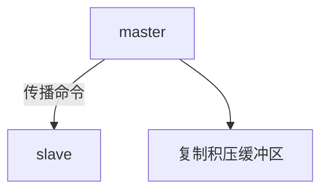

由于缓冲区本质上是先进先出的定长队列，所以能实现保存最近已复制数据的功能，用于部分复制和复制命令丢失的数据补救。复制缓冲区相关统计信息可以通过主节点的`info replication`查看：

```plain
127.0.0.1:6379> info replication
# Replication
role:master
repl_backlog_active:1                // 开启复制缓冲区
repl_backlog_size:1048576            // 缓冲区最大长度
repl_backlog_first_byte_offset:7479  // 起始偏移量，计算当前缓冲区可用范围
repl_backlog_histlen:1048576         // 已保存数据的有效长度
```

#### 部分复制过程

部分复制主要用于**从节点和主节点短暂断开后重新连接**的场景。

例如：

> 从节点已经同步到 offset=1000 → 网络断开 → 主节点继续产生 1001～1050 的写命令 → 从节点重新连接。

只要主节点的**复制积压缓冲区**里还保留着 1001～1050 这些命令，就可以直接把这部分数据补给从节点，**不需要重新传整个 RDB**。

下面是一般流程：

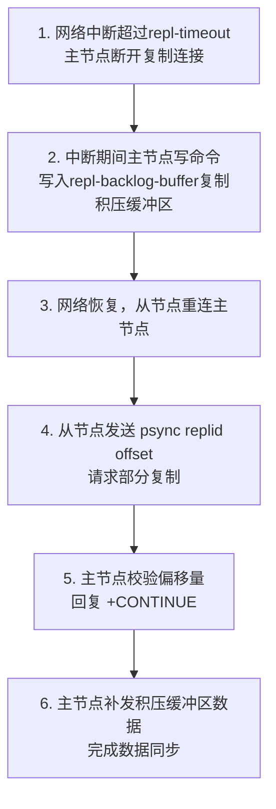

详细步骤说明：

1. 当主从节点之间出现网络中断时，如果超过`repl-timeout`时间，主节点会认为从节点故障并中断复制连接。
2. 主从连接中断期间主节点依然响应命令，但这些复制命令都因网络中断无法及时发送给从节点，**所以暂时将这些命令滞留在复制积压缓冲区中**。
3. 当主从节点网络恢复后，从节点再次连上主节点。
4. 从节点将之前保存的replicationId和复制偏移量作为psync的参数发送给主节点，请求进行部分复制。
5. 主节点接到psync请求后，进行必要的验证。
- **`replid` 是否匹配**：确认从节点之前同步的确实是当前这条复制历史；不匹配就进行全量同步。
- **`offset` 是否还在复制积压缓冲区中**：确认主节点还保存着从节点缺失的那段命令；如果已经满了被覆盖，也只能全量同步。 随后根据offset去复制积压缓冲区查找合适的数据，并响应`+CONTINUE`给从节点。
6. 主节点将需要从节点同步的数据发送给从节点，最终完成一致性。


### 实时复制

主从节点在建立复制连接后，主节点会把自己收到的修改操作，通过TCP长连接的方式，源源不断的传输给从节点；**从节点就会根据这些请求来同时修改自身的数据，从而保持和主节点数据的一致性。**

另外，这样的长连接需要通过应用层心跳包的方式来维护连接状态（不是TCP自带的心跳）：

1. 主从节点彼此都有心跳检测机制，各自模拟成对方的客户端进行通信。
2. 主节点默认每隔10秒对从节点发送`ping`命令，判断从节点的存活性和连接状态。
3. 从节点默认每隔1秒向主节点发送`replconf ack offset`命令，给主节点上报自身当前的复制偏移量。

如果主节点发现从节点通信延迟超过`repl-timeout`配置的值（默认60秒），则判定从节点下线，断开复制客户端连接。从节点恢复连接后，心跳机制继续进行，同时会进行部分复制。

**tips：所有节点不要用同一个aof文件：**

* **如果主从节点共用同一个 AOF 文件**，两个 Redis 实例会同时对同一个文件进行写入，容易造成 AOF 内容混乱甚至损坏，导致无法正确恢复数据。
* **解决方法**：让主节点和从节点使用不同的 AOF 文件，可以修改各自的 `redis.conf`，例如：

  ```conf
  # 主节点
  dir /data/redis/master
  appendfilename "appendonly.aof"

  # 从节点
  dir /data/redis/slave
  appendfilename "appendonly.aof"
  ```

  这样虽然文件名相同，但实际路径不同，不会冲突。


