# .env Redis 配置

输入 `docker exec ubuntu2404 sh -lc 'install -d -m 0755 /var/lib/redis /var/log/redis && redis-server --daemonize yes --dir /var/lib/redis --logfile /var/log/redis/redis-server.log --bind 127.0.0.1 --port 6379'` 启动redis 后，
在运行 `src/test.cpp` 前，请在 `Redis` 目录下创建 `.env` 文件，示例：

```env
REDIS_HOST=127.0.0.1
REDIS_PORT=6379
REDIS_PASSWORD=
REDIS_DB=0
REDIS_CONNECT_TIMEOUT_MS=2000
REDIS_SOCKET_TIMEOUT_MS=2000
```

程序会读取这些配置并连接 Redis，然后执行 `PING` 验证连接。


# 1. RESP 协议

RESP（Redis Serialization Protocol）是 Redis 客户端与服务器之间进行通信所使用的**序列化协议**。它规定了 Redis 命令和返回值在网络中应该如何表示。

例如客户端执行：

```bash
SET name Tom
```

Redis 客户端会按照 RESP 协议将命令编码后发送给服务器，服务器执行完成后，再按照 RESP 格式返回结果。

RESP 的特点是**简单、易解析、效率较高**。

## RESP2 的基本数据类型

| 类型            | 前缀  | 作用               |
| ------------- | --- | ---------------- |
| Simple String | `+` | 表示简单字符串，例如 `+OK` |
| Error         | `-` | 表示错误信息           |
| Integer       | `:` | 表示整数             |
| Bulk String   | `$` | 表示字符串或二进制数据      |
| Array         | `*` | 表示多个元素组成的数组      |

例如：

```text
+OK\r\n
```

表示简单字符串 `OK`。

```text
:100\r\n
```

表示整数 `100`。

```text
$5\r\nhello\r\n
```

表示字符串 `hello`。

Redis 客户端发送命令时，通常会将命令表示为一个 **Array**，数组中的每个参数都是一个 Bulk String。例如：

```text
SET name Tom
```

会表示为：

```text
*3
$3
SET
$4
name
$3
Tom
```

因此可以简单理解为：

> **RESP 就是 Redis 客户端和服务器之间约定的一种通信格式，用来规定“命令怎么发送、结果怎么返回”。**

目前 Redis 还支持 **RESP3**，它在 RESP2 的基础上增加了 Map、Set、Boolean、Null 等数据类型。

[Redis 官方 RESP 协议文档](https://redis.io/docs/latest/develop/reference/protocol-spec/?utm_source=chatgpt.com)


# 2. C++客户端 redis++安装

## 1. 依赖说明

`redis-plus-plus` 基于 C 语言官方客户端 `hiredis` 封装实现，需先安装 hiredis 开发库。

## 2. 安装 hiredis

- **Ubuntu/Debian**

```
apt install libhiredis-dev
```

- **CentOS**

```
yum install hiredis-devel.x86_64
```

## 3. 编译安装 redis-plus-plus

下载源码：

```
git clone https://github.com/sewenew/redis-plus-plus.git
```

### Ubuntu 编译安装

```
cd redis-plus-plus
mkdir build
cd build
cmake ..
make
sudo make install
```

### CentOS 编译安装

CentOS 自带 cmake 版本较低，需先安装 cmake3：

```
yum install cmake3
```

再执行编译安装：

```
cd redis-plus-plus
mkdir build
cd build
cmake3 ..
make
sudo make install
```

### 安装产物

- 头文件路径：`/usr/local/include/sw/redis++/`
- 静态库路径：`/usr/local/lib/`（CentOS 为 `/usr/local/lib64/`）

# 3. cmake编写

```cpp
cmake_minimum_required(VERSION 3.10)
project(RedisClient LANGUAGES CXX)

# redis-plus-plus 当前安装版本使用 std::string_view/std::optional/std::variant 因此必须启用 C++17
set(CMAKE_CXX_STANDARD 17)
set(CMAKE_CXX_STANDARD_REQUIRED ON)

# PkgConfig 用于读取系统库的 .pc 文件；本项目中的 cmake/Findhiredis.cmake 会通过 hiredis.pc 补齐 hiredis 的 CMake 查找能力。
find_package(PkgConfig REQUIRED)
list(APPEND CMAKE_MODULE_PATH "${CMAKE_CURRENT_SOURCE_DIR}/cmake")

# hiredis 是 redis++ 底层依赖，jsoncpp 用于解析 .env 后保存为 Json::Value。
find_package(hiredis REQUIRED)
find_package(jsoncpp REQUIRED)
find_package(redis++ REQUIRED)

# redis_test 是当前示例程序：读取 .env，连接 Redis，并执行 PING。
add_executable(redis_test src/test.cpp)

# 使用导入目标链接第三方库，可以自动携带 include 路径和链接参数。
target_link_libraries(redis_test PRIVATE
    redis++::redis++
    JsonCpp::JsonCpp
)

```

# 4. 通用命令

覆盖 EXISTS、DEL、KEYS、EXPIRE、TTL、PTTL、TYPE 等全局键操作命令。

## GET

* **参数类型**：`StringView key`，对于字符串可读不能写
* **返回值类型**：`std::optional<std::string>`，可能存在值也可能为空
* **含义**：Key 存在返回 value，不存在返回 `std::nullopt`。

## SET

* **参数类型**：`StringView key, StringView value`
* **返回值类型**：`bool`
* **含义**：设置成功返回 `true`，失败或条件不满足返回 `false`。


## EXISTS

* **参数类型**：`StringView key` （也支持传入多个 key）
* **返回值类型**：`long long`
* **含义**：返回**存在的 key 的数量**。

## DEL

* **参数类型**：`StringView key`（也支持传入多个 key）
* **返回值类型**：`long long`
* **含义**：返回**实际删除的 key 的数量**。


## KEYS

* **参数类型**：`StringView pattern`
* **返回值类型**：`void`
* **含义**：将**匹配 `pattern` 的所有 key** 写入你提供的输出迭代器中。Redis++ 的 `keys` 本身不直接返回一个容器。


这里强调一下三个特殊迭代器：
| 类型                           | 创建方式                     | 作用        | 插入位置        | 对应容器操作         | 常见容器                    |
| ---------------------------- | ------------------------ | --------- | ----------- | -------------- | ----------------------- |
| `std::insert_iterator`       | `std::inserter(c, pos)`  | 向指定位置插入元素 | `pos` 指定的位置 | `insert()`     | `vector`、`list`、`set` 等 |
| `std::back_insert_iterator`  | `std::back_inserter(c)`  | 向容器末尾插入元素 | 尾部          | `push_back()`  | `vector`、`deque`、`list` |
| `std::front_insert_iterator` | `std::front_inserter(c)` | 向容器头部插入元素 | 头部          | `push_front()` | `deque`、`list`          |

## EXPIRE

* **参数类型**：`StringView key`、`long long timeout`
* **返回值类型**：`bool`
* **含义**：给指定 key 设置过期时间，设置成功返回 `true`，key 不存在返回 `false`。
## TTL

* **参数类型**：`StringView key`
* **返回值类型**：`long long`
* **含义**：返回 key 的剩余过期时间，单位是秒；`-1` 表示永不过期，`-2` 表示 key 不存在。


## TYPE

* **参数类型**：`StringView key`
* **返回值类型**：`std::string`
* **含义**：返回指定 key 的数据类型，例如 `string`、`list`、`set`、`zset`、`hash`、`stream`；key 不存在时返回 `none`。

测试用函数：
```cpp
void testGenericCommands(sw::redis::Redis &redis)
{
    printf("Generic 系列命令:\n");
    printf("=============================================\n");

    // getset命令
    {
        printf("GetSet 命令\n\n");
        redis.flushdb();
        redis.set("key1", "111");
        auto ret = redis.get("key1");
        if (ret)
            cout << ret.value() << endl; // 由于返回类型是optional，需要判断真假
    }

    // EXISTS 命令
    {
        printf("EXISTS 命令\n\n");
        redis.flushdb();

        bool b;
        b = redis.set("key1", "Hello");
        printf("redis < SET key1 \"Hello\"\n");
        printf("redis > %s\n", b ? "OK" : "(nil)");

        long long e;
        e = redis.exists("key1");
        printf("redis < EXISTS key1\n");
        printf("redis > %lld\n", e);

        e = redis.exists("nosuchkey");
        printf("redis < EXISTS nosuchkey\n");
        printf("redis > %lld\n", e);

        b = redis.set("key2", "World");
        printf("redis < SET key2 \"World\"\n");
        printf("redis > %s\n", b ? "OK" : "(nil)");

        e = redis.exists({"key1", "key2", "nosuchkey"});
        printf("redis < EXISTS key1 key2 nosuchkey\n");
        printf("redis > %lld\n", e);
        printf("\n");
    }

    // DEL 命令
    {
        printf("DEL 命令\n\n");
        redis.flushdb();
        bool b;
        b = redis.set("key1", "Hello");
        printf("redis < SET key1 \"Hello\"\n");
        printf("redis > %s\n", b ? "OK" : "(nil)");

        b = redis.set("key2", "World");
        printf("redis < SET key2 \"World\"\n");
        printf("redis > %s\n", b ? "OK" : "(nil)");

        int d;
        d = redis.del({"key1", "key2", "key3"});
        printf("redis < DEL key1 key2 key3\n");
        printf("redis > %d\n", d);
        printf("\n");
    }

    // KEYS 命令
    {
        printf("KEYS 命令\n\n");
        redis.flushdb();
        std::unordered_map<std::string, std::string> kvs1 = {
            {"firstname", "Jack"},
            {"lastname", "Stuntman"},
            {"age", "35"}};
        redis.mset(kvs1.begin(), kvs1.end()); // 一次设置三个key
        printf("redis < MSET firstname Jack lastname Stuntman age 35\n");
        printf("redis > OK\n");

        std::vector<std::string> keys;
        std::insert_iterator<std::vector<std::string>> ins = std::inserter(keys, keys.begin()); // 创建一个“输出位置”，让 redis.keys() 把找到的 key 放进 keys 里面
        redis.keys("*name*", ins);                                                              // 前面可以有任意字符，后面也可以有任意字符，但中间必须出现 name
        printf("redis < KEYS *name*\n");
        int n = 1;
        for (auto it = keys.begin(); it != keys.end(); ++it)
        {
            printf("redis > %d) %s\n", n++, it->c_str());
        }
    }

    // EXPIRE & TTL 命令
    {
        printf("EXPIRE 命令\n");
        printf("TTL 命令\n\n");
        redis.flushdb();
        bool b;
        b = redis.set("mykey", "Hello");
        printf("redis < SET mykey \"Hello\"\n");
        printf("redis > %s\n", b ? "OK" : "(nil)");

        b = redis.expire("mykey", std::chrono::seconds(10)); // Redis 中的键 mykey 设置 10 秒的过期时间
        printf("redis < EXPIRE mykey 10\n");
        printf("redis > %d\n", b ? 1 : 0);

        long long ttl = redis.ttl("mykey");
        printf("redis < TTL mykey\n");
        printf("redis > %lld\n", ttl);
        printf("\n");
    }

    // TYPE 命令
    {
        printf("TYPE 命令\n\n");
        redis.flushdb();
        bool b;
        b = redis.set("key1", "value");
        printf("redis < SET key1 \"value\"\n");
        printf("redis > %s\n", b ? "OK" : "(nil)");

        long long c = redis.lpush("key2", "value");
        printf("redis < LPUSH key2 \"value\"\n");
        printf("redis > %lld\n", c);

        c = redis.sadd("key3", "value");
        printf("redis < SADD key3 \"value\"\n");
        printf("redis > %lld\n", c);

        std::string type = redis.type("key1");
        printf("redis < TYPE key1\n");
        printf("redis > \"%s\"\n", type.c_str());

        type = redis.type("key2");
        printf("redis < TYPE key2\n");
        printf("redis > \"%s\"\n", type.c_str());

        type = redis.type("key3");
        printf("redis < TYPE key3\n");
        printf("redis > \"%s\"\n", type.c_str());

        printf("=============================================\n");
    }
}
```


# 5. 字符串命令

覆盖 SET、GET、APPEND、GETRANGE、SETEX、INCR/DECR、MSET/MGET 等核心字符串操作。

## 完整代码

```cpp
void testStringCommands(sw::redis::Redis &redis)
{
    printf("String 系列命令:\n");
    printf("=============================================\n");

    // SET 命令（含 NX/XX/过期时间选项）
    {
        printf("SET 命令\n\n");
        redis.flushdb();

        long long e = redis.exists("mykey");
        printf("redis < EXISTS mykey\n");
        printf("redis > %lld\n", e);

        bool b = redis.set("mykey", "Hello");
        printf("redis < SET mykey \"Hello\"\n");
        printf("redis > %s\n", b ? "OK" : "(nil)");

        auto v = redis.get("mykey");
        printf("redis < GET mykey\n");
        if (v)
        {
            printf("redis > \"%s\"\n", v->c_str());
        }
        else
        {
            printf("redis > (nil)\n");
        }

        // NX：键不存在时才设置
        b = redis.set("mykey", "World", std::chrono::milliseconds(0),
                      sw::redis::UpdateType::NOT_EXIST);
        printf("redis < SET mykey \"World\" NX\n");
        printf("redis > %s\n", b ? "OK" : "(nil)");

        long long d = redis.del("mykey");
        printf("redis < DEL mykey\n");
        printf("redis > %lld\n", d);

        // XX：键存在时才设置
        b = redis.set("mykey", "World", std::chrono::seconds(0),
                      sw::redis::UpdateType::EXIST);
        printf("redis < SET mykey \"World\" XX\n");
        printf("redis > %s\n", b ? "OK" : "(nil)");

        v = redis.get("mykey");
        printf("redis < GET mykey\n");
        if (bool(v))
        {
            printf("redis > \"%s\"\n", v->c_str());
        }
        else
        {
            printf("redis > (nil)\n");
        }

        // 设置带过期时间的键
        b = redis.set("mykey", "Will expire in 10s", std::chrono::seconds(10));
        printf("redis < SET mykey \"Will expire in 10s\" EX 10\n");
        printf("redis > %s\n", b ? "OK" : "(nil)");

        v = redis.get("mykey");
        printf("redis < GET mykey\n");
        if (v)
        {
            printf("redis > \"%s\"\n", v->c_str());
        }
        else
        {
            printf("redis > (nil)\n");
        }

        // 等待过期
        for (int i = 10; i > 0; --i)
        {
            printf("Waiting %ds\n", i);
            std::this_thread::sleep_for(std::chrono::seconds(1));
        }

        v = redis.get("mykey");
        printf("redis < GET mykey\n");
        if (v)
        {
            printf("redis > \"%s\"\n", v->c_str());
        }
        else
        {
            printf("redis > (nil)\n");
        }
        printf("\n");
    }

    // GET 命令与批量操作命令
    {
        printf("GET 命令\n\n");
        redis.flushdb();

        auto v = redis.get("nonexisting");
        printf("redis < GET nonexisting\n");
        if (v)
        {
            printf("redis > \"%s\"\n", v->c_str());
        }
        else
        {
            printf("redis > (nil)\n");
        }

        std::unordered_map<std::string, std::string> kvs1 = {
            {"firstname", "Jack"},
            {"lastname", "Stuntman"},
            {"age", "35"}};
        redis.mset(kvs1.begin(), kvs1.end()); // 一次设置多个key
        std::vector<std::string> keys;
        std::insert_iterator<std::vector<std::string>> ins = std::inserter(keys, keys.begin()); // 还是将查询的value插入数组
        redis.mget({"firstname", "lastname"}, ins);                                             // 一次查询多个value
        for (auto it = keys.begin(); it != keys.end(); ++it)
        {
            printf("redis > %d) %s\n", it->c_str());
        }
    }

    // APPEND、GETRANGE 命令
    {
        printf("APPEND 命令\n\n"); // 返回追加字符串后，整个 value 的长度
        redis.flushdb();
        long long c = redis.append("mykey", "Hello");
        printf("redis < APPEND mykey \"Hello\"\n");
        printf("redis > %lld\n", c);
        c = redis.append("mykey", " World");
        printf("redis < APPEND mykey \" World\"\n");
        printf("redis > %lld\n", c);
        printf("\n");

        printf("SETRANGE 命令\n\n");
        redis.set("mykey", "This is a string");
        printf("redis < SETRANGE mykey 0 Redis > %lld\n", redis.setrange("mykey", 0, "Redis"));
        printf("redis < GET mykey > %s\n", redis.get("mykey").value().c_str());

        printf("GETRANGE 命令\n\n"); // 返回指定范围内的字符串，如果不存在则返回空字符串
        redis.set("mykey", "This is a string");
        printf("redis < GETRANGE mykey 0 3 > %s\n", redis.getrange("mykey", 0, 3).c_str());
        printf("redis < GETRANGE mykey -3 -1 > %s\n", redis.getrange("mykey", -3, -1).c_str());
    }

    // 数值增减命令
    {
        printf("INCR / DECR 命令\n\n");
        redis.flushdb();
        printf("redis < INCR mykey > %lld\n", redis.incr("mykey"));
        redis.set("mykey", "10");
        printf("redis < INCR mykey > %lld\n", redis.incr("mykey"));
        printf("redis < DECR mykey > %lld\n", redis.decr("mykey"));
        printf("redis < INCRBY mykey 5 > %lld\n", redis.incrby("mykey", 5));
        printf("redis < INCRBYFLOAT mykey 0.5 > %.2f\n", redis.incrbyfloat("mykey", 0.5));
        printf("=============================================\n");
    }
}
```

# 6. 列表命令

覆盖 LPUSH/RPUSH、LPOP/RPOP、LRANGE、阻塞弹出、索引查询等列表操作。

## 完整代码

```cpp
void testListCommands(sw::redis::Redis &redis)
{
    printf("List 系列命令:\n");
    printf("=============================================\n");

    // 左右压入命令
    {
        printf("LPUSH / RPUSH 命令\n\n");
        redis.flushdb();
        redis.lpush("mylist", "world");            // 左压入一个元素
        redis.lpush("mylist", {"hello", "Redis"}); // 支持一次性压入多个元素

        std::vector<std::string> elements;
        redis.lrange("mylist", 0, -1, std::inserter(elements, elements.begin())); // 获取指定下标范围的元素
        printf("redis < LRANGE mylist 0 -1\n");
        int n = 1;
        for (auto &e : elements)
        {
            printf("redis > %d) %s\n", n++, e.c_str());
        }
    }

    // 弹出命令
    {
        printf("LPOP / RPOP 命令\n\n");
        redis.flushdb();
        redis.rpush("mylist", {"one", "two", "three", "four", "five"}); // 先压入五个元素

        auto left = redis.lpop("mylist"); // 删除并返回 List 左侧的第一个元素；List 不存在或为空时返回 std::nullopt
        printf("redis < LPOP mylist > %s\n", left ? left->c_str() : "(nil)");
        auto right = redis.rpop("mylist");
        printf("redis < RPOP mylist > %s\n", right ? right->c_str() : "(nil)");
        printf("\n");
    }

    // 阻塞弹出 BLPOP/BRPOP
    {
        printf("BLPOP 阻塞弹出命令\n\n");
        redis.flushdb();
        redis.rpush("list1", {"a", "b", "c"});

        auto res = redis.blpop({"list1", "list2"}, std::chrono::seconds(0)); // 成功弹出时，返回 {key, value}；超时没有弹出元素时返回 std::nullopt
        if (res)
        {
            printf("redis > 来自键: %s, 值: %s\n", res->first.c_str(), res->second.c_str());
        }
        printf("\n");
    }

    // 索引与长度
    {
        printf("LINDEX / LLEN 命令\n\n");
        redis.flushdb();
        redis.rpush("mylist", {"Hello", "World"});
        printf("redis < LLEN mylist > %lld\n", redis.llen("mylist"));

        auto val = redis.lindex("mylist", 0); // 类似于get，返回指定下标的元素；不存在时返回 std::nullopt
        printf("redis < LINDEX mylist 0 > %s\n", val ? val->c_str() : "(nil)");
        printf("=============================================\n");
    }
}
```

# 7. 集合命令

覆盖增删查、集合运算（交集、并集、差集）等无序集合操作。

## 完整代码

```cpp
void testSetCommands(sw::redis::Redis &redis)
{
    printf("Set 系列命令:\n");
    printf("=============================================\n");

    // 基础增删查
    {
        printf("SADD / SMEMBERS / SISMEMBER 命令\n\n");
        redis.flushdb();
        redis.sadd("myset", "Hello");
        redis.sadd("myset", "World");
        redis.sadd("myset", "World"); // 重复元素自动去重

        std::unordered_set<std::string> elements;
        redis.smembers("myset", std::inserter(elements, elements.begin()));
        printf("集合元素数量: %zu\n", elements.size());
        printf("是否包含 Hello: %d\n", redis.sismember("myset", "Hello"));

        printf("SISMEMBER 和 SPOP 命令\n\n");
        redis.sadd("myset", {"Hello", "World", "Redis"});
        // SREM：删除集合中的指定元素
        printf("SREM 删除 World: %lld\n", redis.srem("myset", "World"));
        // SPOP：随机删除并返回一个元素
        auto element = redis.spop("myset");
        if (element)
        {
            printf("SPOP 弹出元素: %s\n", element->c_str());
        }
    }

    // 集合运算
    {
        printf("交集 / 并集 / 差集 命令\n\n");
        redis.flushdb();
        redis.sadd("key1", {"a", "b", "c"});
        redis.sadd("key2", {"c", "d", "e"});

        std::unordered_set<std::string> inter;
        redis.sinter({"key1", "key2"}, std::inserter(inter, inter.begin()));
        printf("交集元素数量: %zu\n", inter.size());

        long long count = redis.sinterstore("key3", {"key1", "key2"});

        std::unordered_set<std::string> union_set;
        redis.sunion({"key1", "key2"}, std::inserter(union_set, union_set.begin()));
        printf("并集元素数量: %zu\n", union_set.size());

        std::unordered_set<std::string> diff;
        redis.sdiff({"key1", "key2"}, std::inserter(diff, diff.begin()));
        printf("差集元素数量: %zu\n", diff.size());
    }
}
```

# 8. 哈希命令

覆盖字段读写、批量操作、数值增减等哈希结构操作。

## 完整代码

```cpp
void testHashCommand(sw::redis::Redis &redis)
{
    printf("Hash 系列命令:\n");
    printf("=============================================\n");

    // 基础读写
    {
        printf("HSET / HGET 命令\n\n");
        redis.flushdb();

        redis.hset("key", "f1", "111");
        redis.hset("key", std::make_pair("f2", "222"));
        // hset 能够一次传入多个 field-value 对!!
        redis.hset("key", {std::make_pair("f3", "333"),
                           std::make_pair("f4", "444")});
        vector<std::pair<string, string>> fields = {
            std::make_pair("f5", "555"),
            std::make_pair("f6", "666")};
        redis.hset("key", fields.begin(), fields.end());

        redis.hset("user", "name", "zhangsan");
        redis.hset("user", "age", "20");

        auto name = redis.hget("user", "name");
        auto age = redis.hget("user", "age");
        if (name && age)
        {
            printf("name: %s, age: %s\n", name->c_str(), age->c_str());
        }
    }

    // 批量操作
    {
        printf("HKEYS / HVALS / HMGET 命令\n\n");
        redis.flushdb();
        redis.hset("user", "name", "zhangsan");
        redis.hset("user", "age", "20");

        // HKEYS：获取 Hash 中所有 field
        std::vector<string> keys;
        redis.hkeys("user", std::back_inserter(keys));
        printf("字段数量: %zu\n", keys.size());

        for (const auto &key : keys)
        {
            printf("field: %s\n", key.c_str());
        }

        // HVALS：获取 Hash 中所有 value
        std::vector<string> values;
        redis.hvals("user", std::back_inserter(values));

        printf("值数量: %zu\n", values.size());

        for (const auto &value : values)
        {
            printf("value: %s\n", value.c_str());
        }

        // HMGET：根据多个 field 获取对应的 value
        std::vector<sw::redis::OptionalString> hmget_values;
        vector<string> fields = {"name", "age"};
        redis.hmget("user", fields.begin(), fields.end(), std::back_inserter(hmget_values));
    }

    // 数值增减
    {
        printf("HINCRBY 命令\n\n");
        redis.flushdb();
        redis.hset("user", "age", "20");
        long long new_age = redis.hincrby("user", "age", 2);
        printf("自增后年龄: %lld\n", new_age);
        printf("=============================================\n");
    }
}
```

# 9. 有序集合命令

覆盖带权值的增删查、排名查询、集合运算等有序集合操作。

## 完整代码

```cpp
void testZsetCommand(sw::redis::Redis &redis)
{
    printf("Zset 系列命令:\n");
    printf("=============================================\n");

    // 基础增删与范围查询
    {
        printf("ZADD / ZRANGE 命令\n\n");
        redis.flushdb();
        // 这里其实支持很多插入方式，但是
        redis.zadd("ranking", "吕布", 100);
        redis.zadd("ranking", "赵云", 98);
        redis.zadd("ranking", "典韦", 95);

        vector<std::pair<string, double>> members;
        redis.zrange("ranking", 0, -1, std::inserter(members, members.begin()));
        for (auto &item : members)
        {
            printf("%s: %.0f\n", item.first.c_str(), item.second);
        }
    }

    // 排名与分数查询
    {
        printf("ZRANK / ZSCORE / ZREVRANK / ZCARD 命令\n\n");

        auto rank = redis.zrank("ranking", "吕布"); // 某个成员从小到大排第几
        auto score = redis.zscore("ranking", "吕布");

        printf("吕布的排名(从小到大): %lld, 分数: %.0f\n", rank.value(), score.value());

        rank = redis.zrevrank("ranking", "吕布"); // 某个成员从大到小排第几

        printf("吕布的排名(从大到小): %lld\n", rank.value());

        auto count = redis.zcard("ranking");
        printf("ranking中的成员数量: %lld\n", count);

        auto result = redis.zrem("ranking", "吕布");
        printf("删除了 %lld 个成员\n", result);
    }

    // 交集运算
    {
        printf("ZINTERSTORE 命令\n\n");
        redis.flushdb();
        redis.zadd("key1", "吕布", 100);
        redis.zadd("key1", "赵云", 98);
        redis.zadd("key2", "吕布", 100);
        redis.zadd("key2", "关羽", 92);

        long long count = redis.zinterstore("result", {"key1", "key2"});
        printf("交集结果数量: %lld\n", count);
    }
}
```


# 持久化
Redis支持RDB和AOF两种持久化机制，持久化功能有效地避免因进程退出造成数据丢失问题，当下次重启时利用之前持久化的文件即可实现数据恢复。下面主要介绍的是：
- RDB、AOF的配置和运行流程，以及控制持久化的命令
- 对常见持久化问题进行分析定位和优化

这里我用**最直接、最直白、最不饶弯子、最简洁、最明了、最精炼**的一句话描述关系：RDB 是**定期把内存数据生成快照保存**，AOF 是**记录每一次写操作命令**，因此 RDB 文件更小、恢复更快，而 AOF 数据更完整、丢失数据更少。

## RDB
RDB持久化是把当前进程数据生成快照保存到硬盘的过程，触发RDB持久化过程分为**手动触发和自动触发。**

### 触发机制
手动触发分别对应save和bgsave命令：
- **save命令**：阻塞当前Redis服务器，直到RDB过程完成为止，**对于内存比较大的实例造成长时间阻塞，基本不采用**。
- **bgsave命令**：Redis进程执行fork操作创建子进程，**RDB持久化过程由子进程负责，完成后自动结束。阻塞只发生在fork阶段，一般时间很短**。

Redis内部的所有涉及RDB的操作都采用类似bgsave的方式。RDB 的配置主要在 **`redis.conf`** 中，一般保存在 `/usr/src/redis-5.0.14/redis.conf `通常关注两个地方：

除了手动触发之外，Redis运行自动触发RDB持久化机制：
1. 使用save配置。如`save m n`表示m秒内数据集发生了n次修改，自动RDB持久化。
```conf
save 900 1
save 300 10
save 60 10000
```
> **900 秒内至少修改 1 次，就自动执行 RDB；300 秒内修改 10 次；60 秒内修改 10000 次。**


2. 从节点进行全量复制操作时，主节点自动进行RDB持久化，随后将RDB文件内容发送给从节点。
3. 执行shutdown命令关闭Redis时，执行RDB持久化。


### 流程说明
bgsave是主流的RDB持久化方式，其运作流程如下：

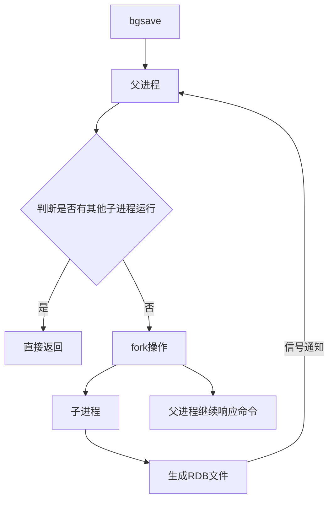

详细执行步骤：
1. 执行bgsave命令，Redis父进程判断当前**是否存在其他正在执行的子进程（如RDB/AOF子进程）**，如果存在则bgsave命令直接返回。
2. 父进程执行fork创建子进程，fork过程中父进程会阻塞，*通过`info stats`命令查看`latest_fork_usec`选项，可以获取最近一次fork操作的耗时，单位为微秒。*
3. 父进程fork完成后，bgsave命令返回"Background saving started"信息并不再阻塞父进程，可以继续响应其他命令。
4. 子进程创建RDB文件，根据父进程内存**生成临时快照文件，完成后对原有文件进行文件替换**。执行`lastsave`命令可以获取最后一次生成RDB的时间，对应info统计的`rdb_last_save_time`选项。
5. 子进程**发送信号给父进程表示完成**，父进程更新统计信息。

### RDB文件的处理
- **保存**：RDB文件保存在dir配置指定的目录（默认`/var/lib/redis/`）下，文件名通过`dbfilename`配置（默认`dump.rdb`）指定。可以通过执行`config set dir {newDir}`和`config set dbfilename {newFilename}`在运行期间动态修改，当下次运行时RDB文件会保存到新目录。
- **压缩**：Redis默认采用LZF算法对生成的RDB文件做压缩处理，压缩后的文件远远小于内存大小，默认开启，可以通过参数`config set rdbcompression {yes|no}`动态修改。

> 压缩RDB会消耗CPU，但可以大幅降低文件的体积，方便保存到硬盘或通过网络发送到从节点，因此建议开启。

- **校验**：如果Redis启动时加载到损坏的RDB文件会拒绝启动。这时可以使用Redis提供的`redis-check-dump`工具检测RDB文件并获取对应的错误报告。


### RDB的优缺点
- RDB是一个紧凑压缩的二进制文件，代表Redis在某个时间点上的数据快照。非常适用于备份、全量复制等场景。比如每6小时执行bgsave备份，并把RDB文件复制到远程机器或者文件系统中（如HDFS）用于灾备。
- **Redis加载RDB恢复数据远远快于AOF的方式。**
- RDB方式数据没办法做到实时持久化/秒级持久化。因为bgsave每次运行都要执行fork创建子进程，属于重量级操作，频繁执行成本过高。
- RDB文件使用特定二进制格式保存，Redis版本演进过程中有多个RDB版本，兼容性可能有风险。
- RDB 的缺点是**只能恢复到最近一次快照，快照之间发生的写操作无法记录，Redis 宕机时可能丢失这部分数据**。

在下面这些场景中，RDB可能也会出错：
* **磁盘空间不足**：没有足够空间写入 RDB 文件。
* **没有写权限**：Redis 无法在指定目录创建或修改 RDB 文件。
* **磁盘故障**：磁盘损坏、挂载异常等导致无法写入。
* **`fork()` 失败**：系统内存不足或进程资源达到限制，无法创建 RDB 子进程。
* **Redis 进程被强制终止**：例如 `kill -9`、系统断电等，**来不及完成 RDB 保存**。
* **RDB 保存过程中发生其他系统错误**：例如文件系统异常等。


## AOF
AOF（Append Only File）持久化：以独立日志的方式记录每次写命令，重启时再重新执行AOF文件中的命令达到恢复数据的目的。AOF的主要作用是解决了数据持久化的实时性，目前已经是Redis持久化的主流方式。**如果 RDB 和 AOF 都开启，Redis 重启恢复数据时以 AOF 为准。**

### 使用
开启AOF功能需要在 `redis.conf` 设置配置：`appendonly yes`，默认不开启。

AOF文件名通过`appendfilename`配置（默认是`appendonly.aof`）设置。保存目录同RDB持久化方式一致，通过`dir`配置指定。
AOF的工作流程包含四个环节：**命令写入（append）、文件同步（sync）、文件重写（rewrite）、重启加载（load）。**

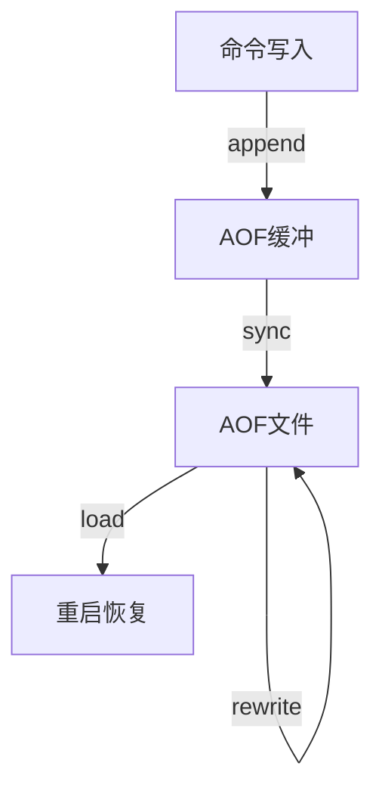

流程说明：
1. 所有的写入命令会追加到aof_buf（AOF 缓冲区）中，缓冲区之后还要写入文件缓冲区，之后才能写入到磁盘：
```plain
Redis内存
   ↓
aof_buf（Redis自己的AOF缓冲区）
   ↓ write()
OS Page Cache（操作系统文件缓存）
   ↓ fsync()
磁盘
```
2. 文件缓冲区根据对应的策略向硬盘做同步操作。
3. 随着AOF文件越来越大，需要定期对AOF文件进行重写，达到压缩的目的。
4. 当Redis服务器启动时，可以加载AOF文件进行数据恢复。

### 命令写入
AOF命令写入的内容直接是文本协议格式。例如`set hello world`这条命令，在AOF缓冲区会追加如下文本：
```
*3\r\n$3\r\nset\r\n$5\r\nhello\r\n$5\r\nworld\r\n
```

此处遵守Redis格式协议，Redis选择文本协议可能的原因：文本协议具备较好的兼容性；实现简单；具备可读性。


### 文件同步
Redis提供了多种同步文件策略，由参数`appendfsync`控制，不同值的含义如下表所示。

| 可配置值 | 说明 |
| :--- | :--- |
| always | 命令写入aof_buf后调用fsync同步，完成后返回 |
| everysec | 命令写入aof_buf后只执行write操作，不进行fsync。每秒由同步线程进行fsync。 |
| no | 命令写入aof_buf后只执行write操作，由OS控制fsync频率。 |

系统调用write和fsync说明：
- write操作会触发延迟写（delayed write）机制。write操作在写入系统缓冲区后立即返回。同步硬盘操作依赖于系统调度机制，例如：缓冲区页空间写满或达到特定时间周期。同步文件之前，如果此时系统故障宕机，缓冲区内数据将丢失。
- **fsync针对单个文件操作，做强制硬盘同步，fsync将阻塞直到数据写入到硬盘**。
- 配置为always时，每次写入都要同步AOF文件，性能很差不建议配置。
- 配置为no时，由于操作系统同步策略不可控，数据丢失风险大增不建议配置。
- 配置为everysec，是默认配置，最多丢失1秒的数据。


### AOF重写

AOF文件会不断变大，因此 Redis 通过**AOF重写**重新生成一个更小的AOF文件：根据当前内存中的数据，**生成能恢复这些数据的最少写命令**。

**为什么能变小：**

* 已过期的数据不再写入。
* 删除旧AOF中的无效命令，如 `DEL`、`HDEL`、`SREM`，只保留最终有效数据。
* 将多条相同类型的操作合并，例如：

  ```bash
  LPUSH list a
  LPUSH list b
  LPUSH list c
  ```

  合并为：

  ```bash
  LPUSH list a b c
  ```

主要可以减少磁盘占用，同时加快 Redis 重启时的数据恢复。

**触发方式：**

* **手动：** `BGREWRITEAOF`
* **自动：** 由以下两个参数控制：

  * `auto-aof-rewrite-min-size`：AOF达到的最小重写大小，默认 **64MB**。
  * `auto-aof-rewrite-percentage`：当前AOF大小相对**上次重写后大小**的增长比例，达到条件后触发重写。


AOF重写的运行流程如下：

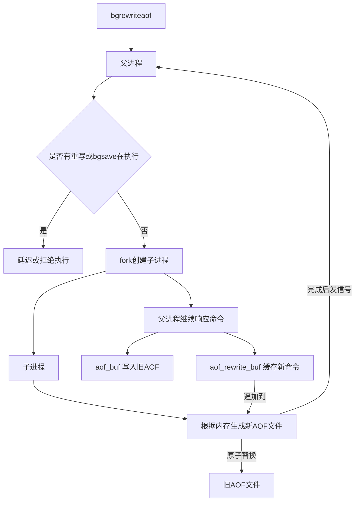

执行步骤：
1. 执行AOF重写请求。
   **如果当前进程正在执行AOF重写，请求不执行。如果当前进程正在执行bgsave操作，重写命令延迟到bgsave完成之后再执行。**
2. 父进程执行fork创建子进程。
3. 重写阶段
   a. 主进程fork之后，继续响应其他命令。所有修改操作写入AOF缓冲区并根据appendfsync策略同步到硬盘，保证旧AOF文件机制正确。
   b. **子进程只有fork之前的所有内存信息，父进程中需要将fork之后这段时间的修改操作写入AOF重写缓冲区中。**
4. 子进程根据内存快照，将命令合并到**新的AOF文件**中。
5. 子进程完成重写
   a. 新文件写入后，子进程发送信号给父进程。
   b. **父进程把AOF重写缓冲区内临时保存的命令追加到新AOF文件中**。
   c. 用新AOF文件替换老AOF文件。

重写时要注意混合式持久化：
* **Redis 4.0** 开始支持混合持久化。
* 配置项：`aof-use-rdb-preamble yes`。
* **AOF 重写时**，先把当前内存数据以 **RDB 格式**（二进制格式）写入 AOF 文件，再把重写期间产生的新写命令以 **AOF 格式**（文本格式）追加到后面。
* 特点：**兼顾 RDB 的恢复速度和 AOF 的数据完整性**，相比纯 AOF 文件更小、恢复更快。

### 启动时数据恢复
当Redis启动时，会根据RDB和AOF文件的内容进行数据恢复，流程如下：

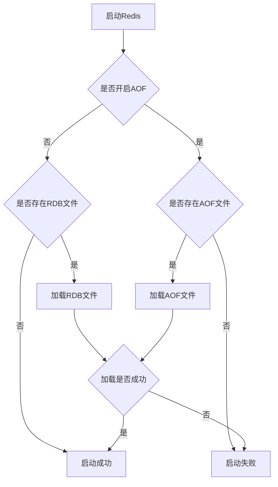

**注意两种不同持久化方式的特点：**

```text
RDB：读取快照 → 直接恢复数据
AOF：读取命令 → 逐条执行 → 恢复数据
```

所以一般来说：

> **RDB 文件更紧凑、需要执行的操作更少，因此恢复速度通常比 AOF 快。**


# 事务

## 概念
Redis 事务和 MySQL 事务区别：

- **弱化了原子性**：Redis 没有“回滚机制”，只能做到操作批量执行，不能做到“一个失败就恢复到初始状态”。
- **不保证一致性**：不涉及数据约束，也没有回滚机制。MySQL 的一致性体现为事务运行前后结果都合理有效，不会出现中间非法状态。
- **不需要隔离性**：没有隔离级别，因为 Redis 单线程处理请求，不会并发执行事务，所有事务都串行执行。
- **不需要持久性**：数据保存在内存中，是否开启持久化以及具体的持久化方式由 redis-server 自身决定，和事务无关。

Redis 事务本质是在服务端维护一个“事务队列”：每次客户端在事务中执行操作，命令会先发送到服务器并放入事务队列，不会立即执行；直到收到 `EXEC` 命令后，才会执行队列中的所有操作。

> 事务中的命令按顺序连续执行，中间不会插入其他客户端的命令，所以不会出现事务执行过程中被其他事务“插队”的问题。


## 事务操作

### MULTI

开启一个事务，执行成功返回 `OK`。

**实例**

```
127.0.0.1:6379> MULTI
OK
```

### EXEC

提交并真正执行事务队列中的所有命令。

**实例**

```
127.0.0.1:6379> MULTI
OK
127.0.0.1:6379> set k1 1
QUEUED
127.0.0.1:6379> set k2 2
QUEUED
127.0.0.1:6379> set k3 3
QUEUED
127.0.0.1:6379> EXEC
1) OK
2) OK
3) OK
```

每次添加操作都会返回 `QUEUED`，表示命令已进入事务队列。执行 `EXEC` 后命令才在服务端执行，此时可以读取到对应的值：

```
127.0.0.1:6379> get k1
"1"
127.0.0.1:6379> get k2
"2"
127.0.0.1:6379> get k3
"3"
```

### DISCARD

放弃当前事务，直接清空事务队列，所有入队的操作都不会真正执行。

**实例**

```
127.0.0.1:6379> MULTI
OK
127.0.0.1:6379> set k1 1
QUEUED
127.0.0.1:6379> set k2 2
QUEUED
127.0.0.1:6379> DISCARD
OK

127.0.0.1:6379> get k1
(nil)
127.0.0.1:6379> get k2
(nil)
```

### WATCH

用于解决并发修改带来的数据不一致问题：如果事务要修改的 key 在执行前被其他客户端改动，事务会执行失败。

#### 并发问题示例

客户端1先开启事务并入队命令：

```
127.0.0.1:6379> MULTI
OK
127.0.0.1:6379> set key 100
QUEUED
```

客户端2在客户端1提交前修改同一个 key：

```
127.0.0.1:6379> set key 200
OK
```

客户端1提交事务：

```
127.0.0.1:6379> EXEC
OK
```

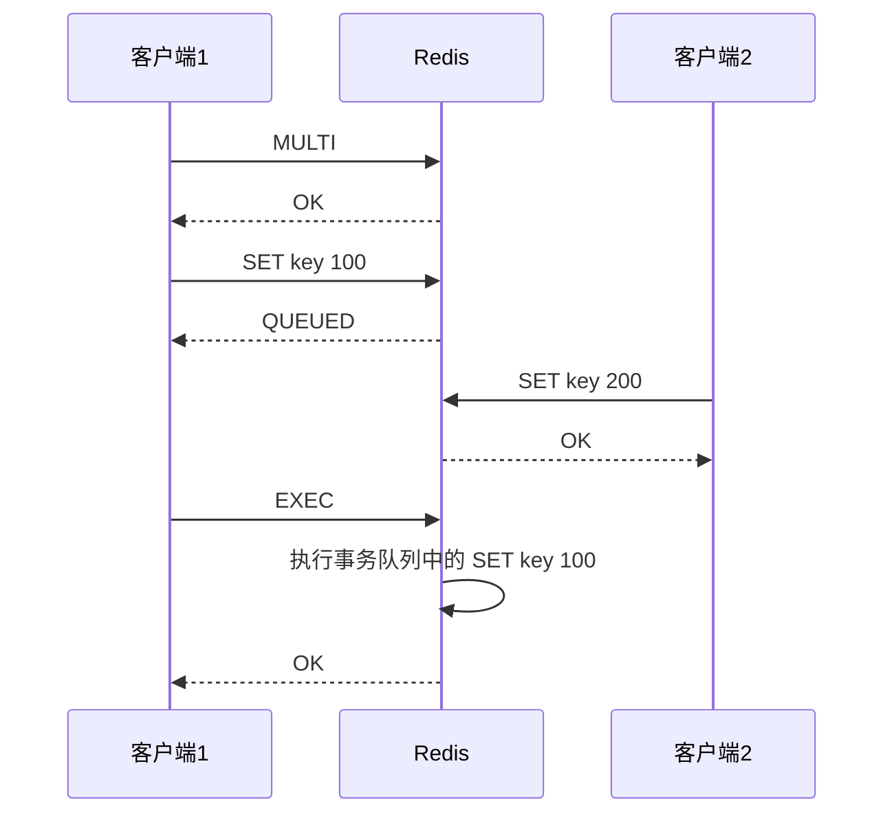

最终 key 的值为 `100`。从输入顺序看客户端1先执行、客户端2后执行，但实际执行顺序是客户端2先写、客户端1后写，最终结果覆盖了客户端2的修改，容易产生业务歧义。

#### WATCH 工作机制

* **悲观锁**：先把资源锁住，阻止其他人修改，自己操作完成后再释放锁。
* **乐观锁**：不加锁，操作前先记录状态，提交时检查数据是否被别人修改过。

**`WATCH` 的工作机制类似于乐观锁**，在客户端监控一组指定的 key：

- 开启事务时，记录被监控 key 的当前版本号（版本号为整数，每次修改都会自增，由服务端维护）。
- 提交事务时，如果服务端 key 的版本号已经大于事务开始时记录的版本号，事务直接执行失败，所有命令都不执行，**证明监控的key已经被修改过了。**

**实例**
客户端1先执行监控并开启事务：

```
127.0.0.1:6379> watch k1    # 开始监控 k1
OK
127.0.0.1:6379> MULTI
OK
127.0.0.1:6379> set k1 100    # 记录当前 k1 版本号为 0，命令入队暂不执行
QUEUED
127.0.0.1:6379> set k2 1000
QUEUED
```

客户端2修改 k1，使服务端版本号从 0 变为 1：

```
127.0.0.1:6379> set k1 200
OK
```

客户端1提交事务，版本校验失败，事务取消：

```
127.0.0.1:6379> EXEC          # 对比版本号：客户端记录 0，服务端已为 1，版本不一致，事务失败
(nil)
127.0.0.1:6379> get k1
"200"
127.0.0.1:6379> get k2
(nil)
```
其他客户端修改了被 WATCH 的 key → 当前客户端的 EXEC 失败 → 当前事务里的命令不会执行，所以最终保留的是别人修改后的结果。

### UNWATCH

取消对 key 的监控，是 `WATCH` 的逆操作。

# 主从复制
一般有三种是 Redis 常见的部署/高可用模式：

1. **主从模式**

   * 一个 Master，多个 Slave。
   * Master 负责写，Slave 复制数据，主要用于**读扩展和数据备份**。
   * **缺点**：Master 挂掉后，通常需要人工处理故障转移。

2. **主从 + 哨兵模式（Sentinel）**

   * 在主从基础上增加 Sentinel。
   * Sentinel 会**监控节点、自动发现故障并选举新的 Master**。
   * 主要解决**主节点自动故障转移**问题。

3. **集群模式（Redis Cluster）**

   * 多个 Master + Slave，并把数据**分片到不同 Master**。
   * 可以同时解决**高并发和大数据量**问题。
   * 复杂度最高，但扩展能力最强。


在分布式系统中，为了解决单点故障问题，通常会将数据复制为多个副本部署在不同服务器，满足故障恢复、负载均衡等需求。Redis 的复制功能是高可用的基础，哨兵、集群模式都基于复制构建。

## 配置

### 建立复制

参与复制的 Redis 实例分为**主节点（master）**和**从节点（slave）**：每个从节点只能有一个主节点，一个主节点可以挂载多个从节点；数据流向是单向的，只能从主节点同步到从节点，**主节点负责写入数据和读取数据，从节点负责读取数据不可以写入数据，并且会从主节点同步数据。**

配置复制的三种方式：

1. 配置文件中写入 `slaveof {masterHost} {masterPort}`，随 Redis 启动生效
2. 启动命令中添加 `--slaveof {masterHost} {masterPort}` 生效
3. 运行时执行 redis 命令 `slaveof {masterHost} {masterPort}` 生效

#### 配置步骤

复制一份从节点配置文件 `redis-slave.conf`，开启守护进程：

```
# By default Redis does not run as a daemon. Use 'yes' if you need it.
# Note that Redis will write a pid file in /var/run/redis.pid when daemonized.
daemonize yes
```

默认端口 6379 的实例作为主节点，启动端口 6380 的从节点实例：

```
# ubuntu
redis-server redis-slave.conf路径 --port 6380 --slaveof 127.0.0.1 6379

# centos
redis-server redis-slave.conf路径 --port 6380 --slaveof 127.0.0.1 6379
```

通过 `netstat -nlpt` 验证两个实例都已启动：

```
tcp        0      0 127.0.0.1:6379          0.0.0.0:*               LISTEN      209656/redis-server
tcp        0      0 127.0.0.1:6380          0.0.0.0:*               LISTEN      778534/redis-server
tcp        0      0 127.0.0.1:6381          0.0.0.0:*               LISTEN      778635/redis-server
```

验证数据同步效果：
主节点写入数据：

```
127.0.0.1:6379> set hello world
OK
127.0.0.1:6379> get hello
"world"
```

从节点读取数据：

```
127.0.0.1:6380> get hello
"world"
```

#### 主从复制基础流向

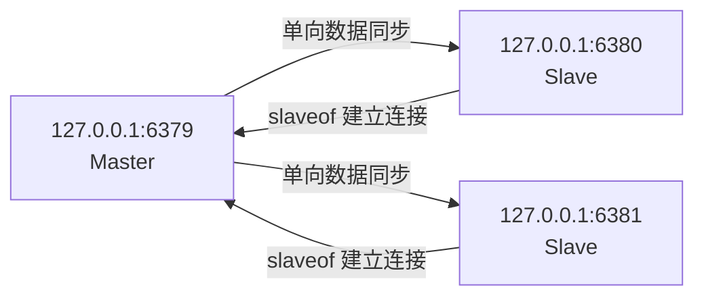

#### 复制状态查看

通过 `info replication` 命令查看主从节点的复制状态。

**主节点 6379 状态**

```
127.0.0.1:6379> info replication
# Replication
role:master                                     # 当前 Redis 节点的角色：主节点
connected_slaves:2                              # 当前连接的从节点数量：2 个

slave0:ip=127.0.0.1,port=6380,state=online,offset=796,lag=1
                                                # 第 1 个从节点
                                                # ip=127.0.0.1：从节点 IP
                                                # port=6380：从节点端口
                                                # state=online：从节点在线
                                                # offset=796：从节点当前已经同步到的位置
                                                # lag=1：距离上次与主节点通信约 1 秒

slave1:ip=127.0.0.1,port=6381,state=online,offset=796,lag=0
                                                # 第 2 个从节点
                                                # ip=127.0.0.1：从节点 IP
                                                # port=6381：从节点端口
                                                # state=online：从节点在线
                                                # offset=796：从节点当前已经同步到的位置
                                                # lag=0：当前没有明显延迟

master_replid:def3ebeb6ed8a1cef6487a8140026fc14dc18200
                                                # 当前主节点的复制 ID
                                                # 用于标识当前这套主节点复制历史

master_replid2:0000000000000000000000000000000000000000
                                                # 上一个主节点的复制 ID
                                                # 这里全是 0，表示当前没有有效的上一个复制 ID

master_repl_offset:796                         # 主节点当前的复制偏移量
                                                # 表示主节点已经产生/记录到复制流中的位置

second_repl_offset:-1                           # 上一个复制 ID 对应的偏移量
                                                # -1 表示当前没有可用的第二复制历史

repl_backlog_active:1                            # 复制积压缓冲区是否启用
                                                # 1 表示已启用

repl_backlog_size:1048576                       # 复制积压缓冲区大小
                                                # 1048576 字节 = 1 MB

repl_backlog_first_byte_offset:1                # 复制积压缓冲区中最早数据的偏移量

repl_backlog_histlen:796                        # 当前复制积压缓冲区中实际保存了多少字节的历史数据
```

**从节点 6380 状态**

```
127.0.0.1:6380> info replication
# Replication
role:slave
master_host:127.0.0.1
master_port:6379
master_link_status:up
master_last_io_seconds_ago:1
master_sync_in_progress:0
slave_repl_offset:100
slave_read_only:1
connected_slaves:0
master_replid:2fbd35a8b8401b22eb92ff49ad5e42250b3e7a06
master_repl_offset:170
second_repl_offset:-1
repl_backlog_active:1
repl_backlog_size:1048576
repl_backlog_first_byte_offset:1
repl_backlog_histlen:170
```

### 断开复制

在从节点cli中执行 `slaveof no one` 即可断开与主节点的复制关系。

断开复制的流程：

1. 从节点断开与主节点的复制连接
2. 从节点晋升为主节点

断开复制后，从节点不会丢弃已有数据，只是不再接收主节点的新数据变更。

#### 切主操作

`slaveof` 也可以切换主节点，执行 `slaveof {newMasterIp} {newMasterPort}` 即可。

切主操作流程：

1. 断开与旧主节点的复制关系
2. 与新主节点建立复制连接
3. 清空从节点当前所有数据
4. 从新主节点重新执行全量复制

> 注意：使用这个命令只能临时改变主从关系，如果重启redis还是会按照配置文件进行启动

### 安全性

如果主节点配置了 `requirepass` 密码验证，客户端访问需要执行 `auth` 命令。主从复制时，从节点需要配置 `masterauth` 参数，值与主节点密码保持一致，才能正常建立复制连接。

#### 主节点

```conf
port 6379
requirepass 123456
```

#### 从节点 1

```conf
port 6380
replicaof 127.0.0.1 6379
masterauth 123456
```

#### 从节点 2

```conf
port 6381
replicaof 127.0.0.1 6379
masterauth 123456
```

#### 客户端连接主节点

```bash
redis-cli -p 6379
```

```bash
AUTH 123456
SET name zhangsan
```


### 只读

默认配置下，从节点通过 `slave-read-only=yes` 设置为只读模式。

由于复制是主到从的单向同步，**修改从节点的数据无法同步回主节点**，会造成主从数据不一致，不建议关闭从节点的只读模式，从节点就不应该修改。

### 传输延迟

主从节点跨机器部署时，网络延迟是重要考量。Redis 通过 `repl-disable-tcp-nodelay` 参数控制 TCP_NODELAY 开关，默认为 `no`（即关闭 TCP_NODELAY）：

- **关闭时（默认 no）**：主节点产生的命令无论大小都会立即发送给从节点，延迟低，但带宽消耗高，适合同机房、网络条件好的场景。
- **开启时（设为 yes）**：主节点会合并小的 TCP 包再发送，节省带宽但延迟升高（默认间隔约 40ms，由内核决定），适合跨机房、网络环境复杂的场景。

## 拓扑

Redis 复制支持单层、多层拓扑，常见分为三种：一主一从、一主多从、树状主从。

### 一主一从结构

最简单的复制拓扑，用于主节点宕机时从节点提供故障转移。

当写并发较高且需要持久化时，可以只在从节点开启 AOF 持久化，既保证数据安全，又避免持久化影响主节点性能。**注意主节点关闭持久化时，宕机后不要自动重启，否则可能导致数据丢失，应该从从节点获取AOF文件恢复数据**

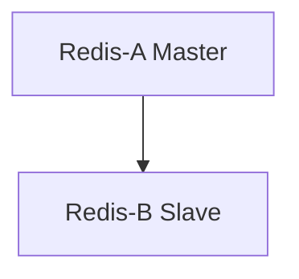

### 一主多从结构

也叫星形结构，适合读多写少的场景，通过多个从节点实现读写分离、读请求负载均衡；也可以将耗时的读命令指定到特定从节点执行，避免影响主业务。

缺点是**写并发高时，主节点需要向多个从节点同步数据，会加重主节点的网络和 CPU 负载。**

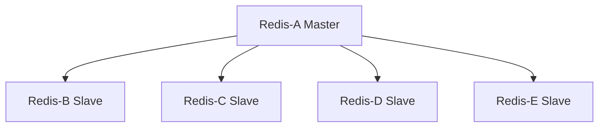

### 树状主从结构

也叫分层结构：从节点既可以从上层节点复制数据，也可以作为主节点向下层从节点同步数据。 **通过中间层分担主节点的复制压力，减少主节点需要直接同步的从节点数量。** 缺点是同步的耗时较长。

数据写入顶层主节点 A 后，同步给中间层 B、C；B 再同步给下层 D、E，适合从节点数量多、需要降低主节点负载的场景。

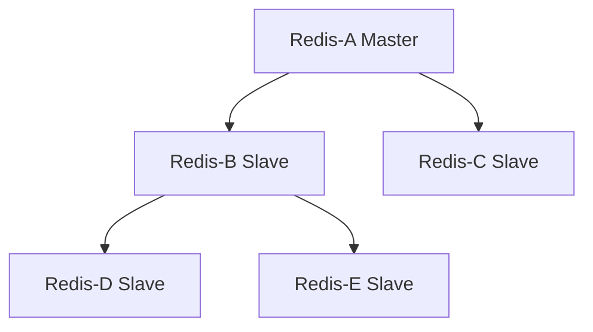

## 原理


### 复制过程

下面详细介绍建立复制的完整流程，复制过程大致分为6个过程：


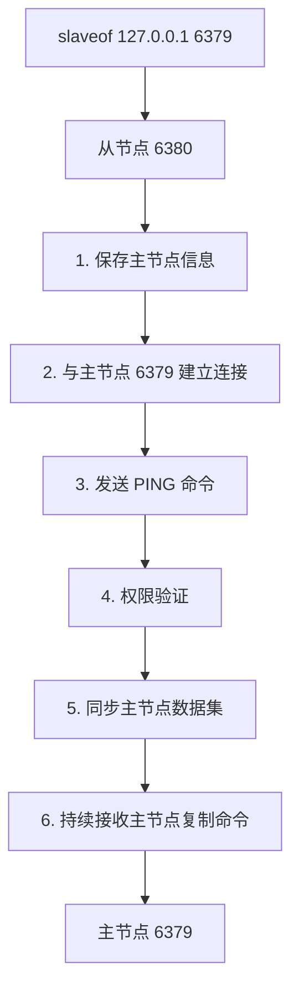

#### 1) 保存主节点（master）的信息

开始配置主从同步关系之后，从节点只保存主节点的地址信息，此时建立复制流程还没有开始，在从节点6380执行`info replication`可以看到如下信息：

```
master_host: 127.0.0.1
master_port: 6379
master_link_status: down
```

从统计信息可以看出，主节点的ip和port被保存下来，但是主节点的连接状态（`master_link_status`）是下线状态。

#### 2) 建立TCP网络连接

从节点（slave）内部通过每秒运行的定时任务维护复制相关逻辑，当定时任务发现存在新的主节点后，会尝试与主节点建立基于TCP的网络连接。如果从节点无法建立连接，定时任务会无限重试直到连接成功或者用户停止主从复制。

#### 3) 发送ping命令

连接建立成功之后，从节点通过`ping`命令确认主节点在应用层上是工作良好的。如果ping命令的结果pong回复超时，从节点会断开TCP连接，等待定时任务下次重新建立连接。

#### 4) 权限验证

如果主节点设置了`requirepass`参数，则需要密码验证，从节点通过配置`masterauth`参数来设置密码。如果验证失败，则从节点的复制将会停止。

#### 5) 同步数据集

对于首次建立复制的场景，主节点会把当前持有的所有数据全部发送给从节点，这步操作基本是耗时最长的，又划分为两种情况：**全量同步和部分同步**

#### 6) 命令持续复制

当从节点复制了主节点的所有数据之后，针对之后的修改命令，主节点会持续的把命令发送给从节点，从节点执行修改命令，保证主从数据的一致性。


### 数据同步 psync

Redis使用`psync`命令完成主从数据同步，同步过程分为：**全量复制**和**部分复制**。

- **全量复制**：一般用于初次复制场景，Redis早期支持的复制功能只有全量复制，**它会把主节点全部数据一次性发送给从节点**，当数据量较大时，会对主从节点和网络造成很大的开销。
- **部分复制**：用于处理在主从复制中因网络闪断等原因造成的数据丢失场景，当从节点再次连上主节点后，如果条件允许，**主节点会补发数据给从节点**。因为补发的数据远小于全量数据，可以有效避免全量复制的过高开销。

### PSYNC 的语法格式

```
PSYNC replicationid offset
```
`replicationid`：从节点之前同步主节点时，由主节点提供并保存下来的复制 ID。
`offset`：从节点根据自己已经接收到的主节点复制数据，维护的复制偏移量。


* 如果 `replicationid` 为 `?`、`offset` 为 `-1`，表示**从节点没有有效的复制历史，向主节点请求全量同步**。
* 如果 `replicationid` 和 `offset` 为具体值，表示**从节点携带已有的复制历史，请求主节点尝试进行部分同步；如果主节点无法满足条件，则会退化为全量同步**。


#### 1. replicationid/replid (复制id)

主节点的复制id。主节点重新启动，或者从节点晋级成主节点，都会生成一个replicationid **（同一个节点，每次重启，生成的replicationid也会变化）**。
从节点在和主节点建立连接之后，就会获取到主节点的replicationid。

通过 `info replication` 看到replicationid：


* `master_replid`：当前节点现在作为**主节点**使用的复制 ID。
* `master_replid2`：这个节点**之前作为从节点时所跟随的那个主节点的复制 ID**；后来因为主节点挂壁了成为新主节点后，把这个旧 ID 保留下来，用于兼容之前的复制历史，支持部分同步。还可以根据这个 旧ID 找回之前的可能恢复的挂壁主节点。


#### 2. offset (偏移量)

参与复制的主从节点都会维护自身复制偏移量。主节点（master）在处理完写入命令后，会把命令的字节长度做累加记录，统计信息在`info replication`中的`master_repl_offset`指标中。


从节点（slave）每秒钟上报自身的复制偏移量给主节点，因此主节点也会保存从节点的复制偏移量，统计指标如下：


从节点在接受到主节点发送的命令后，也会累加记录自身的偏移量。统计信息在`info replication`中的`slave_repl_offset`指标中：


#### 复制偏移量维护

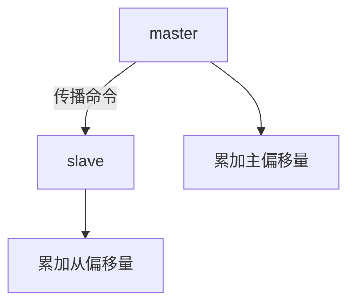

通过对比主从节点的复制偏移量，可以判断主从节点数据是否一致。


>
> **replid + offset 共同标识了一个"数据集"**
> 如果两个节点的replid 和 offset 都相同，则这两个节点上持有的数据就一定相同。


## psync 运行流程

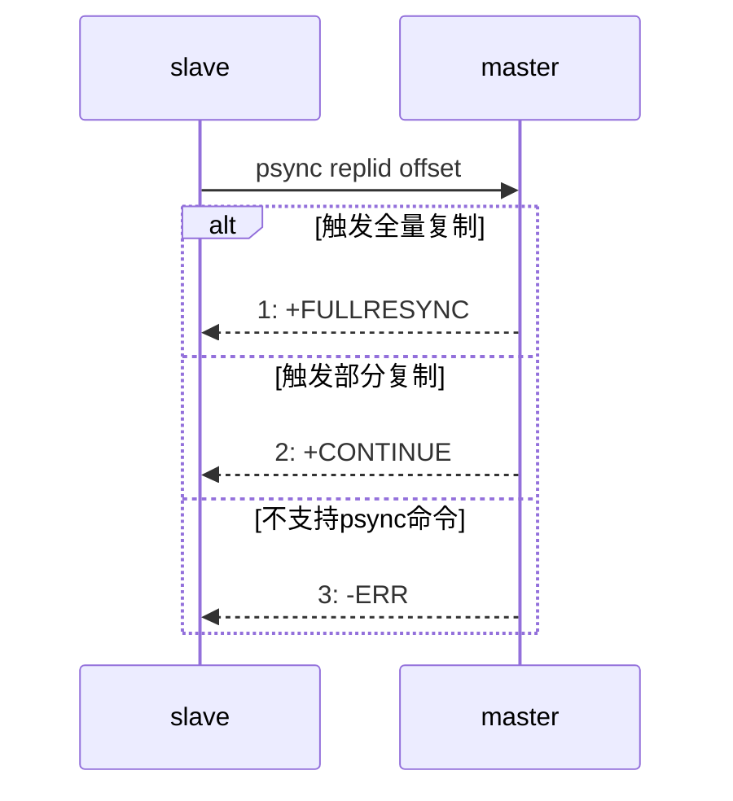

1. 从节点发送psync命令给主节点，replid和offset的默认值分别是`?`和`-1`。
2. 主节点根据psync参数和自身数据情况决定响应结果：
   - 如果回复`+FULLRESYNC replid offset`，则从节点需要进行全量复制流程。
   - 如果回复`+CONTINUE`，从节点进行部分复制流程。
   - 如果回复`-ERR`，说明Redis主节点版本过低，不支持psync命令。从节点可以使用`sync`命令进行全量复制。

补充说明：

- psync一般不需要手动执行，**Redis会在主从复制模式下自动调用执行**。
- 老版本redis `sync` 会阻塞redis server处理其他请求，`psync` 则不会。


### 全量复制

全量复制是Redis最早支持的复制方式，也是主从第一次建立复制时必须经历的阶段。

#### 全量复制流程

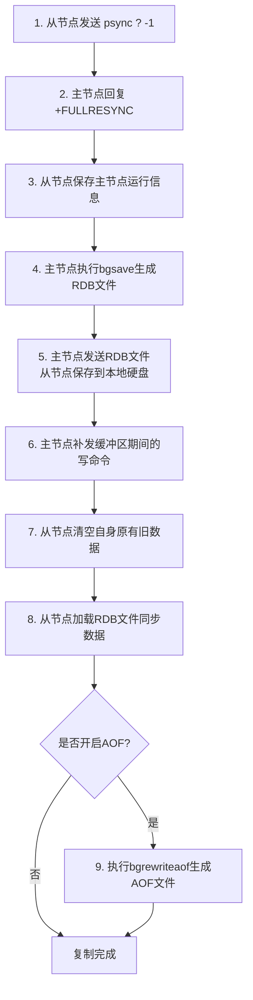

详细步骤说明：

1. 从节点发送psync命令给主节点进行数据同步，由于是第一次进行复制，从节点没有主节点的运行ID和复制偏移量，所以发送`psync ? -1`。
2. 主节点根据命令，解析出要进行全量复制，回复`+FULLRESYNC`响应。
3. 从节点接收主节点的运行信息进行保存。
4. 主节点执行`bgsave`进行RDB文件的持久化。**不用 AOF：主从全量同步需要的是某一时刻的完整数据集快照，RDB 天然就是这个用途，并且压缩的二进制文件便于传输；AOF 保存的是写命令日志，不适合作为全量同步的基础数据文件。**
5. 主节点发送RDB文件给从节点，从节点保存RDB数据到本地硬盘。
6. 主节点将从生成RDB到接收完成期间执行的写命令，写入缓冲区中；等从节点保存完RDB文件后，主节点再将缓冲区内的数据补发给从节点，**补发的数据仍然按照rdb的二进制格式追加写入到收到的rdb文件中，保持主从一致。**
7. 从节点清空自身原有旧数据。
8. 从节点加载RDB文件得到与主节点一致的数据。
9. 如果从节点加载RDB完成之后，并且开启了AOF持久化功能，它会进行`bgrewriteaof`操作，得到最近的AOF文件。

通过分析全量复制的所有流程，可以发现全量复制是高成本操作：包含主节点bgsave的时间、RDB在网络传输的时间、从节点清空旧数据的时间、从节点加载RDB的时间等。因此一般应该尽可能避免对已经有大量数据集的Redis进行全量复制。

#### 有磁盘复制 和 无磁盘复制

默认情况下，进行全量复制需要主节点生成RDB文件到主节点的磁盘中，再把磁盘上的RDB文件发送给从节点。Redis从2.8.18版本开始支持无磁盘复制：主节点在执行RDB生成流程时，不会生成RDB文件到磁盘中，**而是直接把生成的RDB数据通过网络发送给从节点，节省了一系列写硬盘和读硬盘的操作开销。**从节点接收到RDB文件后也可以不用保存到硬盘直接进行数据加载。

无磁盘复制的主要优点就是：

> **不用先把 RDB 写入磁盘，再从磁盘读取，而是直接通过网络发送给从节点，减少磁盘 I/O，提高全量同步效率。**

尤其适合**磁盘较慢、主从复制频繁**的场景。


### 部分复制

部分复制主要是Redis针对全量复制的过高开销做出的一种优化措施，使用`psync replicationId offset`命令实现。当从节点正在复制主节点时，如果出现网络闪断或者命令丢失等异常情况时，从节点会向主节点要求补发丢失的命令数据；如果主节点的复制积压缓冲区存在对应数据则直接发送给从节点，保持主从节点复制的一致性。补发的这部分数据一般远远小于全量数据，开销很小。


#### 复制积压缓冲区

复制积压缓冲区是保存在主节点上的一个固定长度的队列，默认大小为1MB，**当主节点有连接的从节点（slave）时被创建。主节点（master）响应写命令时，不但会把命令发送给从节点，还会写入复制积压缓冲区**。

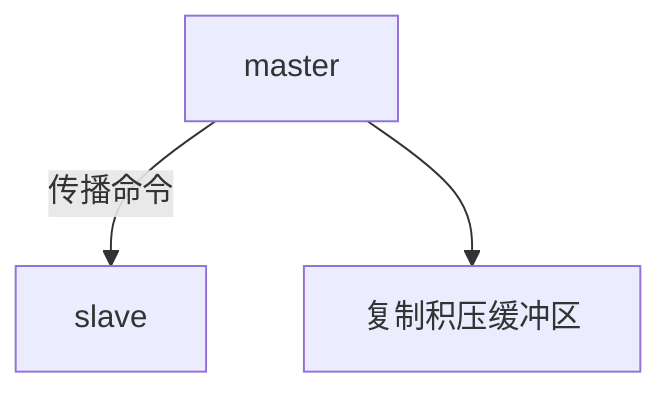

由于缓冲区本质上是先进先出的定长队列，所以能实现保存最近已复制数据的功能，用于部分复制和复制命令丢失的数据补救。复制缓冲区相关统计信息可以通过主节点的`info replication`查看：

```plain
127.0.0.1:6379> info replication
# Replication
role:master
repl_backlog_active:1                // 开启复制缓冲区
repl_backlog_size:1048576            // 缓冲区最大长度
repl_backlog_first_byte_offset:7479  // 起始偏移量，计算当前缓冲区可用范围
repl_backlog_histlen:1048576         // 已保存数据的有效长度
```

#### 部分复制过程

部分复制主要用于**从节点和主节点短暂断开后重新连接**的场景。

例如：

> 从节点已经同步到 offset=1000 → 网络断开 → 主节点继续产生 1001～1050 的写命令 → 从节点重新连接。

只要主节点的**复制积压缓冲区**里还保留着 1001～1050 这些命令，就可以直接把这部分数据补给从节点，**不需要重新传整个 RDB**。

下面是一般流程：

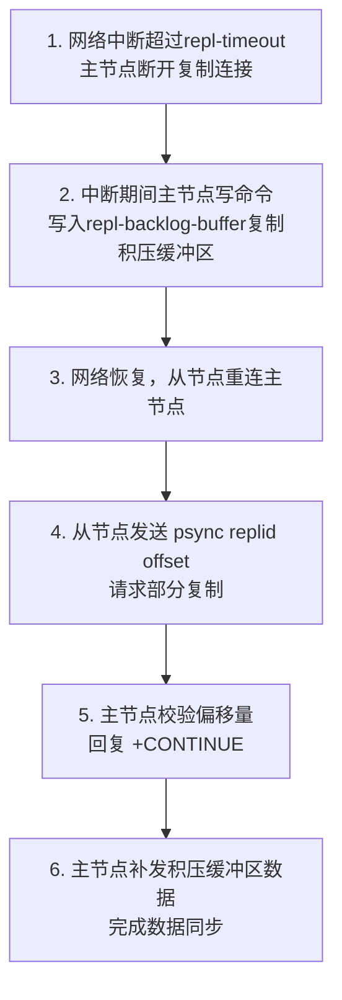

详细步骤说明：

1. 当主从节点之间出现网络中断时，如果超过`repl-timeout`时间，主节点会认为从节点故障并中断复制连接。
2. 主从连接中断期间主节点依然响应命令，但这些复制命令都因网络中断无法及时发送给从节点，**所以暂时将这些命令滞留在复制积压缓冲区中**。
3. 当主从节点网络恢复后，从节点再次连上主节点。
4. 从节点将之前保存的replicationId和复制偏移量作为psync的参数发送给主节点，请求进行部分复制。
5. 主节点接到psync请求后，进行必要的验证。
- **`replid` 是否匹配**：确认从节点之前同步的确实是当前这条复制历史；不匹配就进行全量同步。
- **`offset` 是否还在复制积压缓冲区中**：确认主节点还保存着从节点缺失的那段命令；如果已经满了被覆盖，也只能全量同步。 随后根据offset去复制积压缓冲区查找合适的数据，并响应`+CONTINUE`给从节点。
6. 主节点将需要从节点同步的数据发送给从节点，最终完成一致性。


### 实时复制

主从节点在建立复制连接后，主节点会把自己收到的修改操作，通过TCP长连接的方式，源源不断的传输给从节点；**从节点就会根据这些请求来同时修改自身的数据，从而保持和主节点数据的一致性。**

另外，这样的长连接需要通过应用层心跳包的方式来维护连接状态（不是TCP自带的心跳）：

1. 主从节点彼此都有心跳检测机制，各自模拟成对方的客户端进行通信。
2. 主节点默认每隔10秒对从节点发送`ping`命令，判断从节点的存活性和连接状态。
3. 从节点默认每隔1秒向主节点发送`replconf ack offset`命令，给主节点上报自身当前的复制偏移量。

如果主节点发现从节点通信延迟超过`repl-timeout`配置的值（默认60秒），则判定从节点下线，断开复制客户端连接。从节点恢复连接后，心跳机制继续进行，同时会进行部分复制。

**tips：所有节点不要用同一个aof文件：**

* **如果主从节点共用同一个 AOF 文件**，两个 Redis 实例会同时对同一个文件进行写入，容易造成 AOF 内容混乱甚至损坏，导致无法正确恢复数据。
* **解决方法**：让主节点和从节点使用不同的 AOF 文件，可以修改各自的 `redis.conf`，例如：

  ```conf
  # 主节点
  dir /data/redis/master
  appendfilename "appendonly.aof"

  # 从节点
  dir /data/redis/slave
  appendfilename "appendonly.aof"
  ```

  这样虽然文件名相同，但实际路径不同，不会冲突。


# 哨兵


Redis 从 2.8 开始提供了 Redis Sentinel（哨兵）**用于监控 Redis 主从节点，当主节点故障时，自动选择一个从节点提升为新的主节点，实现自动故障转移。**


**注意一般分为两种情况：**

* **从节点主动断开与主节点的连接**：Sentinel 一般**不会**因此把这个从节点提升为主节点，因为这是**从节点自身下线**，主节点并没有发生故障；Sentinel 的故障转移主要针对**主节点故障**。

* **主节点真正挂掉**：Sentinel 检测到主节点客观下线后，会选择一个健康的从节点，将它**提升为新的主节点**，这就是自动故障转移。


## 概念


| 名词 | 逻辑结构 | 物理结构 |
| --- | --- | --- |
| 主节点 | Redis 主服务 | 一个独立的 redis-server 进程 |
| 从节点 | Redis 从服务 | 一个独立的 redis-server 进程 |
| Redis 数据节点 | 主从节点 | 主节点和从节点的进程 |
| 哨兵节点 | 监控 Redis 数据节点的节点 | 一个独立的 redis-sentinel 进程 |
| 哨兵节点集合 | 若干哨兵节点的抽象组合 | 若干 redis-sentinel 进程 |
| Redis 哨兵（Sentinel） | Redis 提供的高可用方案 | 哨兵节点集合 + Redis 主从节点 |
| 应用方 | 泛指一个或多个客户端 | 一个或多个连接 Redis 的进程 |


### 主从复制的问题

主从复制可以实现**数据备份和读写分离**，但仍存在两个问题：

1. **高可用问题**：主节点宕机后，需要人工切换从节点，故障恢复慢。→ **Redis Sentinel 解决**
2. **扩展性问题**：只能分担读压力，写压力和存储压力仍受单机限制。→ **Redis Cluster 解决**

本章主要介绍 **Redis Sentinel 如何解决主节点故障后的高可用问题**。


### 人工恢复主节点故障

在主从复制模式下，主节点故障后的人工恢复流程非常繁琐，整体过程如下：

#### 阶段1：正常运行的主从架构

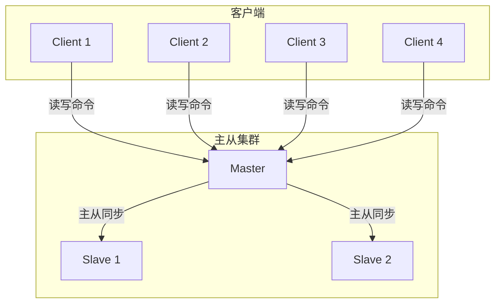

#### 阶段2：主节点宕机，人工发现

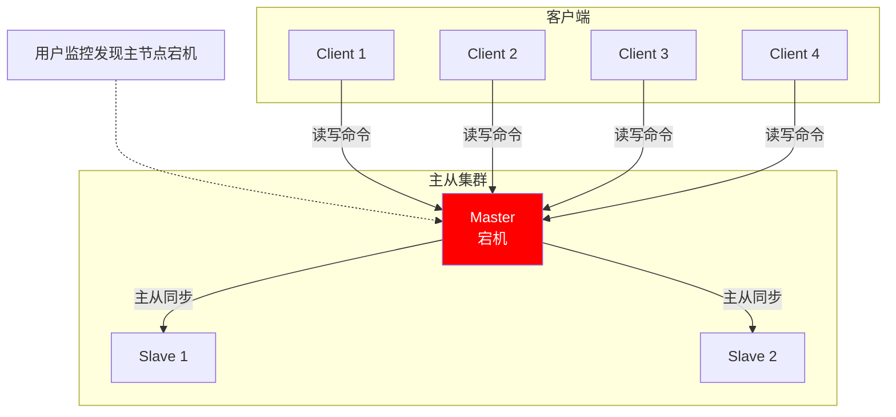

#### 阶段3：人工选定新主节点

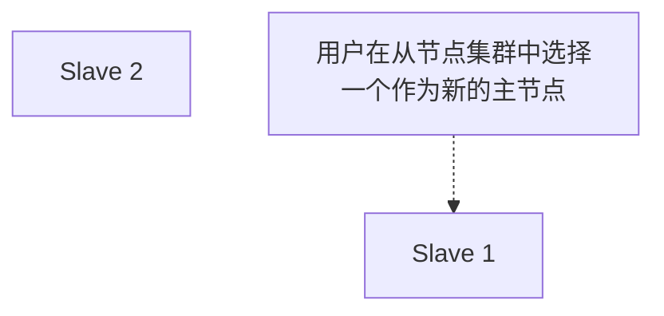

#### 阶段4：调整从节点同步关系

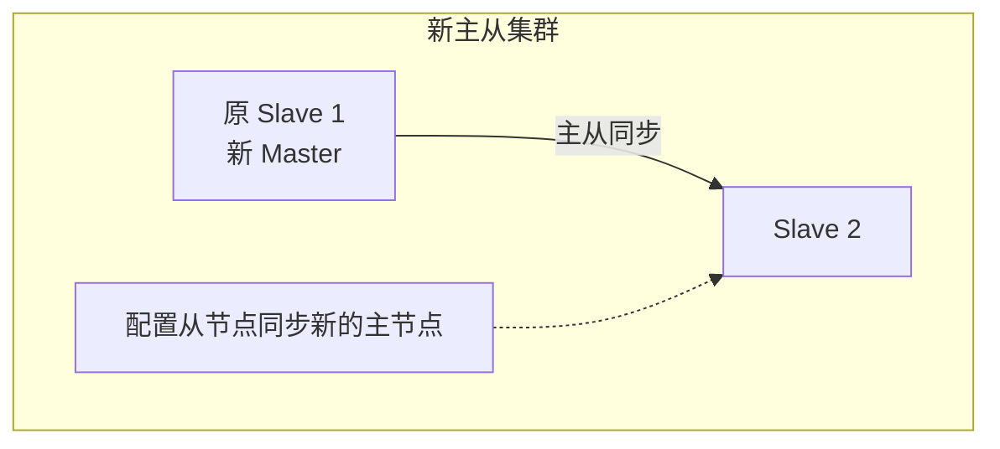

#### 阶段5：客户端切换到新主节点

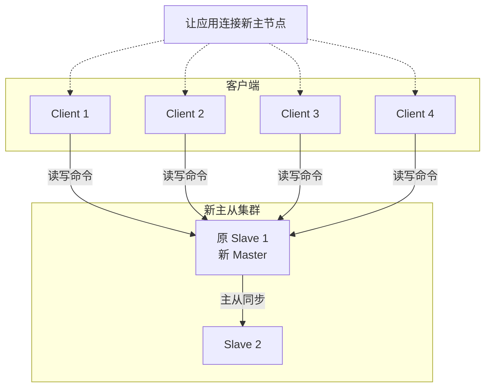

#### 阶段6：原主节点恢复，降级为从节点

```mermaid
graph TD
    subgraph 恢复后主从集群
        NewMaster[原 Slave 1<br/>新 Master]
        Slave2[Slave 2]
        OldMaster[原 Master<br/>新 Slave 3]
        NewMaster -->|主从同步| Slave2
        NewMaster -->|主从同步| OldMaster
        Note[原主节点恢复后<br/>配置其成为一个从节点]
        Note -.-> OldMaster
    end
    subgraph 客户端
        C1[Client 1]
        C2[Client 2]
        C3[Client 3]
        C4[Client 4]
    end
    C1 & C2 & C3 & C4 -->|读写命令| NewMaster
```


1. 运维人员通过监控系统，发现 Redis 主节点故障。
2. 运维人员选定一个从节点（此处选择 slave 1），执行 `slaveof no one`，使其成为新的主节点。
3. 运维人员让剩余从节点（此处为 slave2）执行 `slaveof {newMasterIp} {newMasterPort}`，从新主节点开始数据同步。
4. 更新应用方连接的主节点信息为新主节点的地址和端口。
5. 如果原主节点恢复，执行 `slaveof {newMasterIp} {newMasterPort}`，让其成为新主的一个从节点。


这个流程的主要缺点就是：**全靠人工处理，故障恢复慢，而且容易出错。**

具体来说：

1. **故障发现依赖人工**

   * 需要运维人员先发现主节点故障，无法自动处理。

2. **主从切换依赖人工**

   * 需要人工选择新的 Master，并执行 `slaveof no one`。

3. **其他从节点需要手动重新配置**

   * 每个从节点都要重新指向新的 Master，操作繁琐。

4. **客户端也要手动修改**

   * 应用需要更新新的 Master 地址，否则仍然连接旧 Master。

5. **容易出现操作错误**

   * 主节点选择、配置修改、客户端切换等环节都可能出错。

6. **恢复时间不可控**

   * 从发现故障到完成切换，整个过程取决于运维人员的响应速度。


### 哨兵自动恢复主节点故障

当主节点出现故障时，Redis Sentinel 能自动完成故障发现和故障转移，并通知应用方，从而实现真正的高可用。

**Redis Sentinel 是一个分布式架构，包含若干个 Sentinel 节点和 Redis 数据节点**。每个 Sentinel 节点会对**数据节点和其余 Sentinel 节点**进行监控，当它发现节点不可达时，会标记节点下线。**如果下线的是主节点，它还会和其他 Sentinel 节点协商**，当大多数 Sentinel 节点对“主节点不可达”**达成共识后，会在内部选举出一个领导节点**来完成自动故障转移，同时将变化实时通知给应用方。**整个过程完全自动，不需要人工介入。**


### Redis Sentinel 架构

```mermaid
graph TD
    subgraph 哨兵节点集合
        S1[sentinel 1]
        S2[sentinel 2]
        S3[sentinel 3]
        S1 <--> S2 <--> S3
    end

    subgraph 数据节点集合
        Master[master]
        Slave1[slave]
        Slave2[slave]
        Master -->|主从同步| Slave1
        Master -->|主从同步| Slave2
    end

    S1 & S2 & S3 -->|监控| Master
    S1 & S2 & S3 -->|监控| Slave1
    S1 & S2 & S3 -->|监控| Slave2
```

Redis Sentinel 相比主从复制模式，多了若干（建议保持奇数）Sentinel 节点用于监控数据节点，哨兵节点会定期监控所有节点（包含数据节点和其他哨兵节点）。针对主节点故障的情况，故障转移流程大致如下：

1. 主节点故障，从节点同步连接中断，主从复制停止。
2. 哨兵节点通过定期监控发现主节点故障，与其他哨兵节点协商，达成“主节点故障”的多数共识。这一步主要防止误判：出问题的不是主节点，而是发现故障的哨兵节点本身（常见于哨兵网络被孤立的场景）。
3. 哨兵节点之间使用 Raft 算法选举出一个领导角色，由该节点负责后续的故障转移工作。
4. 哨兵领导者执行故障转移：从节点中选择一个作为新主节点；让其他从节点同步新主节点；通知应用层切换到新主节点。

#### 故障转移时间线

```mermaid
timeline
    title Redis Sentinel 故障转移时间线

    主节点宕机
        : Sentinel 首次发现主节点故障

    故障确认
        : 多个 Sentinel 达成共识

    领导选举
        : 选举出 Sentinel 领导节点

    故障转移
        : 领导节点开始执行故障转移

    切换完成
        : 从节点晋升为新的主节点
```

Redis Sentinel 具有以下几个核心功能：

- **监控**：Sentinel 节点会定期检测 Redis 数据节点、其余哨兵节点是否可达。
- **故障转移**：实现从节点晋升为主节点，并维护后续正确的主从关系。
- **通知**：Sentinel 节点会将故障转移的结果通知给应用方。


### 安装部署 (基于 docker)

#### 准备工作

1. **安装 docker 和 docker-compose**

Docker-compose 安装命令：

```
# ubuntu
apt install docker-compose

# centos
yum install docker-compose
```

2. **停止之前的 redis-server**

```
# 停止 redis-server
service redis-server stop

# 停止 redis-sentinel（如果已有运行）
service redis-sentinel stop
```

3. **使用 docker 获取 redis 镜像**

```
docker pull redis:5.0.9
```

#### 编排 redis 主从节点

1. **编写 docker-compose.yml**

创建 `/root/redis/docker-compose.yml`:


```yaml
version: '3.7'
services:
  master:
    image: 'redis:5.0.9'
    container_name: redis-master
    restart: always
    command: redis-server --appendonly yes
    ports:
      - 6379:6379

  slave1:
    image: 'redis:5.0.9'
    container_name: redis-slave1
    restart: always
    command: redis-server --appendonly yes --slaveof redis-master 6379
    ports:
      - 6380:6379

  slave2:
    image: 'redis:5.0.9'
    container_name: redis-slave2
    restart: always
    command: redis-server --appendonly yes --slaveof redis-master 6379
    ports:
      - 6381:6379
```


2. **启动所有容器**

```
docker-compose up -d
```

如果启动后发现配置有误，需要重新操作，使用 `docker-compose down` 停止并删除刚才创建的容器。

3. **查看运行日志**

```
docker-compose logs
```

4. **验证**

连接主节点：

```
redis-cli -p 6379
```

执行 `info replication` 输出示例：

```
127.0.0.1:6379> info replication
# Replication
role:master
connected_slaves:2
slave0:ip=172.18.0.2,port=6379,state=online,offset=294,lag=0
slave1:ip=172.18.0.3,port=6379,state=online,offset=294,lag=0
master_replid:ba86e6d49696a7c2ee38ec89487764f0f362bb1d
master_replid2:0000000000000000000000000000000000000000
master_repl_offset:294
second_repl_offset:-1
repl_backlog_active:1
repl_backlog_size:1048576
repl_backlog_first_byte_offset:1
repl_backlog_histlen:294
127.0.0.1:6379>
```

连接从节点：

```
redis-cli -p 6380
```

执行 `info replication` 输出示例：

```
127.0.0.1:6379> info replication
# Replication
role:slave
master_host:redis-master
master_port:6379
master_link_status:up
master_last_io_seconds_ago:9
master_sync_in_progress:0
slave_repl_offset:1456
slave_priority:100
slave_read_only:1
connected_slaves:0
master_replid:ba86e6d49696a7c2ee38ec89487764f0f362bb1d
master_replid2:0000000000000000000000000000000000000000
master_repl_offset:1456
second_repl_offset:-1
repl_backlog_active:1
repl_backlog_size:1048576
repl_backlog_first_byte_offset:1
repl_backlog_histlen:1456
```


#### 编排 redis-sentinel 节点

也可以把 redis-sentinel 和 redis 主从放在同一个 yml 中编排，主播这里就分成两组主要有两个原因：

- 观察日志更方便
- 确保 Redis 主从节点启动之后再启动 redis-sentinel。

1. **编写 docker-compose.yml**

创建 `/root/redis-sentinel/docker-compose.yml`


```yaml
version: '3.7'

services:

  # Sentinel 节点 1
  sentinel1:
    image: 'redis:5.0.9'                              # 使用 Redis 5.0.9 镜像
    container_name: redis-sentinel-1                  # 容器名称
    restart: always                                   # 容器退出后自动重启
    command: redis-sentinel /etc/redis/sentinel.conf  # 启动 Sentinel，并加载配置文件
    volumes:
      - ./sentinel1.conf:/etc/redis/sentinel.conf    # 将宿主机 Sentinel 配置文件挂载到容器
    ports:
      - 26379:26379                                  # 宿主机 26379 → 容器 26379

  # Sentinel 节点 2
  sentinel2:
    image: 'redis:5.0.9'
    container_name: redis-sentinel-2
    restart: always
    command: redis-sentinel /etc/redis/sentinel.conf
    volumes:
      - ./sentinel2.conf:/etc/redis/sentinel.conf    # 使用 Sentinel 2 的配置文件
    ports:
      - 26380:26379                                  # 宿主机 26380 → 容器 26379

  # Sentinel 节点 3
  sentinel3:
    image: 'redis:5.0.9'
    container_name: redis-sentinel-3
    restart: always
    command: redis-sentinel /etc/redis/sentinel.conf
    volumes:
      - ./sentinel3.conf:/etc/redis/sentinel.conf    # 使用 Sentinel 3 的配置文件
    ports:
      - 26381:26379                                  # 宿主机 26381 → 容器 26379

# 使用已经存在的 Docker 网络，让 Sentinel 能与 Redis 主从节点通信
networks:
  default:
    external:
      name: redis-data_default
```


2. **创建配置文件**

创建 `sentinel1.conf`、`sentinel2.conf`、`sentinel3.conf` 三份文件，初始内容完全相同，都放到 `/root/redis-sentinel/` 目录中。

```
bind 0.0.0.0                         # 监听所有网卡，允许其他容器连接 Sentinel
port 26379                           # Sentinel 监听端口

sentinel monitor redis-master redis-master 6379 2
# 监控名为 redis-master 的主节点
# redis-master：主节点地址
# 6379：主节点端口
# 2：至少 2 个 Sentinel 同意主节点下线，才认为主节点客观下线

sentinel down-after-milliseconds redis-master 1000
# 1 秒内无法与主节点正常通信，则认为主节点主观下线
```

#### 理解 sentinel monitor

格式：

```
sentinel monitor 主节点名 主节点ip 主节点端口 法定票数
```

- **主节点名**：哨兵内部自定义的主节点标识名称。
- **主节点ip**：部署 redis-master 的设备 IP。此处使用 docker，可以直接写容器名，会被自动 DNS 解析为对应容器 IP。
- **主节点端口**：主节点 Redis 服务端口。
- **法定票数**：判定主节点下线的同意票数阈值。单个哨兵可能因为自身网络问题误判主节点下线，通过多哨兵投票可以避免误判；当认为主节点下线的哨兵数 ≥ 法定票数时，才会真正判定主节点下线。

#### 理解 sentinel down-after-milliseconds

主节点和哨兵之间通过心跳包通信，如果心跳包在指定时间内没有返回，就视为节点出现故障。


3. **启动所有容器**

```
docker-compose up -d
```

如果启动后发现配置有误，需要重新操作，使用 `docker-compose down` 即可停止并删除刚才创建的容器。

4. **查看运行日志**

```
docker-compose logs
```


启动后可以看到，哨兵节点已经通过主节点，自动发现了对应的从节点。
日志示例：

```
1:X 27 Aug 2026 16:01:16.205 # oO0OoO0OoO0Oo Redis is starting oO0OoO0OoO0Oo
1:X 27 Aug 2026 16:01:16.205 # Redis version=5.0.9, bits=64, commit=00000000, modified=0, pid=1, just started
1:X 27 Aug 2026 16:01:16.205 # Configuration loaded
1:X 27 Aug 2026 16:01:16.205 * Running mode=sentinel, port=26379.
1:X 27 Aug 2026 16:01:16.207 # Sentinel ID is c8bdb10b8999ffdc6a5d84fede44f287b2557494
1:X 27 Aug 2026 16:01:16.207 # +monitor master redis-master 172.18.0.4 6379 quorum 2
1:X 27 Aug 2026 16:01:16.208 * +slave slave 172.18.0.2:6379 172.18.0.2 6379 @ redis-master 172.18.0.4 6379
1:X 27 Aug 2026 16:01:16.209 * +slave slave 172.18.0.3:6379 172.18.0.3 6379 @ redis-master 172.18.0.4 6379
1:X 27 Aug 2026 16:01:18.255 * +sentinel sentinel 7fcaa173a0685008dd9129973099c286bfe3a09d 172.18.0.7 26379 @ redis-master 172.18.0.4 6379
```


### 重新选举

#### redis-master 宕机之后

手动把 `redis-master` 停止：

```
docker stop redis-master
```

#### 观察哨兵日志

可以看到哨兵先检测到主节点主观下线（sdown），进一步由于主节点故障得票达到法定阈值，master 最终被判定为客观下线（odown）。

- **主观下线 (Subjectively Down, SDown)**：单个哨兵感知到主节点心跳异常，单方面判定为主观下线。
- **客观下线 (Objectively Down, ODown)**：多个哨兵达成一致意见，共同确认 master 确实下线。

随后哨兵集群会挑选出一个新的 master，关键日志示例：

```
+switch-master redis-master 172.22.0.2 6379 172.22.0.4 6379
```

整个切换过程对业务无感知，Redis 服务仍然可以正常使用。

### redis-master 重启之后

手动把 `redis-master` 重新启动：

```
docker start redis-master
```

#### 观察哨兵日志

可以看到重启后的原主节点会被自动降级为从节点：

```
+convert-to-slave slave 172.22.0.2:6379 172.22.0.2 6379 @ redis-master 172.22.0.4 6379
```

使用 redis-cli 可以验证节点角色变化：

```
127.0.0.1:6379> info replication
# Replication
role:slave
master_host:172.22.0.4
master_port:6379
master_link_status:up
master_last_io_seconds_ago:0
master_sync_in_progress:0
slave_repl_offset:324475
slave_priority:100
slave_read_only:1
connected_slaves:0
master_replid:e6ecc285a2892fba157318c77ebe1409f9c2254e
master_replid2:0000000000000000000000000000000000000000
master_repl_offset:324475
second_repl_offset:-1
repl_backlog_active:1
repl_backlog_size:1048576
repl_backlog_first_byte_offset:318295
repl_backlog_histlen:6181
```


- Redis 主节点宕机后，**哨兵会自动从从节点中提拔一个节点成为新的主节点。**
- 原主节点重启恢复后，**会被哨兵纳入监控，但只会作为新主节点的从节点使用。**


### 选举原理

假定当前环境：3 个哨兵节点（sentinel1、sentinel2、sentinel3），1 个主节点（redis-master），2 个从节点（redis-slave1、redis-slave2）。
当主节点出现故障时，会触发完整的重新选举流程。

#### 哨兵整体架构

```mermaid
graph TD
    subgraph 哨兵节点集合
        S1[sentinel 1]
        S2[sentinel 2]
        S3[sentinel 3]
        S1 <--> S2 <--> S3
    end

    subgraph 数据节点集合
        Master[master]
        Slave1[slave]
        Slave2[slave]
        Master -->|主从同步| Slave1
        Master -->|主从同步| Slave2
    end

    S1 & S2 & S3 -->|监控| Master
    S1 & S2 & S3 -->|监控| Slave1
    S1 & S2 & S3 -->|监控| Slave2
```

#### 故障转移完整流程

```mermaid
flowchart TD
    A[主节点宕机] --> B[单个哨兵检测到心跳中断<br/>判定主观下线 SDown]
    B --> C[多个哨兵互相通信、投票]
    C --> D{票数 >= 法定票数?}
    D -- 否 --> F[维持现状，继续监控]
    D -- 是 --> E[判定客观下线 ODown]
    E --> G[哨兵集群 Raft 选举 leader]
    G --> H[leader 按规则挑选新主节点]
    H --> I[提升选中从节点为新 master]
    I --> J[其余从节点切换同步新 master]
    J --> K[通知客户端新主节点地址]
    K --> L[故障转移完成]
```

##### 1) 主观下线

当 redis-master 宕机时，它与三个哨兵之间的心跳连接会断开。redis-master 出现严重故障，三个哨兵都会独立将 redis-master 判定为**主观下线 (SDown)**。

##### 2) 客观下线

判定主观下线后，sentinel1、sentinel2、sentinel3 会互相通信，对主节点故障这件事进行投票。当故障确认票数 >= 配置的法定票数之后，就会触发客观下线。

法定票数在哨兵配置中定义：

```
sentinel monitor redis-master 172.22.0.4 6379 2
```

这里配置的 `2` 就是法定票数。
当多数哨兵确认主节点故障，就意味着 redis-master 故障被正式确认，此时触发**客观下线 (ODown)**。

##### 3) 选举出哨兵的 leader

接下来需要从哨兵集群中选出一个领导节点（leader），由它全权负责后续的从节点升级、主从关系调整等故障转移工作。选举过程基于 **Raft 算法** 实现。

可以，这里其实不用把 Raft 的细节讲得这么复杂。你只需要抓住 **“选一个 leader 出来负责故障转移”**。

##### Raft 选举过程

假设有 3 个 Sentinel：S1、S2、S3。

1. **Sentinel 之间互相投票**，每个节点只能投一票。
2. **获得多数票（至少 2 票）的 Sentinel 成为 Leader**。
3. **Leader 负责执行故障转移**，选择一个 Slave 晋升为新的 Master。
4. 选举完成。

不是随机选 Leader，而是按照“先收到谁的拉票请求，就优先给谁投票”的规则进行竞争，因此最终结果可能受网络延迟、消息到达顺序影响


##### 4) leader 挑选合适的 slave 成为新 master

leader 按照以下优先级规则挑选新主节点：


1. **先排除不合格节点**：与主节点断开时间过长的从节点，不参与选举。
2. **优先级优先**：比较 `slave-priority`/ `replica-priority`，**数值越小优先级越高**；`0` 表示永远不会被提升为主节点。
3. **复制偏移量优先**：优先级相同时，比较 `replication offset`，**偏移量越大，说明从主节点处理的数据越多，越优先**。
4. **运行 ID 最后比较**：前两项都相同时，比较 `run ID` 的**字典序（lexicographical）**，**字典序更小的优先**。这主要是为了让选择结果确定，而不是因为“小 ID 本身更优秀”。


当某个 slave 被指定为新 master 之后：

1. leader 向该节点发送命令，执行 `slave no one`，正式升级为主节点；
2. leader 通知剩余所有从节点，切换同步到这个新的主节点。


### 注意事项

- 哨兵节点不能只有一个，否则哨兵节点自身故障会影响整个系统的可用性。
- 哨兵节点数量最好为奇数，方便 leader 选举，得票更容易超过半数。
- 哨兵只负责故障转移，数据存储仍然由 Redis 主从节点负责。
- 哨兵 + 主从复制解决了存储高可用问题，但无法解决单机存储容量不足的问题，当数据量超过单机上限时，这种架构就难以胜任。


# 集群

## 概念

* **哨兵模式**解决的是 **Master 故障后的自动故障转移**，但数据仍然由**单组 Master / Slave** 存储，受单机内存限制。
* 当数据量超过单机内存时，需要进行**横向扩容**。
* **Redis Cluster** 将数据划分成多个**分片（多组 Master / Slave）**，每组只存储部分数据，所有分片共同组成完整的数据集。
* 例如：**1TB 数据 → 3 组分片 → 每组约存储 1/3 数据**。


### Redis 集群架构
```mermaid
graph TB
    subgraph 全量数据集
        AllData[全部业务数据]
    end

    subgraph 分片 0
        M1[Master 1]
        S11[Slave 1-1]
        S12[Slave 1-2]
        M1 -->|主从同步| S11
        M1 -->|主从同步| S12
    end

    subgraph 分片 1
        M2[Master 2]
        S21[Slave 2-1]
        S22[Slave 2-2]
        M2 -->|主从同步| S21
        M2 -->|主从同步| S22
    end

    subgraph 分片 2
        M3[Master 3]
        S31[Slave 3-1]
        S32[Slave 3-2]
        M3 -->|主从同步| S31
        M3 -->|主从同步| S32
    end

    AllData -->|1/3 数据| M1
    AllData -->|1/3 数据| M2
    AllData -->|1/3 数据| M3
```

架构说明：
- Master1 和 Slave11、Slave12 存储相同数据，占总数据的 1/3
- Master2 和 Slave21、Slave22 存储相同数据，占总数据的 1/3
- Master3 和 Slave31、Slave32 存储相同数据，占总数据的 1/3
- 三组分片存储的数据各不相同，共同组成完整数据集
- 每个 Slave 都是对应 Master 的备份，Master 宕机后对应的 Slave 会自动补位成 Master
- 每一组主从结构都称为一个**分片（Sharding）**
- 全量数据增长时，只需要增加更多分片即可完成扩容


## 数据分片算法


### 1) 哈希求余

#### 原理
设有 N 个分片，使用 `[0, N-1]` 进行编号。对给定的 key 计算 hash 值，再将结果对 N 取余，得到的结果就是该 key 所属的分片编号。

**示例**：N = 3，key 为 `hello`，对 key 计算 md5 哈希值得到 `bc4b2a76b9719d91`，将结果对 3 取余为 0，那么 `hello` 这个 key 就存放到 0 号分片。

```mermaid
flowchart LR
    A[输入 key] --> B[计算 hash 值]
    B --> C[hash 值 % 分片总数 N]
    C --> D[得到分片编号]
    D --> E[路由到对应分片]
```

#### 优缺点
- **优点**：算法简单高效，数据分配均匀。
- **缺点**：扩容时 N 发生变化，原有的映射规则几乎全部失效，需要在节点间大量迁移数据，扩容开销非常大。


### 2) 一致性哈希算法

为了降低扩容时的数据迁移开销，业界提出了一致性哈希算法。

#### 原理
1. **构建哈希环**：将 `0 ~ 2^32-1` 的整数空间映射成一个首尾相连的圆环，数据按顺时针方向增长。
2. **分片落位**：将 N 个分片分别映射到圆环的某个固定位置上。
3. **key 路由**：对 key 计算 hash 得到值 H，从 H 在圆环上的位置**顺时针向下查找**，遇到的第一个分片，就是该 key 所属的分片。

相当于 N 个分片把整个圆环分成了 N 个管辖区间，key 的 hash 值落在哪个区间，就归对应区间的分片管理。

```mermaid
graph TD
    subgraph HashRing["一致性哈希环（3个分片）"]
        P0["0号分片"]
        P1["1号分片"]
        P2["2号分片"]

        P0 -->|"顺时针管辖"| P1
        P1 -->|"顺时针管辖"| P2
        P2 -->|"顺时针管辖"| P0
    end

    K1["key1"] -->|"顺时针查找"| P1
    K2["key2"] -->|"顺时针查找"| P2
    K3["key3"] -->|"顺时针查找"| P0
```

#### 扩容特性
如果新增一个分片，只需要把前一个分片的部分区间数据迁移到新分片上，其余分片的管辖区间完全不受影响。

比如 3 分片扩容为 4 分片，只需要把 0 号分片的部分数据迁移给 3 号分片，1 号、2 号分片的数据完全不用动。

```mermaid
graph TD
    subgraph 扩容为4分片哈希环
        P0[0号分片]
        P1[1号分片]
        P2[2号分片]
        P3[3号分片]

        P0 -- 部分区间迁移 --> P3
        P0 -- 剩余区间 --> P1
        P1 -- 区间不变 --> P2
        P2 -- 区间不变 --> P3
        P3 -- 顺时针区间 --> P0
    end
```

#### 优缺点
- **优点**：大幅降低了扩容时的数据搬运量，提升了扩容操作的效率。
- **缺点**：节点数量较少时，**数据分配容易不均匀，出现数据倾斜。**


### 3) 哈希槽算法（Redis 采用）

为了解决数据分配不均的问题，Redis Cluster 引入了 **哈希槽（Hash Slots）** 算法。

#### 原理
Redis 集群总共预设了 **16384 个哈希槽**，编号范围 `0 ~ 16383`。每一个key对应的槽位是固定的，每个 key 通过 CRC16 算法计算出哈希值，再对 16384 取余，得到对应的槽位：
```plain
hash_slot = crc16(key) % 16384
```

集群中的每个主节点负责管理一部分哈希槽，key 落在哪个槽，就由负责该槽的节点处理。**每个分片的节点使用位图来记录自己持有哪些槽位。**

**分配示例**：
- 0 号主节点：负责 `[0, 5461]`，共 5462 个槽位
- 1 号主节点：负责 `[5462, 10922]`，共 5461 个槽位
- 2 号主节点：负责 `[10923, 16383]`，共 5461 个槽位

#### 扩容特性
扩容时只需要从原有节点中迁移部分槽位到新节点即可，不需要重新计算所有 key 的映射。比如新增 3 号节点，只需要从每个原有节点各挪一部分槽位给新节点。

```plain
Master0 → 一部分槽位
Master1 → 一部分槽位
Master2 → 一部分槽位
                 ↓
             Master3
```

**为什么是 16384 个槽位？**

- 正常 Redis 集群节点数不会超过 1000 个，16384 个槽位足够均匀分配。
- 16384 个槽位的位图（bitmap）只占 2KB 左右，节点间同步状态时传输开销很小。
- 槽位数量过多会提升同步成本，16k 是性能和容量的均衡值。


## 搭建（基于 docker）

### 搭建规划
本次共创建 11 个 Redis 节点容器：
- 前 9 个节点搭建基础集群（3 主 6 从，每个主节点配 2 个从节点）
- 后 2 个节点用于后续演示集群扩容

#### 第一步：创建目录和配置文件
创建 `redis-cluster` 目录，目录内新建 `generate.sh` 脚本，批量生成 11 个节点的配置文件。

`generate.sh` 内容：
```bash
# 生成前9个节点配置
for port in $(seq 1 9); \
do \
mkdir -p redis${port}/; \
touch redis${port}/redis.conf
cat << EOF > redis${port}/redis.conf
port 6379
bind 0.0.0.0
protected-mode no
appendonly yes
cluster-enabled yes
cluster-config-file nodes.conf
cluster-node-timeout 5000
cluster-announce-ip 172.30.0.10${port}
cluster-announce-port 6379
cluster-announce-bus-port 16379
EOF
done

# 生成后2个扩容节点配置
for port in $(seq 10 11); \
do \
mkdir -p redis${port}/; \
touch redis${port}/redis.conf
cat << EOF > redis${port}/redis.conf
port 6379
bind 0.0.0.0
protected-mode no
appendonly yes
cluster-enabled yes
cluster-config-file nodes.conf
cluster-node-timeout 5000
cluster-announce-ip 172.30.0.1${port}
cluster-announce-port 6379
cluster-announce-bus-port 16379
EOF
done
```
这个脚本就是：

* **一次性创建 11 个 Redis 节点的目录和配置文件。**
* **前 9 个节点用于搭建初始 Redis Cluster，后 2 个作为后续扩容节点。**
* 每个节点都开启 **Cluster 模式、AOF 持久化**，并配置自己的集群通信 IP 和端口。
* **这里只是在准备节点配置，还没有真正创建集群或分配 Master/Slave。**


执行脚本生成配置：
```bash
bash generate.sh
```

生成的目录结构：
```
redis-cluster/
├── docker-compose.yml
├── generate.sh
├── redis1/
│   └── redis.conf
├── redis2/
│   └── redis.conf
...
└── redis11/
    └── redis.conf
```

#### 配置项说明
- `cluster-enabled yes`：开启 Redis 集群模式
- `cluster-config-file nodes.conf`：集群节点信息自动生成的配置文件
- `cluster-node-timeout 5000`：节点心跳失联的超时时间，单位毫秒
- `cluster-announce-ip`：节点对外宣告的自身 IP，供其他节点访问
- `cluster-announce-port`：节点业务数据端口
- `cluster-announce-bus-port`：节点集群总线端口，用于节点间管理通信


#### 第二步：编写 docker-compose.yml
创建自定义网段 `172.30.0.0/24`，配置 11 个节点的容器、端口映射和固定 IP。

```yaml
version: '3.7'
networks:
  mynet:
    ipam:
      config:
        - subnet: 172.30.0.0/24 # 创建 mynet 的 Docker 局域网
services:
  redis1:
    # 使用 Redis 5.0.9 镜像
    image: 'redis:5.0.9'
    # 给容器指定固定名称，方便 docker exec、docker logs 等操作
    container_name: redis1
    # 容器异常退出或 Docker 重启后，自动重新启动
    restart: always
    # 挂载配置文件目录
    # 宿主机 ./redis1/  →  容器 /etc/redis/
    volumes:
      - ./redis1/:/etc/redis/

    # 端口映射
    # 宿主机端口 : 容器端口
    ports:
      # Redis 客户端访问端口
      # 宿主机 6371 → redis1 容器的 6379
      - 6371:6379
      # Redis Cluster Bus 集群内部通信端口
      # 宿主机 16371 → redis1 容器的 16379
      - 16371:16379
    # 启动 Redis，并指定使用 redis.conf 配置文件
    command: redis-server /etc/redis/redis.conf

    # 将 redis1 加入 mynet Docker 网络
    networks:
      mynet:
        # 给 redis1 指定固定的 Docker 内网 IP
        ipv4_address: 172.30.0.101
  redis2:
    image: 'redis:5.0.9'
    container_name: redis2
    restart: always
    volumes:
      - ./redis2/:/etc/redis/
    ports:
      - 6372:6379
      - 16372:16379
    command: redis-server /etc/redis/redis.conf
    networks:
      mynet:
        ipv4_address: 172.30.0.102
  redis3:
    image: 'redis:5.0.9'
    container_name: redis3
    restart: always
    volumes:
      - ./redis3/:/etc/redis/
    ports:
      - 6373:6379
      - 16373:16379
    command: redis-server /etc/redis/redis.conf
    networks:
      mynet:
        ipv4_address: 172.30.0.103
  redis4:
    image: 'redis:5.0.9'
    container_name: redis4
    restart: always
    volumes:
      - ./redis4/:/etc/redis/
    ports:
      - 6374:6379
      - 16374:16379
    command: redis-server /etc/redis/redis.conf
    networks:
      mynet:
        ipv4_address: 172.30.0.104
  redis5:
    image: 'redis:5.0.9'
    container_name: redis5
    restart: always
    volumes:
      - ./redis5/:/etc/redis/
    ports:
      - 6375:6379
      - 16375:16379
    command: redis-server /etc/redis/redis.conf
    networks:
      mynet:
        ipv4_address: 172.30.0.105
  redis6:
    image: 'redis:5.0.9'
    container_name: redis6
    restart: always
    volumes:
      - ./redis6/:/etc/redis/
    ports:
      - 6376:6379
      - 16376:16379
    command: redis-server /etc/redis/redis.conf
    networks:
      mynet:
        ipv4_address: 172.30.0.106
  redis7:
    image: 'redis:5.0.9'
    container_name: redis7
    restart: always
    volumes:
      - ./redis7/:/etc/redis/
    ports:
      - 6377:6379
      - 16377:16379
    command: redis-server /etc/redis/redis.conf
    networks:
      mynet:
        ipv4_address: 172.30.0.107
  redis8:
    image: 'redis:5.0.9'
    container_name: redis8
    restart: always
    volumes:
      - ./redis8/:/etc/redis/
    ports:
      - 6378:6379
      - 16378:16379
    command: redis-server /etc/redis/redis.conf
    networks:
      mynet:
        ipv4_address: 172.30.0.108
  redis9:
    image: 'redis:5.0.9'
    container_name: redis9
    restart: always
    volumes:
      - ./redis9/:/etc/redis/
    ports:
      - 6379:6379
      - 16379:16379
    command: redis-server /etc/redis/redis.conf
    networks:
      mynet:
        ipv4_address: 172.30.0.109
  redis10:
    image: 'redis:5.0.9'
    container_name: redis10
    restart: always
    volumes:
      - ./redis10/:/etc/redis/
    ports:
      - 6380:6379
      - 16380:16379
    command: redis-server /etc/redis/redis.conf
    networks:
      mynet:
        ipv4_address: 172.30.0.110
  redis11:
    image: 'redis:5.0.9'
    container_name: redis11
    restart: always
    volumes:
      - ./redis11/:/etc/redis/
    ports:
      - 6381:6379
      - 16381:16379
    command: redis-server /etc/redis/redis.conf
    networks:
      mynet:
        ipv4_address: 172.30.0.111
```


#### 第三步：启动容器
在 `redis-cluster` 目录下执行：
```bash
docker-compose up -d
```


#### 第四步：构建集群
使用 `redis-cli` 执行集群创建命令，将前 9 个节点组建成 3 主 6 从的集群：

```bash
# 创建 Redis Cluster
redis-cli --cluster create \

# 加入 Redis Cluster 的节点
172.30.0.101:6379 \
172.30.0.102:6379 \
172.30.0.103:6379 \
172.30.0.104:6379 \
172.30.0.105:6379 \
172.30.0.106:6379 \
172.30.0.107:6379 \
172.30.0.108:6379 \
172.30.0.109:6379 \

# 每个主节点配置 2 个从节点
# 9 个节点最终分配为：
# 3 个 Master + 6 个 Replica
--cluster-replicas 2
```

参数说明：
- `--cluster create`：创建集群，后面依次列出所有节点地址
- `--cluster-replicas 2`：每个主节点配置 2 个从节点

```plain
```text
>>> Performing hash slots allocation on 9 nodes...
# 在 9 个 Redis 节点中分配 Redis Cluster 的 16384 个 Hash Slot

Master[0] -> Slots 0 - 5460
# 第 1 个主节点负责 0~5460 号槽位，共 5461 个

Master[1] -> Slots 5461 - 10922
# 第 2 个主节点负责 5461~10922 号槽位，共 5462 个

Master[2] -> Slots 10923 - 16383
# 第 3 个主节点负责 10923~16383 号槽位，共 5461 个

# 三个 Master 一共覆盖：
# 5461 + 5462 + 5461 = 16384 个槽位


Adding replica 172.30.0.105:6379 to 172.30.0.101:6379
# redis5 作为 redis1 的 Replica（从节点）

Adding replica 172.30.0.106:6379 to 172.30.0.101:6379
# redis6 作为 redis1 的 Replica（从节点）


Adding replica 172.30.0.107:6379 to 172.30.0.102:6379
# redis7 作为 redis2 的 Replica（从节点）

Adding replica 172.30.0.108:6379 to 172.30.0.102:6379
# redis8 作为 redis2 的 Replica（从节点）


Adding replica 172.30.0.109:6379 to 172.30.0.103:6379
# redis9 作为 redis3 的 Replica（从节点）

Adding replica 172.30.0.104:6379 to 172.30.0.103:6379
# redis4 作为 redis3 的 Replica（从节点）


M: 15f9572e7e81195a695f5507ca1b49eccf53b659 172.30.0.101:6379
# M = Master，172.30.0.101 是主节点 redis1

   slots:[0-5460] (5461 slots) master
# redis1 负责 0~5460 号槽位


M: b4c01a0a885600b87688bf1c74f4b031746e4d6b 172.30.0.102:6379
# M = Master，172.30.0.102 是主节点 redis2

   slots:[5461-10922] (5462 slots) master
# redis2 负责 5461~10922 号槽位


M: 7ac99970b4eed7b1e40b704f1127e4309b93098a 172.30.0.103:6379
# M = Master，172.30.0.103 是主节点 redis3

   slots:[10923-16383] (5461 slots) master
# redis3 负责 10923~16383 号槽位


S: e4cad376b31d415496773dc84d0a1fe11891c2ad 172.30.0.104:6379
# S = Slave，172.30.0.104 是从节点 redis4

   replicates 7ac99970b4eed7b1e40b704f1127e4309b93098a
# redis4 复制的 Master 是 7ac999...，即 redis3


S: eb89624804c1d5185ccaf1c133f8d7b7b54001fb 172.30.0.105:6379
# S = Slave，172.30.0.105 是从节点 redis5

   replicates 15f9572e7e81195a695f5507ca1b49eccf53b659
# redis5 复制的 Master 是 15f957...，即 redis1


S: b0b57cafbce8af451c5cd57b798d084af93e6cc9 172.30.0.106:6379
# S = Slave，172.30.0.106 是从节点 redis6

   replicates 15f9572e7e81195a695f5507ca1b49eccf53b659
# redis6 复制的 Master 是 15f957...，即 redis1


S: f32a32b2b77d4d86f8d9e173cc1131950c4be1d2 172.30.0.107:6379
# S = Slave，172.30.0.107 是从节点 redis7

   replicates b4c01a0a885600b87688bf1c74f4b031746e4d6b
# redis7 复制的 Master 是 b4c01...，即 redis2


S: f715129df8d8808f3130b2ab58e98b524650dd62 172.30.0.108:6379
# S = Slave，172.30.0.108 是从节点 redis8

   replicates b4c01a0a885600b87688bf1c74f4b031746e4d6b
# redis8 复制的 Master 是 b4c01...，即 redis2


S: 0c04db5e9ced335a29cbe0887457b2bc90e7ac8c 172.30.0.109:6379
# S = Slave，172.30.0.109 是从节点 redis9

   replicates 7ac99970b4eed7b1e40b704f1127e4309b93098a
# redis9 复制的 Master 是 7ac999...，即 redis3


Can I set the above configuration? (type 'yes' to accept): yes
# Redis CLI 把上面的主从关系和 Slot 分配结果展示出来
# 输入 yes 后，正式应用这套 Cluster 配置


>>> Nodes configuration updated
# 各个 Redis 节点的 Cluster 配置已经更新


>>> Assign a different config epoch to each node
# 给节点分配不同的 config epoch（集群配置版本号）


>>> Sending CLUSTER MEET messages to join the cluster
# 向各个 Redis 节点发送 CLUSTER MEET
# 让这些节点互相认识，并加入同一个 Redis Cluster


Waiting for the cluster to join
# 等待所有节点完成加入和节点信息交换

....
# 等待过程中，节点之间正在建立集群关系


>>> Performing Cluster Check (using node 172.30.0.101:6379)
# 以 redis1（172.30.0.101）为入口，检查整个 Cluster


M: 15f9572e7e81195a695f5507ca1b49eccf53b659 172.30.0.101:6379
   slots:[0-5460] (5461 slots) master
   2 additional replica(s)
# redis1 是 Master
# 负责 0~5460 号槽位
# 并且有 2 个 Replica：redis5、redis6


S: 0c04db5e9ced335a29cbe0887457b2bc90e7ac8c 172.30.0.109:6379
   slots: (0 slots) slave
   replicates 7ac99970b4eed7b1e40b704f1127e4309b93098a
# redis9 是 Slave
# 从节点本身不负责 Slot，所以显示 0 slots
# 它复制 redis3


S: e4cad376b31d415496773dc84d0a1fe11891c2ad 172.30.0.104:6379
   slots: (0 slots) slave
   replicates 7ac99970b4eed7b1e40b704f1127e4309b93098a
# redis4 是 Slave
# 它复制 redis3


S: f32a32b2b77d4d86f8d9e173cc1131950c4be1d2 172.30.0.107:6379
   slots: (0 slots) slave
   replicates b4c01a0a885600b87688bf1c74f4b031746e4d6b
# redis7 是 Slave
# 它复制 redis2


S: eb89624804c1d5185ccaf1c133f8d7b7b54001fb 172.30.0.105:6379
   slots: (0 slots) slave
   replicates 15f9572e7e81195a695f5507ca1b49eccf53b659
# redis5 是 Slave
# 它复制 redis1


S: f715129df8d8808f3130b2ab58e98b524650dd62 172.30.0.108:6379
   slots: (0 slots) slave
   replicates b4c01a0a885600b87688bf1c74f4b031746e4d6b
# redis8 是 Slave
# 它复制 redis2


S: b0b57cafbce8af451c5cd57b798d084af93e6cc9 172.30.0.106:6379
   slots: (0 slots) slave
   replicates 15f9572e7e81195a695f5507ca1b49eccf53b659
# redis6 是 Slave
# 它复制 redis1


M: b4c01a0a885600b87688bf1c74f4b031746e4d6b 172.30.0.102:6379
   slots:[5461-10922] (5462 slots) master
   2 additional replica(s)
# redis2 是 Master
# 负责 5461~10922 号槽位
# 并且有 2 个 Replica：redis7、redis8


M: 7ac99970b4eed7b1e40b704f1127e4309b93098a 172.30.0.103:6379
   slots:[10923-16383] (5461 slots) master
   2 additional replica(s)
# redis3 是 Master
# 负责 10923~16383 号槽位
# 并且有 2 个 Replica：redis9、redis4


[OK] All nodes agree about slots configuration.
# 所有节点对 Slot 的分配结果一致
# 都认为：
# redis1 → 0~5460
# redis2 → 5461~10922
# redis3 → 10923~16383


>>> Check for open slots...
# 检查是否存在没有正确分配给 Master 的 Slot


>>> Check slots coverage...
# 检查 16384 个 Slot 是否全部被覆盖


[OK] All 16384 slots covered.
# 16384 个 Slot 全部已经被 3 个 Master 覆盖
# 表示 Cluster 的 Slot 分配完整，集群创建成功
```
执行后命令行会输出哈希槽分配方案、主从对应关系，输入 `yes` 确认配置。
当看到输出 `[OK] All 16384 slots covered` 时，代表集群搭建完成。

#### 客户端连接
连接集群时需要加上 `-c` 参数，用于开启集群模式，让 `redis-cli` 遇到 `MOVED` 重定向时自动跳转到正确的 Redis 节点。

```bash
redis-cli -h 172.30.0.101 -p 6379 -c

172.30.0.101:6379> set key 123456
-> Redirected to slot [12539] located at 172.30.0.103:6379
OK
```

`key` 计算得到 **12539 槽位**，该槽位由 `172.30.0.103:6379` 负责，所以 `-c` 自动将请求重定向过去执行。

> 对于一个命令涉及到多个key的情况，会出现一些错误。因为 Redis Cluster 要求**同一次涉及多个 Key 的操作必须让这些 Key 属于同一个 Slot**，否则会报 `CROSSSLOT`，无法重定向到一个节点统一执行。


查看集群节点状态：
```bash
172.30.0.103:6379> CLUSTER nodes
15f9572e7e81195a695f5507ca1b49eccf53b659 172.30.0.101:6379@16379 master - 0 1788016749000 1 connected 0-5460
e4cad376b31d415496773dc84d0a1fe11891c2ad 172.30.0.104:6379@16379 slave 7ac99970b4eed7b1e40b704f1127e4309b93098a 0 1788016750946 4 connected
f32a32b2b77d4d86f8d9e173cc1131950c4be1d2 172.30.0.107:6379@16379 slave b4c01a0a885600b87688bf1c74f4b031746e4d6b 0 1788016749000 7 connected
b0b57cafbce8af451c5cd57b798d084af93e6cc9 172.30.0.106:6379@16379 slave 15f9572e7e81195a695f5507ca1b49eccf53b659 0 1788016750536 6 connected
7ac99970b4eed7b1e40b704f1127e4309b93098a 172.30.0.103:6379@16379 myself,master - 0 1788016749000 3 connected 10923-16383
f715129df8d8808f3130b2ab58e98b524650dd62 172.30.0.108:6379@16379 slave b4c01a0a885600b87688bf1c74f4b031746e4d6b 0 1788016749512 8 connected
eb89624804c1d5185ccaf1c133f8d7b7b54001fb 172.30.0.105:6379@16379 slave 15f9572e7e81195a695f5507ca1b49eccf53b659 0 1788016750000 5 connected
0c04db5e9ced335a29cbe0887457b2bc90e7ac8c 172.30.0.109:6379@16379 slave 7ac99970b4eed7b1e40b704f1127e4309b93098a 0 1788016749921 9 connected
b4c01a0a885600b87688bf1c74f4b031746e4d6b 172.30.0.102:6379@16379 master - 0 1788016749512 2 connected 5461-10922
```


### 主节点宕机与故障转移

#### 演示效果
手动停止一个主节点，观察集群自动故障转移：

1. 停止主节点 redis1：
```bash
docker stop redis1
```

2. 连接其他节点查看集群状态，会发现 redis1 节点被标记为 `fail`，它的其中一个从节点会自动晋升为新的主节点，接管所有槽位。


3. 重新启动 redis1：
```bash
docker start redis1
```

4. 再次查看状态，原主节点重启后会自动降级为从节点，同步新主节点的数据。

也可以手动执行 `CLUSTER FAILOVER` 进行主从切换，将原主节点重新恢复为主角色。


#### 故障处理流程

#### 1) 故障判定

集群中的所有节点，都会周期性的使用心跳包进行通信。

1. 节点A给节点B发送ping包，B就会给A返回一个pong包。ping和pong除了 **message type** 属性之外，其他部分都是一样的。这里包含了集群的配置信息(该节点的id，该节点从属于哪个分片，是主节点还是从节点，都属于谁，持槽有哪些slots的位置…)。
2. 每个节点每秒钟，都会给一些随机的节点发起ping包，而不是全发一遍。这样设定是为了避免在节点很多的时候，心跳包也非常多
3. 当节点A给节点B发起ping包，B不能如期回应的时候，此时A就会尝试重置和B的tcp连接，看能否连接成功。如果仍然连接失败，A就会把B设为 **PFAIL** 状态 **(主观下线)**。
   - A判定B为 **PFALL** 之后，会通过redis 内部的Gossip协议，和其他节点进行沟通，向其他节点确认B的状态。
4. 此时A发现其他很多节点，也认为B为 **PFALL**，并且数目超过总集群个数的一半，那么A就会把B标记成 **FAIL** **(客观下线)**，并且把这个消息同步给其他节点(其他节点收到之后，也会把B标记成FAIL)。


有的时候会引起整个集群都宕机(称为 fail 状态)。以下三种情况会出现集群宕机：

- 某个分片，所有的主节点和从节点都挂了。
- 某个分片，主节点挂了，但是没有从节点。
- 超过半数的master节点都挂了。


#### 故障判定流程

```mermaid
flowchart TD
    A[节点A向节点B发送ping心跳包] --> B{节点B正常返回pong?}
    B -->|是| C[维持正常通信状态]
    B -->|否| D[重置TCP连接重试通信]
    D --> E{重试连接成功?}
    E -->|是| C
    E -->|否| F[节点A将B标记为PFAIL<br>主观下线]
    F --> G[通过Gossip协议同步状态<br>询问其他节点对B的判定]
    G --> H{认为B下线的主节点<br>数量超过集群半数?}
    H -->|否| I[维持PFAIL主观下线状态]
    H -->|是| J[将B标记为FAIL<br>客观下线]
    J --> K[广播FAIL消息给集群全部节点]
```

#### 2) 故障迁移

上述例子中，B故障，并且A把B FAIL的消息告知集群中的其他节点。

- **如果B是从节点，那么不需要进行故障迁移。**
- **如果B是主节点，那么就会由B的从节点(比如C和D)触发故障迁移了。**

故障迁移把从节点提拔成主节点，继续给整个redis集群提供支持：

1. **参选资格**：从节点与主节点长时间失联，超过阈值就失去参选资格。
2. **等待竞选**：有资格的从节点随机等待，**复制偏移量越大，等待越短，越优先参选**。
3. **拉票**：等待结束后向其他节点发起投票请求，**只有其他正常的主节点有投票权**。
4. **当选主节点**：获得**超过半数主节点的票**后，当选并执行 `SLAVEOF NO ONE`，其他从节点重新复制它。
5. **同步信息**：新主节点通知其他节点，**更新集群拓扑信息**。


> Redis Cluster 的故障转移选举采用类似 **Raft** 的机制，等待时间最短的从节点优先发起选举并更容易当选。

#### 故障迁移流程

```mermaid
flowchart TD
    A[主节点B被标记为FAIL故障] --> B{故障节点角色？}
    B -->|从节点| C[无需执行故障迁移]
    B -->|主节点| D[从节点检查参选资格<br>校验与主节点失联时长]
    D --> E{具备参选资格?}
    E -->|否| F[放弃本轮竞选]
    E -->|是| G[进入随机休眠倒计时]
    G --> H[休眠结束，向所有主节点发起拉票]
    H --> I{得票数超过主节点总数的一半?}
    I -->|否| J[等待下一轮选举周期]
    I -->|是| K[晋升为新主节点<br>执行 slaveof no one]
    K --> L[通知其他从节点指向新主节点]
    L --> M[同步新集群拓扑给所有节点]
```

## 集群扩容


### 集群扩容整体流程

```mermaid
flowchart TD
    A[启动扩容流程] --> B[添加新主节点进入集群<br>cluster add-node]
    B --> C[新节点成为无slot的空主节点]
    C --> D[执行 reshard 重新分片<br>迁移slot到新主节点]
    D --> E[slot与对应数据迁移完成]
    E --> F[为新主节点挂载从节点<br>add-node --cluster-slave]
    F --> G[集群扩容完成]
```

#### 第一步: 把新的主节点加入到集群

上面已经把redis1~redis9重新构成了集群，**接下来把redis10和redis11也加入集群。这里把redis10作为主机，redis11作为从机。**

```bash
drw@192 ~ % docker exec redis2 redis-cli --cluster add-node 172.30.0.110:6379 172.30.0.101:6379
>>> Adding node 172.30.0.110:6379 to cluster 172.30.0.101:6379
>>> Performing Cluster Check (using node 172.30.0.101:6379)
S: 15f9572e7e81195a695f5507ca1b49eccf53b659 172.30.0.101:6379
   slots: (0 slots) slave
   replicates eb89624804c1d5185ccaf1c133f8d7b7b54001fb
M: eb89624804c1d5185ccaf1c133f8d7b7b54001fb 172.30.0.105:6379
   slots:[0-5460] (5461 slots) master
   2 additional replica(s)
S: 0c04db5e9ced335a29cbe0887457b2bc90e7ac8c 172.30.0.109:6379
   slots: (0 slots) slave
   replicates 7ac99970b4eed7b1e40b704f1127e4309b93098a
M: b4c01a0a885600b87688bf1c74f4b031746e4d6b 172.30.0.102:6379
   slots:[5461-10922] (5462 slots) master
   2 additional replica(s)
M: 7ac99970b4eed7b1e40b704f1127e4309b93098a 172.30.0.103:6379
   slots:[10923-16383] (5461 slots) master
   2 additional replica(s)
S: e4cad376b31d415496773dc84d0a1fe11891c2ad 172.30.0.104:6379
   slots: (0 slots) slave
   replicates 7ac99970b4eed7b1e40b704f1127e4309b93098a
S: f715129df8d8808f3130b2ab58e98b524650dd62 172.30.0.108:6379
   slots: (0 slots) slave
   replicates b4c01a0a885600b87688bf1c74f4b031746e4d6b
S: b0b57cafbce8af451c5cd57b798d084af93e6cc9 172.30.0.106:6379
   slots: (0 slots) slave
   replicates eb89624804c1d5185ccaf1c133f8d7b7b54001fb
S: f32a32b2b77d4d86f8d9e173cc1131950c4be1d2 172.30.0.107:6379
   slots: (0 slots) slave
   replicates b4c01a0a885600b87688bf1c74f4b031746e4d6b
[OK] All nodes agree about slots configuration.
>>> Check for open slots...
>>> Check slots coverage...
[OK] All 16384 slots covered.
>>> Send CLUSTER MEET to node 172.30.0.110:6379 to make it join the cluster.
[OK] New node added correctly.
```

> 172.30.0.110 加入了 以 172.30.0.101:6379 作为集群入口节点


#### 第二步: 重新分配 slots

**对 Redis Cluster 重新分配 Hash Slot，把原来 Master 的一部分 Slot 和数据迁移给新节点。**

```bash
redis-cli --cluster reshard 172.30.0.101:6379
```


* `reshard`：执行重新分片
* `172.30.0.101:6379`：作为操作入口，**可以是集群中的任意节点**


执行之后，会进入交互式操作，redis会提示用户输入以下内容：

- How many slots do you want to move (from 1 to 16384)? **填写你想从原有 Master 迁移给新 Master 的 Slot 数量。**
- What is the receiving node ID? **接收 Slot 的节点 ID**
- Please enter all the source node IDs.
  Type 'all' to use all the nodes as source nodes for the hash slots.
  Type 'done' once you entered all the source nodes IDs.**选择所有的master都拿过来点或从指定的master复制。**


> **Redis Cluster 在 Reshard 过程中存在短暂的数据迁移不一致和访问重定向问题**：正在迁移的 Slot 访问可能遇到 `MOVED/ASK` 等重定向，而未迁移的 Slot 不受影响；迁移完成后恢复正常。睡哦人话就是用户访问某个 `key` 时，如果它所在的 Slot **正在迁移**，请求可能暂时被重定向或访问异常；如果 Slot **没有迁移**，访问正常。


#### 第三步: 给新的主节点添加从节点

还需要给新添加到集群的主节点搭配相应的，**把 `172.30.0.111` 加入集群，并指定它作为 `172.30.0.110` 的从节点。**

```bash
redis-cli --cluster add-node 172.30.0.111:6379 172.30.0.101:6379 \
--cluster-slave \
--cluster-master-id [172.30.0.110 的 nodeId]
```

参数含义：

* `add-node`：向集群添加一个新节点
* `172.30.0.111:6379`：**要加入的新节点**
* `172.30.0.101:6379`：**集群中任意一个已有节点**，作为联系集群的入口
* `--cluster-slave`：指定新节点作为 **Replica（从节点）**
* `--cluster-master-id`：指定这个 Replica **跟随哪个 Master**
* `[172.30.0.110 的 nodeId]`：填写新 Master `172.30.0.110` 的 **Node ID**


## 集群缩容


### 集群缩容整体流程

```mermaid
flowchart TD
    A[启动缩容流程] --> B[删除待下线主节点对应的从节点<br>cluster del-node]
    B --> C[分批执行 reshard<br>迁移待下线节点的所有slot]
    C --> D[待下线节点不再持有任何slot]
    D --> E[删除待下线的主节点<br>cluster del-node]
    E --> F[集群缩容完成]
```
具体的操作步骤就省略了，因为使用场景较少，嗯就这样。


# 缓存
## 什么是缓存
缓存的核心思想是：**将频繁访问的数据存放在访问速度更快、距离更近的地方**，从而减少数据获取的时间，提高系统整体性能。由于访问速度越快的存储介质通常容量越小、成本越高，因此缓存空间有限，通常只保存访问频繁的**热点数据**，以较小的存储成本换取较大的性能提升。


## 使用 Redis 作为缓存
传统Mysql存储数据性能不高，进行一次查询操作消耗的系统资源较多。

> 为什么说关系型数据库性能不高？
>
> 1. 数据库存储在硬盘上，硬盘尤其是随机 IO 的速度较慢。
> 2. 查询无法命中索引时，需要遍历数据，会增加 IO 次数。
> 3. SQL 执行需要进行解析、校验和优化。
> 4. 复杂查询（如联合查询）涉及更多计算，效率更低。
> 5. ……

因此，当访问数据库的并发量较高时，数据库的 CPU、内存、IO、网络等资源会快速消耗，容易达到性能瓶颈甚至宕机。


如何让数据库能够承担更大的并发量呢？核心思路主要是两个：

* **开源**：增加数据库实例，构建数据库集群。（主从复制、分库分表等……）
* **节流**：引入缓存，保存热点数据，减少直接访问数据库的请求。

实际开发中，这两种方案通常会结合使用。

Redis 就是常见的数据库缓存方案。

> Redis 访问速度通常比 MySQL 更快。
>
> * Redis 数据存储在内存中，访问速度比硬盘快。
> * Redis 主要提供简单的 key-value 操作，不需要处理复杂 SQL 查询。

因此，Redis 可以作为 MySQL 前面的“护盾”，减少数据库压力，提高系统的并发处理能力。


```mermaid
flowchart LR
    subgraph 客户端集群
        C1[客户端]
        C2[客户端]
        C3[客户端]
    end
    C1 --> 业务服务器
    C2 --> 业务服务器
    C3 --> 业务服务器
    业务服务器 --> Redis[Redis 缓存]
    业务服务器 --> MySQL[MySQL 数据库]
```

查询流程：
- 客户端访问业务服务器，发起查询请求。
- 业务服务器先查询 Redis，看想要的数据是否在 Redis 中存在。
  - 如果在 Redis 中存在了，就直接返回，此时不必访问 MySQL 了。
  - 如果在 Redis 中不存在，再查询 MySQL。

按照“二八定律”，缓存少量热点数据，就能覆盖大部分读请求，从而减少数据库访问、提高性能。具体比例会因业务而异，但缓存通常能有效降低数据库压力。

> **注意！**
> 缓存主要用于提升**读操作**性能；写操作通常仍需写入数据库，缓存本身不能直接提升写性能。


## 缓存的更新策略

接下来一个重要问题是：**哪些数据属于热点数据？**

### 1) 定期生成

每隔一段时间（如一天、一周、一个月），统计数据的访问频次，选出访问量最高的前 N% 作为热点数据。

> 以搜索引擎为例：通过日志记录用户的搜索词，定期统计搜索频次，得到“高频词表”并缓存。

这种方式实现简单，但**实时性较低**，不适合应对突发热点。例如春节期间，“春晚”的访问量会突然大幅增加。

### 2) 实时生成

先通过 Redis 的 `maxmemory` 设置缓存容量上限。用户查询时：

* **Redis 命中**：直接返回。
* **Redis 未命中**：查询数据库，并将结果写入 Redis。

当缓存达到 `maxmemory` 限制时，触发**缓存淘汰策略**，淘汰不够热门的数据。持续运行后，Redis 中会自然保留访问频繁的热点数据。通用的淘汰策略主要有以下几种：


* **FIFO (First In First Out)**：淘汰最早进入缓存的数据。
* **LRU (Least Recently Used)**：淘汰最近最久未使用的数据。
* **LFU (Least Frequently Used)**：淘汰访问次数最少的数据。
* **Random**：随机淘汰数据。


Redis 内置的淘汰策略如下：

* `volatile-lru`：内存不足时，从**设置了过期时间的 key** 中使用 LRU 淘汰。
* `allkeys-lru`：内存不足时，从**所有 key** 中使用 LRU 淘汰。
* `volatile-lfu`：Redis 4.0 新增；内存不足时，从**设置了过期时间的 key** 中使用 LFU 淘汰。
* `allkeys-lfu`：Redis 4.0 新增；内存不足时，从**所有 key** 中使用 LFU 淘汰。
* `volatile-random`：内存不足时，从**设置了过期时间的 key** 中随机淘汰。
* `allkeys-random`：内存不足时，从**所有 key** 中随机淘汰。
* `volatile-ttl`：内存不足时，从**设置了过期时间的 key** 中优先淘汰剩余 TTL 最短的 key。
* `noeviction`：默认策略；内存不足时**不淘汰数据，新写入操作直接报错**。

整体来看，Redis 的淘汰策略主要分为两类：

* **volatile-***：只处理设置了过期时间的 key。
* **allkeys-***：处理所有 key。

再结合 `lru`、`lfu`、`random`、`ttl` 等具体策略决定**淘汰谁**。


## 缓存预热, 缓存穿透, 缓存雪崩 和 缓存击穿

### 关于缓存预热 (Cache preheating)

#### 什么是缓存预热

Redis 作为 MySQL 缓存时，刚启动或大量 key 同时失效后，缓存基本为空，大量请求会直接访问 MySQL，造成较大压力。

因此需要提前将**热点数据写入 Redis**，让缓存尽快发挥保护 MySQL 的作用。

热点数据可通过访问统计得到，不要求完全准确，只要能覆盖大部分请求即可；随着运行，缓存会根据实际访问情况逐渐调整。

---

### 关于缓存穿透 (Cache penetration)

#### 什么是缓存穿透？

请求的 key 在 **Redis 和数据库中都不存在**，因此不会被缓存，后续请求仍会反复查询数据库，导致数据库压力增大。

#### 为何产生？

* **业务设计不合理**：缺少参数合法性校验，非法 key 被直接查询。
* **误操作**：数据库中的部分数据被误删。
* **恶意攻击**：攻击者大量请求不存在的 key。

#### 如何解决？

* **参数校验**：查询前验证 key 的合法性。
* **缓存空值**：数据库中不存在的 key 也写入 Redis，例如设置为 `""`，避免重复查询数据库。
* **布隆过滤器**：查询前判断 key 是否可能存在，不存在则直接返回。


---

### 关于缓存雪崩 (Cache avalanche)

#### 什么是缓存雪崩？

**短时间内大量 key 同时失效**，导致大量请求直接访问数据库，使数据库压力骤增，甚至宕机。

#### 为何产生？

主要有两种情况：

* **Redis 整体故障**。
* **大量 key 同时过期**。

大量 key 同时过期，常见原因是短时间写入大量 key，并设置了相同的过期时间。

#### 如何解决？

* **部署高可用 Redis 集群**，并完善监控和报警。
* **避免 key 同时过期**：不设置过期时间，或在过期时间中加入随机时间因子。

---

### 关于缓存击穿 (Cache breakdown)

#### 什么是缓存击穿？

缓存雪崩的**特殊情况**：某个**热点 key 突然过期**，大量并发请求同时访问数据库，可能导致数据库压力骤增甚至宕机。

#### 如何解决？

* **热点 key 永不过期**：通过统计发现热点 key 后，不设置过期时间。
* **服务降级**：例如访问数据库时使用**分布式锁**，限制同时访问数据库的并发请求数。

# 分布式锁

## 什么是分布式锁?


在分布式系统中，多个节点可能同时访问同一资源，需要使用**分布式锁**保证互斥。

Java 的 `synchronized`、C++ 的 `std::mutex` 只能在**当前进程内**生效，无法解决跨进程、跨主机的并发问题。

分布式锁本质上是通过一个**公共服务记录锁的状态**，常见实现有 **Redis、MySQL、ZooKeeper** 等。

## 分布式锁的基础实现


核心思路是通过一个**键值对记录锁的状态**。

以买票为例：多个服务器都可能同时执行“查询余票 → 余票减 1”。如果不加锁，多个请求可能同时读到相同的余票并重复扣减，导致**超卖**，因此需要通过锁保证操作的互斥性。


无分布式锁的架构：
```mermaid
flowchart LR
    subgraph 买票服务器集群
        S1[买票服务器1]
        S2[买票服务器2]
        S3[买票服务器3]
    end
    S1 --> MySQL[MySQL 数据库]
    S2 --> MySQL
    S3 --> MySQL
```

在上述架构中引入一个 Redis，作为分布式锁的管理器。引入 Redis 后的分布式锁架构：
```mermaid
flowchart LR
    subgraph 买票服务器集群
        S1[买票服务器1]
        S2[买票服务器2]
        S3[买票服务器3]
    end
    S1 --> Redis[Redis 锁管理器]
    S2 --> Redis
    S3 --> Redis
    Redis --> MySQL[MySQL 数据库]
```

买票服务器操作数据库前，先在 Redis 中用**车次作为 key 加锁**：

* `SETNX`：key 不存在则加锁成功，进入数据库操作；存在则加锁失败，等待或放弃。
* 数据库操作完成后，删除 Redis 中的锁，释放资源。

因此，Redis 的 `SETNX` 可以实现多个服务器之间的**互斥访问**。

> **注意：仅使用 `SETNX + DEL` 还不完善，还存在锁误删等问题。**


## 引入过期时间


服务器加锁后如果宕机，无法执行 `DEL`，可能导致锁永久存在。解决方法是在加锁时同时设置**过期时间**，让锁自动释放。

使用：

```bash
SET key value EX 10 NX
```

表示：**只有 key 不存在时加锁，并设置 10 秒后自动过期。**


> **注意：不能使用 `SETNX + EXPIRE` 分开操作。即使放进事务，也无法保证两个操作都一定成功；如果 `SETNX` 成功而 `EXPIRE` 失败，锁仍可能无法自动释放。因此应使用一条 `SET EX NX` 命令原子完成加锁和设置过期时间。**


## 引入校验 id


Redis 中的锁可能被其他服务器误删，因此可以把设置的键值对的值，不再是简单的设为一个 1，而是设成服务器的编号吗，给锁绑定**持有者身份**。

例如：

```text
"001": "服务器1"
```

服务器1加锁后，服务器2即使误执行删除操作，也应该先检查锁的 `value` 是否属于自己。**只有加锁的服务器才能释放该锁**，从而避免误删其他服务器持有的锁。


逻辑用伪代码描述如下：
```java
String key = [要加锁的资源 id];
String serverId = [服务器的编号];

// 加锁，设置过期时间为 10s
redis.set(key, serverId, "NX", "EX", "10s");

// 执行各种业务逻辑，比如修改数据库数据。
doSomeThing();

// 解锁，删除 key。但是删除前要检验下 serverId 是否匹配。
if (redis.get(key) == serverId) {
    redis.del(key);
}
```

**但是很明显，解锁逻辑是两步操作“get”和“del”，这样做并非是原子的。**

服务器1的线程 A 执行 `GET`，确认锁是自己的；但在执行 `DEL` 前，锁可能已经过期，服务器2的线程 C 通过 `SET NX EX` **重新获得了这把锁**。此时线程 A 再执行 `DEL`，就会把 **服务器2刚获得的锁删除**。


## 引入 lua


> **Lua 是一种轻量级的脚本语言，Redis 支持将 Lua 脚本直接在服务器端执行。**
>
> 在 Redis 中，可以把多个操作写进一个 Lua 脚本中，例如“判断锁是否属于当前线程 + 删除锁”。
>
> **Redis 会将整个 Lua 脚本作为一个整体执行，中间不会被其他客户端的命令插队，从而保证多个操作的原子性。**
>
> 因此，Lua 可以解决分布式锁中“先判断、再删除”两个操作之间被其他客户端插队的问题。

不用事务，是因为事务只能保证一组命令连续执行，**不能方便地根据查询结果执行条件逻辑；Lua 可以在 Redis 服务端完成“查询 → 判断 → 操作”的完整逻辑，并保证整个脚本原子执行。**


使用 Lua 脚本完成上述解锁功能：
```lua
if redis.call('get',KEYS[1]) == ARGV[1] then
    return redis.call('del',KEYS[1])
else
    return 0
end;
```

上述代码可以编写成一个 `.lua` 后缀的文件，由 `redis-cli` 或者 `redis-plus-plus` 或者 `jedis` 等客户端加载，并发送给 Redis 服务器，由 Redis 服务器来执行这段逻辑。
**一个 lua 脚本会被 Redis 服务器以原子的方式来执行。**


## 引入 watch dog
> **问题：固定过期时间无法彻底解决锁提前失效。**
> 比如锁设置 10s，但任务执行超过 10s，锁就会提前失效；把时间设为 30s 甚至更长，也无法保证任务一定在过期前完成。而且过期时间过长时，如果持锁服务器宕机，其他服务器也要等待很久才能获取锁。
>
> **解决方案：Watch Dog（看门狗）动态续约。**
> Watch Dog 本质上是**业务服务器上的一个独立线程**，不是 Redis 服务器中的线程。它会定期检查任务是否完成，并动态维护锁的过期时间。
>
>
> 例如：
>
> * 加锁时设置过期时间 **10s**；
> * Watch Dog 每 **3s** 检查一次；
> * **任务已完成**：通过 Lua 脚本删除锁；
> * **任务未完成**：将锁的过期时间重新设置为 **10s**，也就是续约。
>
> 这样既能避免任务执行时间过长导致锁提前失效，又能保证持锁服务器宕机后，Watch Dog 也随之停止，锁无法继续续约，最终自动过期，让其他服务器及时获取锁。


## 引入 Redlock 算法
实践中，Redis 一般以**集群方式**部署，至少采用主从架构，而不是单机部署。这样就可能出现一种比较极端的情况：

> 服务器1 向 master 节点加锁。刚写入 key，master 就宕机了；此时 slave 还未来得及同步这个 key，随后 slave 被提升为新的 master。由于新的 master 中没有这个 key，服务器2 仍然可以成功加锁。此时，服务器1 的加锁操作就形同虚设了。

为了解决这种问题，Redis 作者提出了 **Redlock 算法**。

这里引入一组相互独立的 Redis master 节点。每个 master 后面可以配置若干 slave，用于故障转移。不同组之间存储的数据是一致的，它们之间是**备份关系，而不是数据分片关系**，这一点与 Redis Cluster 不同。

加锁时，客户端会按照一定顺序，依次向多个 master 节点发送加锁请求，并为每次加锁设置一个**超时时间**，例如 50ms。如果某个节点执行 `SETNX` 超过 50ms 仍未成功，就认为本次加锁在该节点上失败。

```mermaid
flowchart TD
    M1[Redis master1]
    M2[Redis master2]
    M3[Redis master3]
    M4[Redis master4]
    M5[Redis master5]

    线程一 -->|获取锁30ms| M1
    线程一 -->|获取锁40ms| M2
    线程一 -.->|超时| M3
    线程一 -->|获取锁40ms| M4
    线程一 -.->|超时| M5
```

如果某个节点加锁失败，就立即继续尝试下一个节点。

当**成功加锁的节点数超过总节点数的一半**时，才认为整体加锁成功。

例如，上面一共有 5 个节点，其中 3 个加锁成功，2 个失败，此时就认为加锁成功。

这样，即使部分 Redis 节点发生故障，也不会直接导致锁失效。

> 那么，是否可能所有节点都同时出现上述“大冤种”情况呢？
>
> 理论上当然可能，但多个独立节点同时出现这种故障的概率较低，因此在工程实践中可以通过这种方式提高锁的可靠性。

释放锁时，也需要尝试向**所有节点**发送解锁请求，即使某些节点之前加锁超时，也需要尝试解锁，尽量避免残留锁。

Redlock 的核心思想就是：加锁不能只依赖一个 Redis 节点，而是同时向多个独立的 Redis master 节点加锁；只有成功获得超过半数节点的锁，才认为整体加锁成功。**

这样即使少数节点出现故障，也不会影响锁的整体可靠性。


